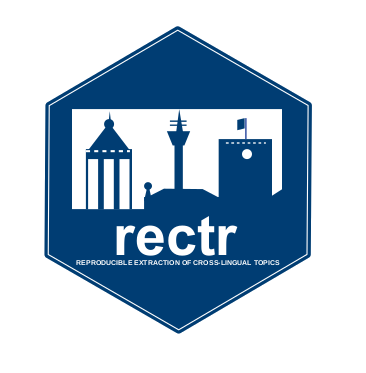

Reproducible Extraction of Cross-lingual Topics using R.
================

# rectr 

Please cite this package as:

*Chan, C.H., Zeng, J., Wessler, H., Jungblut, M., Welbers, K.,
Bajjalieh, J., van Atteveldt, W., & Althaus, S. (2020) Reproducible
Extraction of Cross-lingual Topics. Communication Methods & Measures
(Accepted)*

The rectr package contains an example dataset “wiki” with English and
German articles from Wikipedia about programming languages and locations
in Germany. This package uses the corpus data structure from the
`quanteda` package.

``` r
require(rectr)
```

    ## Loading required package: rectr

``` r
require(tibble)
```

    ## Loading required package: tibble

``` r
require(dplyr)
```

    ## Loading required package: dplyr

    ## 
    ## Attaching package: 'dplyr'

    ## The following objects are masked from 'package:stats':
    ## 
    ##     filter, lag

    ## The following objects are masked from 'package:base':
    ## 
    ##     intersect, setdiff, setequal, union

``` r
wiki
```

    ## # A tibble: 342 x 3
    ##    title                     content                                       lang 
    ##    <chr>                     <chr>                                         <chr>
    ##  1 Wismar                    "Die Hansestadt Wismar liegt an der Ostseekü… de   
    ##  2 Bamberg                   "Bamberg (mittelalterlich: Babenberg, bamber… de   
    ##  3 Grube Messel              "Die Grube Messel in Messel im Landkreis Dar… de   
    ##  4 Adenine                   "Adenine, benannt nach der Nukleinbase Adeni… de   
    ##  5 Haskell (programming lan… "Haskell /ˈhæskəl/ is a standardized, genera… en   
    ##  6 SPARQL                    "SPARQL ist eine graph-basierte Abfragesprac… de   
    ##  7 Trier                     "Trier (französisch Trèves, luxemburgisch Tr… de   
    ##  8 ATS (programming languag… "ATS (Applied Type System) is a programming … en   
    ##  9 Nationalpark Niedersächs… "Der Nationalpark Niedersächsisches Wattenme… de   
    ## 10 Wittenberg                "Wittenberg, officially Lutherstadt Wittenbe… en   
    ## # … with 332 more rows

Currently, this package supports [aligned
fastText](https://github.com/facebookresearch/fastText/tree/master/alignment)
from Facebook Research and [Multilingual BERT
(MBERT)](https://github.com/google-research/bert/blob/master/multilingual.md)
from Google Research. For easier integration, the PyTorch version of
MBERT from [Transformers](https://github.com/huggingface/transformers)
is used.

# Multilingual BERT

## Step 1: Setup your conda environment

``` r
## setup a conda environment, default name: rectr_condaenv
mbert_env_setup()
```

## Step 1: Download MBERT model

``` r
## default to your current directory
download_mbert(noise = TRUE)
```

## Step 2: Create corpus

Create a multilingual corpus

``` r
wiki_corpus <- create_corpus(wiki$content, wiki$lang)
```

## Step 2: Create bag-of-embeddings dfm

Create a multilingual dfm

``` r
## default
wiki_dfm <- transform_dfm_boe(wiki_corpus, noise = TRUE)
```

    ## [1] "Conda environment rectr_condaenv is initialized.\n"

``` r
wiki_dfm
```

    ## dfm with a dimension of 342 x 768 and de/en language(s).
    ## 
    ## Aligned word embeddings: bert

## Step 3: Filter dfm

Filter the dfm for language differences

``` r
wiki_dfm_filtered <- filter_dfm(wiki_dfm, k = 2)
wiki_dfm_filtered
```

    ## dfm with a dimension of 342 x 5 and de/en language(s).
    ## Filtered with k =  2
    ## Aligned word embeddings: bert

## Step 4: Estimate GMM

Estimate a Guassian Mixture Model

``` r
wiki_gmm <- calculate_gmm(wiki_dfm_filtered, seed = 46709394)
wiki_gmm
```

    ## 2-topic rectr model trained with a dfm with a dimension of 342 x 5 and de/en language(s).
    ## Filtered with k =  2
    ## Aligned word embeddings: bert

The document-topic matrix is available in `wiki_gmm$theta`.

Rank the articles according to the theta1.

``` r
wiki %>% mutate(theta1 = wiki_gmm$theta[,1]) %>% arrange(theta1) %>% select(title, lang, theta1) %>% print(n = 400)
```

    ## # A tibble: 342 x 3
    ##     title                                                        lang     theta1
    ##     <chr>                                                        <chr>     <dbl>
    ##   1 Lustre (Programmiersprache)                                  de    6.28e-120
    ##   2 Babelsberg                                                   en    2.58e-118
    ##   3 Tcllib                                                       de    2.64e-118
    ##   4 Haskell (programming language)                               en    2.62e-117
    ##   5 Erlang (Programmiersprache)                                  de    3.06e-117
    ##   6 Lustre (programming language)                                en    3.98e-116
    ##   7 Opal (programming language)                                  en    7.31e-116
    ##   8 Oz (Programmiersprache)                                      de    7.57e-116
    ##   9 Rüdesheim am Rhein                                           en    1.01e-115
    ##  10 Euler (programming language)                                 en    1.11e-115
    ##  11 Großsiedlung Siemensstadt                                    en    1.13e-115
    ##  12 Gofer (programming language)                                 en    1.21e-115
    ##  13 Maple (Software)                                             de    1.22e-115
    ##  14 Imperial Palace Ingelheim                                    en    1.58e-115
    ##  15 NewLISP                                                      en    4.85e-115
    ##  16 Lorch, Hesse                                                 en    6.16e-115
    ##  17 Muskau Park                                                  en    7.87e-115
    ##  18 Common Lisp                                                  de    8.39e-115
    ##  19 Tcl/Java                                                     en    2.60e-114
    ##  20 Rammelsberg                                                  de    4.27e-114
    ##  21 Maulbronn Monastery                                          en    4.35e-114
    ##  22 Coq (Software)                                               de    1.46e-113
    ##  23 Völklingen Ironworks                                         en    1.51e-113
    ##  24 Clean (programming language)                                 en    1.64e-113
    ##  25 XProc                                                        de    2.51e-113
    ##  26 GNU Pascal                                                   de    5.50e-113
    ##  27 Bamberg                                                      en    6.78e-113
    ##  28 Wismar                                                       en    1.46e-112
    ##  29 Imperial Abbey of Corvey                                     en    9.72e-111
    ##  30 Windows PowerShell                                           de    5.04e-110
    ##  31 Embedded SQL                                                 de    2.53e- 83
    ##  32 Embedded SQL                                                 en    2.24e- 79
    ##  33 Java Command Language                                        de    2.64e- 72
    ##  34 F Sharp (programming language)                               en    8.42e- 68
    ##  35 StepTalk                                                     en    1.50e- 67
    ##  36 PHP                                                          de    6.39e- 67
    ##  37 StepTalk                                                     de    1.31e- 66
    ##  38 Python (programming language)                                en    5.49e- 66
    ##  39 Tcllib                                                       en    2.98e- 63
    ##  40 JavaScript                                                   de    6.02e- 63
    ##  41 QML                                                          de    9.61e- 63
    ##  42 Extensible Application Markup Language                       de    1.23e- 62
    ##  43 Java (programming language)                                  en    2.63e- 62
    ##  44 XSL Transformation                                           de    3.43e- 62
    ##  45 Boo (programming language)                                   en    1.28e- 60
    ##  46 Ruby (Programmiersprache)                                    de    2.78e- 59
    ##  47 Standard ML                                                  en    9.13e- 59
    ##  48 Objective-C                                                  en    1.11e- 58
    ##  49 Erlang (programming language)                                en    2.67e- 58
    ##  50 Gofer                                                        de    1.09e- 57
    ##  51 DrRacket                                                     de    7.51e- 57
    ##  52 Objective-C                                                  de    1.75e- 56
    ##  53 C++                                                          de    7.27e- 56
    ##  54 Hack (programming language)                                  en    1.36e- 55
    ##  55 Lua                                                          de    1.63e- 55
    ##  56 Windows PowerShell                                           en    5.87e- 55
    ##  57 Scala (programming language)                                 en    1.12e- 54
    ##  58 Extensible Application Markup Language                       en    8.38e- 54
    ##  59 C (Programmiersprache)                                       de    3.13e- 53
    ##  60 C++                                                          en    4.14e- 53
    ##  61 JavaScript                                                   en    5.02e- 53
    ##  62 Ruby (programming language)                                  en    1.18e- 52
    ##  63 Synchronized Multimedia Integration Language                 de    1.21e- 52
    ##  64 Scala (Programmiersprache)                                   de    1.25e- 52
    ##  65 Racket (programming language)                                en    4.97e- 52
    ##  66 PEARL                                                        de    6.14e- 52
    ##  67 Clojure                                                      en    2.93e- 50
    ##  68 Vala (programming language)                                  en    8.41e- 50
    ##  69 XProc                                                        en    1.09e- 49
    ##  70 Io (Programmiersprache)                                      de    2.14e- 49
    ##  71 Io (programming language)                                    en    3.08e- 49
    ##  72 XSLT                                                         en    1.52e- 48
    ##  73 MATLAB                                                       en    1.66e- 48
    ##  74 F-Logic                                                      de    5.91e- 48
    ##  75 C (programming language)                                     en    2.23e- 47
    ##  76 Smalltalk (Programmiersprache)                               de    2.58e- 47
    ##  77 PHP                                                          en    2.74e- 47
    ##  78 Objective CAML                                               de    2.84e- 47
    ##  79 OCaml                                                        en    6.18e- 47
    ##  80 Julia (programming language)                                 en    7.41e- 47
    ##  81 XQuery                                                       de    1.39e- 46
    ##  82 C Sharp (programming language)                               en    1.63e- 46
    ##  83 QML                                                          en    1.66e- 46
    ##  84 F-Sharp                                                      de    3.19e- 46
    ##  85 Curl (programming language)                                  en    1.90e- 45
    ##  86 Vala (Programmiersprache)                                    de    3.39e- 45
    ##  87 CycL                                                         en    1.12e- 44
    ##  88 Opal (Programmiersprache)                                    de    2.82e- 44
    ##  89 Haskell (Programmiersprache)                                 de    9.17e- 44
    ##  90 ATS (programming language)                                   en    1.04e- 43
    ##  91 C-Sharp                                                      de    1.80e- 43
    ##  92 Java (Programmiersprache)                                    de    3.53e- 43
    ##  93 Squeak                                                       en    4.02e- 43
    ##  94 Lua (programming language)                                   en    2.83e- 42
    ##  95 Pharo (Programmiersprache)                                   de    2.85e- 42
    ##  96 Standard ML                                                  de    2.77e- 41
    ##  97 ML (Programmiersprache)                                      de    3.50e- 41
    ##  98 Common Lisp                                                  en    4.85e- 41
    ##  99 Pharo                                                        en    6.63e- 41
    ## 100 ISWIM                                                        en    1.73e- 40
    ## 101 Synchronized Multimedia Integration Language                 en    1.81e- 40
    ## 102 Ada (Programmiersprache)                                     de    2.76e- 40
    ## 103 Miranda (programming language)                               en    4.05e- 40
    ## 104 Miranda (Programmiersprache)                                 de    4.05e- 40
    ## 105 XQuery                                                       en    4.45e- 40
    ## 106 MetaPost                                                     en    4.55e- 40
    ## 107 COBOL                                                        de    6.44e- 40
    ## 108 Julia (Programmiersprache)                                   de    6.59e- 40
    ## 109 Self (programming language)                                  en    8.48e- 40
    ## 110 Strongtalk                                                   en    1.30e- 39
    ## 111 Adenine                                                      de    3.77e- 39
    ## 112 Clojure                                                      de    6.01e- 39
    ## 113 Applied Type System                                          de    1.64e- 38
    ## 114 Perl (Programmiersprache)                                    de    2.03e- 38
    ## 115 GNU Pascal                                                   en    3.01e- 38
    ## 116 Lout                                                         de    3.83e- 38
    ## 117 D (programming language)                                     en    8.52e- 38
    ## 118 F-logic                                                      en    8.56e- 38
    ## 119 Adenine (programming language)                               en    1.57e- 37
    ## 120 J (programming language)                                     en    1.87e- 37
    ## 121 Hack (Programmiersprache)                                    de    3.21e- 37
    ## 122 Mercury (programming language)                               en    3.59e- 37
    ## 123 Rebol                                                        en    1.15e- 35
    ## 124 Fortran                                                      de    1.35e- 35
    ## 125 SQL                                                          en    2.09e- 35
    ## 126 J (Programmiersprache)                                       de    6.55e- 35
    ## 127 Tcl                                                          de    9.14e- 35
    ## 128 Strongtalk                                                   de    5.65e- 34
    ## 129 MetaPost                                                     de    2.31e- 33
    ## 130 Mercury (Programmiersprache)                                 de    4.50e- 33
    ## 131 Tcl                                                          en    6.06e- 33
    ## 132 Boo (Programmiersprache)                                     de    8.66e- 33
    ## 133 SPARQL                                                       de    9.53e- 33
    ## 134 Prolog                                                       en    2.15e- 32
    ## 135 CycL                                                         de    3.64e- 32
    ## 136 Modelica                                                     en    6.26e- 32
    ## 137 SuperCollider                                                en    6.45e- 32
    ## 138 Web Ontology Language                                        de    1.46e- 31
    ## 139 Python (Programmiersprache)                                  de    3.53e- 31
    ## 140 APL (programming language)                                   en    3.98e- 31
    ## 141 Perl                                                         en    5.74e- 31
    ## 142 Lisp                                                         de    1.18e- 30
    ## 143 SPARQL                                                       en    1.94e- 30
    ## 144 METAFONT                                                     de    2.77e- 30
    ## 145 Self (Programmiersprache)                                    de    1.05e- 29
    ## 146 PEARL (programming language)                                 en    2.77e- 29
    ## 147 Modelica                                                     de    4.16e- 29
    ## 148 COBOL                                                        en    7.50e- 28
    ## 149 Euler (Programmiersprache)                                   de    1.15e- 27
    ## 150 SuperCollider                                                de    1.41e- 27
    ## 151 Curl (Programmiersprache)                                    de    1.74e- 27
    ## 152 ML (programming language)                                    en    2.75e- 27
    ## 153 MUMPS                                                        en    3.11e- 27
    ## 154 Matlab                                                       de    1.07e- 26
    ## 155 Fortran                                                      en    2.88e- 26
    ## 156 Web Ontology Language                                        en    5.25e- 26
    ## 157 Lisp (programming language)                                  en    7.40e- 26
    ## 158 Squeak                                                       de    1.09e- 25
    ## 159 Clean (Programmiersprache)                                   de    1.31e- 25
    ## 160 Lout (software)                                              en    2.05e- 25
    ## 161 Go (programming language)                                    en    3.79e- 25
    ## 162 Prolog (Programmiersprache)                                  de    5.05e- 25
    ## 163 Metafont                                                     en    9.76e- 25
    ## 164 REBOL                                                        de    1.97e- 24
    ## 165 Datalog                                                      en    2.90e- 23
    ## 166 MUMPS                                                        de    4.04e- 23
    ## 167 Go (Programmiersprache)                                      de    6.73e- 23
    ## 168 Logo (Programmiersprache)                                    de    2.10e- 22
    ## 169 Ada (programming language)                                   en    3.39e- 21
    ## 170 Joy (programming language)                                   en    1.42e- 20
    ## 171 D (Programmiersprache)                                       de    2.04e- 20
    ## 172 APL (Programmiersprache)                                     de    2.48e- 20
    ## 173 NewLISP                                                      de    1.06e- 19
    ## 174 Maple (software)                                             en    1.22e- 19
    ## 175 R (programming language)                                     en    1.27e- 19
    ## 176 Datalog                                                      de    9.14e- 19
    ## 177 Paul Graham (computer programmer)                            en    4.16e- 18
    ## 178 ISWIM                                                        de    2.01e- 17
    ## 179 SQL                                                          de    2.09e- 17
    ## 180 Coq                                                          en    4.86e- 16
    ## 181 Smalltalk                                                    en    7.22e- 16
    ## 182 Logo (programming language)                                  en    2.82e- 13
    ## 183 Oz (programming language)                                    en    3.93e- 13
    ## 184 Joy (Programmiersprache)                                     de    5.73e- 13
    ## 185 Paul Graham                                                  de    1.27e-  9
    ## 186 R (Programmiersprache)                                       de    5.65e-  9
    ## 187 Musterhaus Am Horn                                           de    1.00e+  0
    ## 188 Fagus-Werk                                                   de    1.00e+  0
    ## 189 Grube Messel                                                 de    1.00e+  0
    ## 190 Kulturlandschaft Dresdner Elbtal                             de    1.00e+  0
    ## 191 Bauhaus                                                      de    1.00e+  0
    ## 192 Wattenmeer (Nordsee)                                         de    1.00e+  0
    ## 193 Nationalpark Schleswig-Holsteinisches Wattenmeer             de    1.00e+  0
    ## 194 Prehistoric pile dwellings around the Alps                   en    1.00e+  0
    ## 195 Oberharzer Wasserregal                                       de    1.00e+  0
    ## 196 Großsiedlung Siemensstadt                                    de    1.00e+  0
    ## 197 Wadden Sea                                                   en    1.00e+  0
    ## 198 Primeval Beech Forests of the Carpathians and the Ancient B… en    1.00e+  0
    ## 199 Limes (Grenzwall)                                            de    1.00e+  0
    ## 200 Wismar                                                       de    1.00e+  0
    ## 201 Bamberg                                                      de    1.00e+  0
    ## 202 Trier                                                        de    1.00e+  0
    ## 203 Nationalpark Niedersächsisches Wattenmeer                    de    1.00e+  0
    ## 204 Wittenberg                                                   en    1.00e+  0
    ## 205 Goslar                                                       de    1.00e+  0
    ## 206 Margravial Opera House                                       en    1.00e+  0
    ## 207 Weimar                                                       de    1.00e+  0
    ## 208 Bremer Rathaus                                               de    1.00e+  0
    ## 209 Würzburg Residence                                           en    1.00e+  0
    ## 210 Glienicke Palace                                             en    1.00e+  0
    ## 211 New Garden, Potsdam                                          en    1.00e+  0
    ## 212 Upper Harz Water Regale                                      en    1.00e+  0
    ## 213 Kloster Maulbronn                                            de    1.00e+  0
    ## 214 Martin Luther's Birth House                                  en    1.00e+  0
    ## 215 Speyer Cathedral                                             en    1.00e+  0
    ## 216 Konstantinbasilika                                           de    1.00e+  0
    ## 217 Welterbe in Deutschland                                      de    1.00e+  0
    ## 218 Barbara Baths                                                en    1.00e+  0
    ## 219 Lübeck                                                       de    1.00e+  0
    ## 220 Herkules (Kassel)                                            de    1.00e+  0
    ## 221 Lübeck                                                       en    1.00e+  0
    ## 222 Dessau-Wörlitz Garden Realm                                  en    1.00e+  0
    ## 223 Sanssouci                                                    de    1.00e+  0
    ## 224 Klassisches Weimar                                           de    1.00e+  0
    ## 225 Kaiserthermen (Trier)                                        de    1.00e+  0
    ## 226 Rammelsberg                                                  en    1.00e+  0
    ## 227 Ingelheimer Kaiserpfalz                                      de    1.00e+  0
    ## 228 Zollverein Coal Mine Industrial Complex                      en    1.00e+  0
    ## 229 Heilandskirche am Port von Sacrow                            de    1.00e+  0
    ## 230 Porta Nigra                                                  en    1.00e+  0
    ## 231 Pfaueninsel                                                  en    1.00e+  0
    ## 232 Hildesheimer Dom                                             de    1.00e+  0
    ## 233 Stadtkirche Lutherstadt Wittenberg                           de    1.00e+  0
    ## 234 Dessau-Wörlitzer Gartenreich                                 de    1.00e+  0
    ## 235 Hercules monument (Kassel)                                   en    1.00e+  0
    ## 236 Prähistorische Pfahlbauten um die Alpen                      de    1.00e+  0
    ## 237 Museum Island                                                en    1.00e+  0
    ## 238 Aula Palatina                                                en    1.00e+  0
    ## 239 Welterbe Römische Baudenkmäler, Dom und Liebfrauenkirche in… de    1.00e+  0
    ## 240 Zeche Zollverein                                             de    1.00e+  0
    ## 241 Bergpark Wilhelmshöhe                                        en    1.00e+  0
    ## 242 Melanchthonhaus (Wittenberg)                                 en    1.00e+  0
    ## 243 Reichenau (Insel)                                            de    1.00e+  0
    ## 244 Bauhaus Dessau Foundation                                    en    1.00e+  0
    ## 245 Stiftung Bauhaus Dessau                                      de    1.00e+  0
    ## 246 Goslar                                                       en    1.00e+  0
    ## 247 Aachen Cathedral Treasury                                    en    1.00e+  0
    ## 248 Kloster Lorsch                                               de    1.00e+  0
    ## 249 Trier Amphitheater                                           en    1.00e+  0
    ## 250 Eibingen Abbey                                               en    1.00e+  0
    ## 251 Roman Monuments, Cathedral of St. Peter and Church of Our L… en    1.00e+  0
    ## 252 Lutherstadt Eisleben                                         de    1.00e+  0
    ## 253 Porta Nigra                                                  de    1.00e+  0
    ## 254 Trierer Dom                                                  de    1.00e+  0
    ## 255 Reichenau Island                                             en    1.00e+  0
    ## 256 Trier                                                        en    1.00e+  0
    ## 257 Lower Saxon Wadden Sea National Park                         en    1.00e+  0
    ## 258 Dresden Elbe Valley                                          en    1.00e+  0
    ## 259 Trier Imperial Baths                                         en    1.00e+  0
    ## 260 Wartburg                                                     en    1.00e+  0
    ## 261 Bremen City Hall                                             en    1.00e+  0
    ## 262 Speyerer Dom                                                 de    1.00e+  0
    ## 263 Holstentor                                                   de    1.00e+  0
    ## 264 Eisleben                                                     en    1.00e+  0
    ## 265 Neuer Garten Potsdam                                         de    1.00e+  0
    ## 266 Regensburg                                                   de    1.00e+  0
    ## 267 Palaces and Parks of Potsdam and Berlin                      en    1.00e+  0
    ## 268 Martin Luther's Death House                                  en    1.00e+  0
    ## 269 Quedlinburg                                                  en    1.00e+  0
    ## 270 Messel pit                                                   en    1.00e+  0
    ## 271 Lorch (Rheingau)                                             de    1.00e+  0
    ## 272 Berlin Modernism Housing Estates                             en    1.00e+  0
    ## 273 Bauhaus                                                      en    1.00e+  0
    ## 274 Cologne Cathedral                                            en    1.00e+  0
    ## 275 List of World Heritage Sites in Germany                      en    1.00e+  0
    ## 276 Museumsinsel (Berlin)                                        de    1.00e+  0
    ## 277 Limes                                                        en    1.00e+  0
    ## 278 Wieskirche                                                   de    1.00e+  0
    ## 279 Augusteum und Lutherhaus Wittenberg                          de    1.00e+  0
    ## 280 Imperial Palace of Goslar                                    en    1.00e+  0
    ## 281 Lutherstadt Wittenberg                                       de    1.00e+  0
    ## 282 Schlösser und Gärten von Potsdam und Berlin                  de    1.00e+  0
    ## 283 Fürst-Pückler-Park Bad Muskau                                de    1.00e+  0
    ## 284 Weimar                                                       en    1.00e+  0
    ## 285 Stadtkirche Wittenberg                                       en    1.00e+  0
    ## 286 Bremen Roland                                                en    1.00e+  0
    ## 287 Buchenurwälder in den Karpaten und alte Buchenwälder in Deu… de    1.00e+  0
    ## 288 Kaiserpfalz Goslar                                           de    1.00e+  0
    ## 289 Stralsund                                                    de    1.00e+  0
    ## 290 Lorsch Abbey                                                 en    1.00e+  0
    ## 291 Babelsberg Palace                                            en    1.00e+  0
    ## 292 Pfaueninsel                                                  de    1.00e+  0
    ## 293 Obergermanisch-Raetischer Limes#Der Limes heute              de    1.00e+  0
    ## 294 Abtei St. Hildegard (Rüdesheim am Rhein)                     de    1.00e+  0
    ## 295 Haus am Horn                                                 en    1.00e+  0
    ## 296 Rüdesheim am Rhein                                           de    1.00e+  0
    ## 297 Cathedral of Trier                                           en    1.00e+  0
    ## 298 Schlösser Augustusburg und Falkenlust                        de    1.00e+  0
    ## 299 Wartburg                                                     de    1.00e+  0
    ## 300 Igel Column                                                  en    1.00e+  0
    ## 301 Quedlinburg                                                  de    1.00e+  0
    ## 302 Babelsberg                                                   de    1.00e+  0
    ## 303 Igeler Säule                                                 de    1.00e+  0
    ## 304 St. Michael's Church, Hildesheim                             en    1.00e+  0
    ## 305 Würzburger Residenz                                          de    1.00e+  0
    ## 306 Liebfrauenkirche (Trier)                                     de    1.00e+  0
    ## 307 Stift Corvey                                                 de    1.00e+  0
    ## 308 Wieskirche                                                   en    1.00e+  0
    ## 309 Classical Weimar (World Heritage Site)                       en    1.00e+  0
    ## 310 Sanssouci                                                    en    1.00e+  0
    ## 311 Kölner Dom                                                   de    1.00e+  0
    ## 312 Schloss Glienicke                                            de    1.00e+  0
    ## 313 Liebfrauenkirche, Trier                                      en    1.00e+  0
    ## 314 St. Michael (Hildesheim)                                     de    1.00e+  0
    ## 315 Welterbe Kulturlandschaft Oberes Mittelrheintal              de    1.00e+  0
    ## 316 Bremer Roland                                                de    1.00e+  0
    ## 317 Hildesheim Cathedral                                         en    1.00e+  0
    ## 318 Limes Germanicus                                             en    1.00e+  0
    ## 319 Siedlungen der Berliner Moderne                              de    1.00e+  0
    ## 320 Martin Luthers Sterbehaus                                    de    1.00e+  0
    ## 321 Rhine Gorge                                                  en    1.00e+  0
    ## 322 Martin Luthers Geburtshaus                                   de    1.00e+  0
    ## 323 Melanchthonhaus Wittenberg                                   de    1.00e+  0
    ## 324 Regensburg                                                   en    1.00e+  0
    ## 325 Aachener Dom                                                 de    1.00e+  0
    ## 326 Fagus Factory                                                en    1.00e+  0
    ## 327 Lutherhaus                                                   en    1.00e+  0
    ## 328 Augustusburg and Falkenlust Palaces, Brühl                   en    1.00e+  0
    ## 329 Hufeisensiedlung                                             de    1.00e+  0
    ## 330 Völklinger Hütte                                             de    1.00e+  0
    ## 331 Aachen Cathedral                                             en    1.00e+  0
    ## 332 Schleswig-Holstein Wadden Sea National Park                  en    1.00e+  0
    ## 333 Markgräfliches Opernhaus                                     de    1.00e+  0
    ## 334 Schloss Babelsberg                                           de    1.00e+  0
    ## 335 Hufeisensiedlung                                             en    1.00e+  0
    ## 336 Amphitheater (Trier)                                         de    1.00e+  0
    ## 337 Bergpark Wilhelmshöhe                                        de    1.00e+  0
    ## 338 Barbarathermen                                               de    1.00e+  0
    ## 339 Church of the Redeemer, Sacrow                               en    1.00e+  0
    ## 340 Holstentor                                                   en    1.00e+  0
    ## 341 Aachener Domschatzkammer                                     de    1.00e+  0
    ## 342 Stralsund                                                    en    1.00e+  0

# Aligned fastText

## Step 1: Download word embeddings

Download and preprocess fastText word embeddings from Facebook. Make
sure you have at least 5G of disk space and a reasonably amount of RAM.
It took around 20 minutes on my machine.

``` r
get_ft("en")
get_ft("de")
```

## Step 1: Read the downloaded word embeddings

``` r
emb <- read_ft(c("en", "de"))
```

## Step 2: Create corpus

Create a multilingual corpus

``` r
wiki_corpus <- create_corpus(wiki$content, wiki$lang)
```

## Step 2: Create bag-of-embeddings dfm

Create a multilingual dfm

``` r
wiki_dfm <- transform_dfm_boe(wiki_corpus, emb)
```

    ##  Progress:                                                                  100% Progress: ─                                                                100% Progress: ─                                                                100% Progress: ─                                                                100% Progress: ──                                                               100% Progress: ──                                                               100% Progress: ───                                                              100% Progress: ────                                                             100% Progress: ─────                                                            100% Progress: ──────                                                           100% Progress: ──────                                                           100% Progress: ────────                                                         100% Progress: ─────────                                                        100% Progress: ──────────                                                       100% Progress: ───────────                                                      100% Progress: ────────────                                                     100% Progress: ─────────────                                                    100% Progress: ──────────────                                                   100% Progress: ───────────────                                                  100% Progress: ────────────────                                                 100% Progress: ─────────────────                                                100% Progress: ──────────────────                                               100% Progress: ───────────────────                                              100% Progress: ────────────────────                                             100% Progress: ─────────────────────                                            100% Progress: ──────────────────────                                           100% Progress: ────────────────────────                                         100% Progress: ─────────────────────────                                        100% Progress: ──────────────────────────                                       100% Progress: ───────────────────────────                                      100% Progress: ────────────────────────────                                     100% Progress: ─────────────────────────────                                    100% Progress: ──────────────────────────────                                   100% Progress: ───────────────────────────────                                  100% Progress: ────────────────────────────────                                 100% Progress: ─────────────────────────────────                                100% Progress: ──────────────────────────────────                               100% Progress: ──────────────────────────────────                               100% Progress: ───────────────────────────────────                              100% Progress: ─────────────────────────────────────                            100% Progress: ─────────────────────────────────────                            100% Progress: ──────────────────────────────────────                           100% Progress: ───────────────────────────────────────                          100% Progress: ────────────────────────────────────────                         100% Progress: ─────────────────────────────────────────                        100% Progress: ──────────────────────────────────────────                       100% Progress: ───────────────────────────────────────────                      100% Progress: ────────────────────────────────────────────                     100% Progress: ─────────────────────────────────────────────                    100% Progress: ──────────────────────────────────────────────                   100% Progress: ───────────────────────────────────────────────                  100% Progress: ────────────────────────────────────────────────                 100% Progress: ─────────────────────────────────────────────────                100% Progress: ──────────────────────────────────────────────────               100% Progress: ───────────────────────────────────────────────────              100% Progress: ────────────────────────────────────────────────────             100% Progress: ─────────────────────────────────────────────────────            100% Progress: ──────────────────────────────────────────────────────           100% Progress: ───────────────────────────────────────────────────────          100% Progress: ────────────────────────────────────────────────────────         100% Progress: ────────────────────────────────────────────────────────         100% Progress: ────────────────────────────────────────────────────────         100% Progress: ─────────────────────────────────────────────────────────        100% Progress: ─────────────────────────────────────────────────────────        100% Progress: ──────────────────────────────────────────────────────────       100% Progress: ──────────────────────────────────────────────────────────       100% Progress: ───────────────────────────────────────────────────────────      100% Progress: ───────────────────────────────────────────────────────────      100% Progress: ────────────────────────────────────────────────────────────     100% Progress: ─────────────────────────────────────────────────────────────    100% Progress: ──────────────────────────────────────────────────────────────   100% Progress: ──────────────────────────────────────────────────────────────   100% Progress: ──────────────────────────────────────────────────────────────   100% Progress: ───────────────────────────────────────────────────────────────  100% Progress: ──────────────────────────────────────────────────────────────── 100%

``` r
wiki_dfm
```

    ## dfm with a dimension of 342 x 300 and de/en language(s).
    ## 
    ## Aligned word embeddings: fasttext

## Step 3: Filter dfm

Filter the dfm for language differences

``` r
wiki_dfm_filtered <- filter_dfm(wiki_dfm, k = 2)
wiki_dfm_filtered
```

    ## dfm with a dimension of 342 x 5 and de/en language(s).
    ## Filtered with k =  2
    ## Aligned word embeddings: fasttext

## Step 4: Estimate GMM

Estimate a Guassian Mixture Model

``` r
wiki_gmm <- calculate_gmm(wiki_dfm_filtered, seed = 46709394)
wiki_gmm
```

    ## 2-topic rectr model trained with a dfm with a dimension of 342 x 5 and de/en language(s).
    ## Filtered with k =  2
    ## Aligned word embeddings: fasttext

The document-topic matrix is available in `wiki_gmm$theta`.

Rank the articles according to the theta1.

``` r
wiki %>% mutate(theta1 = wiki_gmm$theta[,1]) %>% arrange(theta1) %>% select(title, lang, theta1) %>% print(n = 400)
```

    ## # A tibble: 342 x 3
    ##     title                                                        lang     theta1
    ##     <chr>                                                        <chr>     <dbl>
    ##   1 Lustre (Programmiersprache)                                  de    2.65e-322
    ##   2 GNU Pascal                                                   de    3.23e-234
    ##   3 Pharo (Programmiersprache)                                   de    2.26e-194
    ##   4 Embedded SQL                                                 de    2.48e-163
    ##   5 Windows PowerShell                                           de    1.28e-159
    ##   6 Java Command Language                                        de    8.66e-137
    ##   7 Embedded SQL                                                 en    8.59e-130
    ##   8 Tcllib                                                       en    3.58e-129
    ##   9 Tcl/Java                                                     en    3.46e-127
    ##  10 StepTalk                                                     en    2.11e-116
    ##  11 StepTalk                                                     de    4.51e-110
    ##  12 QML                                                          de    4.23e-107
    ##  13 Extensible Application Markup Language                       de    2.95e-105
    ##  14 Lua (programming language)                                   en    3.42e-100
    ##  15 Java (programming language)                                  en    8.32e- 99
    ##  16 NewLISP                                                      en    4.24e- 98
    ##  17 Windows PowerShell                                           en    6.20e- 95
    ##  18 Synchronized Multimedia Integration Language                 en    6.74e- 94
    ##  19 XSL Transformation                                           de    1.04e- 91
    ##  20 Curl (programming language)                                  en    6.87e- 91
    ##  21 Clojure                                                      en    3.04e- 90
    ##  22 JavaScript                                                   de    5.35e- 90
    ##  23 C++                                                          de    7.09e- 90
    ##  24 Objective-C                                                  en    6.32e- 88
    ##  25 GNU Pascal                                                   en    2.78e- 86
    ##  26 C (Programmiersprache)                                       de    9.52e- 85
    ##  27 Extensible Application Markup Language                       en    1.71e- 84
    ##  28 JavaScript                                                   en    1.91e- 84
    ##  29 Synchronized Multimedia Integration Language                 de    1.22e- 80
    ##  30 Clojure                                                      de    2.60e- 80
    ##  31 Boo (Programmiersprache)                                     de    9.24e- 80
    ##  32 Oz (Programmiersprache)                                      de    1.71e- 79
    ##  33 Tcl                                                          en    8.71e- 79
    ##  34 Common Lisp                                                  en    2.17e- 78
    ##  35 Vala (Programmiersprache)                                    de    2.72e- 77
    ##  36 Boo (programming language)                                   en    4.18e- 77
    ##  37 Lua                                                          de    9.49e- 77
    ##  38 F Sharp (programming language)                               en    1.94e- 76
    ##  39 PHP                                                          de    1.85e- 75
    ##  40 Java (Programmiersprache)                                    de    1.12e- 74
    ##  41 QML                                                          en    1.28e- 74
    ##  42 Common Lisp                                                  de    2.17e- 74
    ##  43 Ada (Programmiersprache)                                     de    5.05e- 73
    ##  44 C-Sharp                                                      de    1.34e- 72
    ##  45 Python (programming language)                                en    3.67e- 72
    ##  46 PEARL                                                        de    3.68e- 72
    ##  47 Ruby (programming language)                                  en    3.73e- 72
    ##  48 XQuery                                                       de    4.51e- 71
    ##  49 SPARQL                                                       en    6.60e- 70
    ##  50 Go (programming language)                                    en    9.01e- 70
    ##  51 XSLT                                                         en    3.83e- 69
    ##  52 Hack (programming language)                                  en    1.84e- 68
    ##  53 XProc                                                        de    2.99e- 67
    ##  54 MATLAB                                                       en    4.58e- 67
    ##  55 DrRacket                                                     de    1.17e- 65
    ##  56 Tcllib                                                       de    1.50e- 65
    ##  57 Scala (programming language)                                 en    8.90e- 65
    ##  58 Squeak                                                       en    1.49e- 64
    ##  59 PHP                                                          en    2.16e- 64
    ##  60 Io (programming language)                                    en    3.37e- 64
    ##  61 OCaml                                                        en    5.30e- 64
    ##  62 Rebol                                                        en    3.12e- 63
    ##  63 Vala (programming language)                                  en    1.85e- 62
    ##  64 Objective-C                                                  de    2.52e- 62
    ##  65 C++                                                          en    2.62e- 62
    ##  66 Fortran                                                      en    3.16e- 61
    ##  67 Adenine                                                      de    4.96e- 61
    ##  68 COBOL                                                        de    1.60e- 60
    ##  69 Objective CAML                                               de    2.17e- 60
    ##  70 XQuery                                                       en    7.47e- 60
    ##  71 NewLISP                                                      de    2.93e- 58
    ##  72 Lout                                                         de    8.20e- 58
    ##  73 Opal (programming language)                                  en    1.42e- 57
    ##  74 Racket (programming language)                                en    2.18e- 57
    ##  75 C Sharp (programming language)                               en    3.05e- 57
    ##  76 Pharo                                                        en    7.80e- 57
    ##  77 Tcl                                                          de    8.97e- 57
    ##  78 Lisp                                                         de    1.73e- 56
    ##  79 Haskell (programming language)                               en    3.88e- 55
    ##  80 Gofer (programming language)                                 en    8.00e- 55
    ##  81 Smalltalk (Programmiersprache)                               de    1.12e- 54
    ##  82 Adenine (programming language)                               en    5.84e- 53
    ##  83 Ruby (Programmiersprache)                                    de    7.63e- 53
    ##  84 Smalltalk                                                    en    1.93e- 52
    ##  85 C (programming language)                                     en    3.80e- 52
    ##  86 Python (Programmiersprache)                                  de    3.09e- 51
    ##  87 MetaPost                                                     de    3.66e- 51
    ##  88 Fortran                                                      de    5.79e- 51
    ##  89 Ada (programming language)                                   en    3.67e- 50
    ##  90 Erlang (programming language)                                en    9.44e- 50
    ##  91 Clean (programming language)                                 en    1.17e- 49
    ##  92 Standard ML                                                  en    1.45e- 49
    ##  93 D (programming language)                                     en    7.10e- 49
    ##  94 Euler (programming language)                                 en    1.72e- 48
    ##  95 Perl                                                         en    3.79e- 48
    ##  96 Scala (Programmiersprache)                                   de    4.02e- 48
    ##  97 SQL                                                          en    4.38e- 48
    ##  98 Haskell (Programmiersprache)                                 de    1.16e- 47
    ##  99 ISWIM                                                        en    1.89e- 47
    ## 100 Miranda (programming language)                               en    2.04e- 46
    ## 101 ATS (programming language)                                   en    1.50e- 45
    ## 102 Io (Programmiersprache)                                      de    3.74e- 45
    ## 103 Mercury (programming language)                               en    4.13e- 45
    ## 104 Perl (Programmiersprache)                                    de    5.50e- 45
    ## 105 F-Sharp                                                      de    9.30e- 45
    ## 106 Lisp (programming language)                                  en    2.16e- 44
    ## 107 Paul Graham (computer programmer)                            en    3.08e- 44
    ## 108 Gofer                                                        de    3.59e- 44
    ## 109 Matlab                                                       de    4.98e- 44
    ## 110 Erlang (Programmiersprache)                                  de    1.39e- 43
    ## 111 XProc                                                        en    6.55e- 43
    ## 112 APL (programming language)                                   en    1.27e- 42
    ## 113 COBOL                                                        en    2.50e- 42
    ## 114 Miranda (Programmiersprache)                                 de    1.13e- 41
    ## 115 Lout (software)                                              en    5.61e- 41
    ## 116 Euler (Programmiersprache)                                   de    6.48e- 41
    ## 117 SuperCollider                                                en    6.62e- 41
    ## 118 Prolog                                                       en    1.93e- 40
    ## 119 Julia (programming language)                                 en    5.36e- 40
    ## 120 APL (Programmiersprache)                                     de    3.09e- 39
    ## 121 SQL                                                          de    7.14e- 39
    ## 122 PEARL (programming language)                                 en    2.01e- 38
    ## 123 MetaPost                                                     en    2.30e- 38
    ## 124 Metafont                                                     en    2.40e- 38
    ## 125 Lustre (programming language)                                en    1.55e- 37
    ## 126 Modelica                                                     en    2.02e- 37
    ## 127 Mercury (Programmiersprache)                                 de    2.74e- 37
    ## 128 Oz (programming language)                                    en    3.46e- 36
    ## 129 Datalog                                                      en    3.50e- 36
    ## 130 REBOL                                                        de    4.55e- 36
    ## 131 Logo (programming language)                                  en    2.10e- 35
    ## 132 J (Programmiersprache)                                       de    4.12e- 35
    ## 133 Go (Programmiersprache)                                      de    6.00e- 35
    ## 134 CycL                                                         en    7.61e- 35
    ## 135 Self (Programmiersprache)                                    de    1.47e- 34
    ## 136 SPARQL                                                       de    1.89e- 34
    ## 137 Curl (Programmiersprache)                                    de    2.26e- 34
    ## 138 ML (programming language)                                    en    3.65e- 34
    ## 139 Julia (Programmiersprache)                                   de    8.23e- 34
    ## 140 Self (programming language)                                  en    8.79e- 34
    ## 141 CycL                                                         de    1.68e- 33
    ## 142 MUMPS                                                        en    4.52e- 33
    ## 143 ML (Programmiersprache)                                      de    1.15e- 32
    ## 144 F-logic                                                      en    4.58e- 32
    ## 145 F-Logic                                                      de    1.47e- 31
    ## 146 Hack (Programmiersprache)                                    de    2.69e- 31
    ## 147 Standard ML                                                  de    3.49e- 31
    ## 148 J (programming language)                                     en    6.12e- 31
    ## 149 Opal (Programmiersprache)                                    de    1.10e- 30
    ## 150 Strongtalk                                                   en    1.79e- 30
    ## 151 Strongtalk                                                   de    1.48e- 29
    ## 152 Web Ontology Language                                        de    2.92e- 29
    ## 153 Prolog (Programmiersprache)                                  de    4.74e- 29
    ## 154 R (programming language)                                     en    1.06e- 28
    ## 155 D (Programmiersprache)                                       de    1.30e- 28
    ## 156 Coq                                                          en    1.48e- 27
    ## 157 Squeak                                                       de    1.85e- 27
    ## 158 MUMPS                                                        de    1.54e- 26
    ## 159 Maple (software)                                             en    1.80e- 26
    ## 160 SuperCollider                                                de    7.56e- 25
    ## 161 Maple (Software)                                             de    8.59e- 24
    ## 162 Applied Type System                                          de    2.04e- 23
    ## 163 Web Ontology Language                                        en    2.29e- 23
    ## 164 Logo (Programmiersprache)                                    de    1.85e- 22
    ## 165 Clean (Programmiersprache)                                   de    2.65e- 21
    ## 166 Joy (programming language)                                   en    7.15e- 21
    ## 167 METAFONT                                                     de    1.42e- 19
    ## 168 Modelica                                                     de    2.32e- 19
    ## 169 Datalog                                                      de    4.73e- 19
    ## 170 Paul Graham                                                  de    8.49e- 17
    ## 171 ISWIM                                                        de    8.60e- 16
    ## 172 R (Programmiersprache)                                       de    4.40e- 13
    ## 173 Joy (Programmiersprache)                                     de    7.48e- 10
    ## 174 Coq (Software)                                               de    1.61e-  9
    ## 175 Fagus Factory                                                en    1.00e+  0
    ## 176 Bauhaus                                                      en    1.00e+  0
    ## 177 Haus am Horn                                                 en    1.00e+  0
    ## 178 Berlin Modernism Housing Estates                             en    1.00e+  0
    ## 179 Martin Luther's Birth House                                  en    1.00e+  0
    ## 180 Musterhaus Am Horn                                           de    1.00e+  0
    ## 181 Bauhaus                                                      de    1.00e+  0
    ## 182 Prehistoric pile dwellings around the Alps                   en    1.00e+  0
    ## 183 Klassisches Weimar                                           de    1.00e+  0
    ## 184 Limes (Grenzwall)                                            de    1.00e+  0
    ## 185 Grube Messel                                                 de    1.00e+  0
    ## 186 Bauhaus Dessau Foundation                                    en    1.00e+  0
    ## 187 Limes                                                        en    1.00e+  0
    ## 188 Siedlungen der Berliner Moderne                              de    1.00e+  0
    ## 189 Hufeisensiedlung                                             en    1.00e+  0
    ## 190 Kulturlandschaft Dresdner Elbtal                             de    1.00e+  0
    ## 191 Dessau-Wörlitz Garden Realm                                  en    1.00e+  0
    ## 192 Sanssouci                                                    en    1.00e+  0
    ## 193 Zollverein Coal Mine Industrial Complex                      en    1.00e+  0
    ## 194 Lutherhaus                                                   en    1.00e+  0
    ## 195 Weimar                                                       en    1.00e+  0
    ## 196 Igel Column                                                  en    1.00e+  0
    ## 197 Wismar                                                       de    1.00e+  0
    ## 198 Bamberg                                                      de    1.00e+  0
    ## 199 Trier                                                        de    1.00e+  0
    ## 200 Nationalpark Niedersächsisches Wattenmeer                    de    1.00e+  0
    ## 201 Wittenberg                                                   en    1.00e+  0
    ## 202 Goslar                                                       de    1.00e+  0
    ## 203 Margravial Opera House                                       en    1.00e+  0
    ## 204 Maulbronn Monastery                                          en    1.00e+  0
    ## 205 Weimar                                                       de    1.00e+  0
    ## 206 Wismar                                                       en    1.00e+  0
    ## 207 Bremer Rathaus                                               de    1.00e+  0
    ## 208 Würzburg Residence                                           en    1.00e+  0
    ## 209 Glienicke Palace                                             en    1.00e+  0
    ## 210 New Garden, Potsdam                                          en    1.00e+  0
    ## 211 Upper Harz Water Regale                                      en    1.00e+  0
    ## 212 Kloster Maulbronn                                            de    1.00e+  0
    ## 213 Speyer Cathedral                                             en    1.00e+  0
    ## 214 Lorch, Hesse                                                 en    1.00e+  0
    ## 215 Konstantinbasilika                                           de    1.00e+  0
    ## 216 Welterbe in Deutschland                                      de    1.00e+  0
    ## 217 Barbara Baths                                                en    1.00e+  0
    ## 218 Lübeck                                                       de    1.00e+  0
    ## 219 Herkules (Kassel)                                            de    1.00e+  0
    ## 220 Lübeck                                                       en    1.00e+  0
    ## 221 Oberharzer Wasserregal                                       de    1.00e+  0
    ## 222 Sanssouci                                                    de    1.00e+  0
    ## 223 Kaiserthermen (Trier)                                        de    1.00e+  0
    ## 224 Rammelsberg                                                  en    1.00e+  0
    ## 225 Ingelheimer Kaiserpfalz                                      de    1.00e+  0
    ## 226 Babelsberg                                                   en    1.00e+  0
    ## 227 Heilandskirche am Port von Sacrow                            de    1.00e+  0
    ## 228 Wattenmeer (Nordsee)                                         de    1.00e+  0
    ## 229 Porta Nigra                                                  en    1.00e+  0
    ## 230 Pfaueninsel                                                  en    1.00e+  0
    ## 231 Hildesheimer Dom                                             de    1.00e+  0
    ## 232 Stadtkirche Lutherstadt Wittenberg                           de    1.00e+  0
    ## 233 Dessau-Wörlitzer Gartenreich                                 de    1.00e+  0
    ## 234 Hercules monument (Kassel)                                   en    1.00e+  0
    ## 235 Prähistorische Pfahlbauten um die Alpen                      de    1.00e+  0
    ## 236 Museum Island                                                en    1.00e+  0
    ## 237 Aula Palatina                                                en    1.00e+  0
    ## 238 Muskau Park                                                  en    1.00e+  0
    ## 239 Welterbe Römische Baudenkmäler, Dom und Liebfrauenkirche in… de    1.00e+  0
    ## 240 Großsiedlung Siemensstadt                                    en    1.00e+  0
    ## 241 Zeche Zollverein                                             de    1.00e+  0
    ## 242 Bergpark Wilhelmshöhe                                        en    1.00e+  0
    ## 243 Melanchthonhaus (Wittenberg)                                 en    1.00e+  0
    ## 244 Reichenau (Insel)                                            de    1.00e+  0
    ## 245 Stiftung Bauhaus Dessau                                      de    1.00e+  0
    ## 246 Goslar                                                       en    1.00e+  0
    ## 247 Aachen Cathedral Treasury                                    en    1.00e+  0
    ## 248 Kloster Lorsch                                               de    1.00e+  0
    ## 249 Trier Amphitheater                                           en    1.00e+  0
    ## 250 Eibingen Abbey                                               en    1.00e+  0
    ## 251 Roman Monuments, Cathedral of St. Peter and Church of Our L… en    1.00e+  0
    ## 252 Rammelsberg                                                  de    1.00e+  0
    ## 253 Lutherstadt Eisleben                                         de    1.00e+  0
    ## 254 Porta Nigra                                                  de    1.00e+  0
    ## 255 Trierer Dom                                                  de    1.00e+  0
    ## 256 Reichenau Island                                             en    1.00e+  0
    ## 257 Trier                                                        en    1.00e+  0
    ## 258 Lower Saxon Wadden Sea National Park                         en    1.00e+  0
    ## 259 Dresden Elbe Valley                                          en    1.00e+  0
    ## 260 Trier Imperial Baths                                         en    1.00e+  0
    ## 261 Wartburg                                                     en    1.00e+  0
    ## 262 Bremen City Hall                                             en    1.00e+  0
    ## 263 Speyerer Dom                                                 de    1.00e+  0
    ## 264 Holstentor                                                   de    1.00e+  0
    ## 265 Primeval Beech Forests of the Carpathians and the Ancient B… en    1.00e+  0
    ## 266 Eisleben                                                     en    1.00e+  0
    ## 267 Neuer Garten Potsdam                                         de    1.00e+  0
    ## 268 Regensburg                                                   de    1.00e+  0
    ## 269 Palaces and Parks of Potsdam and Berlin                      en    1.00e+  0
    ## 270 Fagus-Werk                                                   de    1.00e+  0
    ## 271 Martin Luther's Death House                                  en    1.00e+  0
    ## 272 Quedlinburg                                                  en    1.00e+  0
    ## 273 Messel pit                                                   en    1.00e+  0
    ## 274 Lorch (Rheingau)                                             de    1.00e+  0
    ## 275 Bamberg                                                      en    1.00e+  0
    ## 276 Cologne Cathedral                                            en    1.00e+  0
    ## 277 List of World Heritage Sites in Germany                      en    1.00e+  0
    ## 278 Museumsinsel (Berlin)                                        de    1.00e+  0
    ## 279 Wieskirche                                                   de    1.00e+  0
    ## 280 Augusteum und Lutherhaus Wittenberg                          de    1.00e+  0
    ## 281 Imperial Palace of Goslar                                    en    1.00e+  0
    ## 282 Lutherstadt Wittenberg                                       de    1.00e+  0
    ## 283 Schlösser und Gärten von Potsdam und Berlin                  de    1.00e+  0
    ## 284 Fürst-Pückler-Park Bad Muskau                                de    1.00e+  0
    ## 285 Stadtkirche Wittenberg                                       en    1.00e+  0
    ## 286 Bremen Roland                                                en    1.00e+  0
    ## 287 Buchenurwälder in den Karpaten und alte Buchenwälder in Deu… de    1.00e+  0
    ## 288 Kaiserpfalz Goslar                                           de    1.00e+  0
    ## 289 Stralsund                                                    de    1.00e+  0
    ## 290 Lorsch Abbey                                                 en    1.00e+  0
    ## 291 Babelsberg Palace                                            en    1.00e+  0
    ## 292 Pfaueninsel                                                  de    1.00e+  0
    ## 293 Obergermanisch-Raetischer Limes#Der Limes heute              de    1.00e+  0
    ## 294 Nationalpark Schleswig-Holsteinisches Wattenmeer             de    1.00e+  0
    ## 295 Abtei St. Hildegard (Rüdesheim am Rhein)                     de    1.00e+  0
    ## 296 Völklingen Ironworks                                         en    1.00e+  0
    ## 297 Rüdesheim am Rhein                                           de    1.00e+  0
    ## 298 Cathedral of Trier                                           en    1.00e+  0
    ## 299 Großsiedlung Siemensstadt                                    de    1.00e+  0
    ## 300 Schlösser Augustusburg und Falkenlust                        de    1.00e+  0
    ## 301 Wartburg                                                     de    1.00e+  0
    ## 302 Quedlinburg                                                  de    1.00e+  0
    ## 303 Babelsberg                                                   de    1.00e+  0
    ## 304 Igeler Säule                                                 de    1.00e+  0
    ## 305 St. Michael's Church, Hildesheim                             en    1.00e+  0
    ## 306 Würzburger Residenz                                          de    1.00e+  0
    ## 307 Imperial Palace Ingelheim                                    en    1.00e+  0
    ## 308 Liebfrauenkirche (Trier)                                     de    1.00e+  0
    ## 309 Stift Corvey                                                 de    1.00e+  0
    ## 310 Wieskirche                                                   en    1.00e+  0
    ## 311 Classical Weimar (World Heritage Site)                       en    1.00e+  0
    ## 312 Wadden Sea                                                   en    1.00e+  0
    ## 313 Kölner Dom                                                   de    1.00e+  0
    ## 314 Imperial Abbey of Corvey                                     en    1.00e+  0
    ## 315 Schloss Glienicke                                            de    1.00e+  0
    ## 316 Liebfrauenkirche, Trier                                      en    1.00e+  0
    ## 317 St. Michael (Hildesheim)                                     de    1.00e+  0
    ## 318 Rüdesheim am Rhein                                           en    1.00e+  0
    ## 319 Welterbe Kulturlandschaft Oberes Mittelrheintal              de    1.00e+  0
    ## 320 Bremer Roland                                                de    1.00e+  0
    ## 321 Hildesheim Cathedral                                         en    1.00e+  0
    ## 322 Limes Germanicus                                             en    1.00e+  0
    ## 323 Martin Luthers Sterbehaus                                    de    1.00e+  0
    ## 324 Rhine Gorge                                                  en    1.00e+  0
    ## 325 Martin Luthers Geburtshaus                                   de    1.00e+  0
    ## 326 Melanchthonhaus Wittenberg                                   de    1.00e+  0
    ## 327 Regensburg                                                   en    1.00e+  0
    ## 328 Aachener Dom                                                 de    1.00e+  0
    ## 329 Augustusburg and Falkenlust Palaces, Brühl                   en    1.00e+  0
    ## 330 Hufeisensiedlung                                             de    1.00e+  0
    ## 331 Völklinger Hütte                                             de    1.00e+  0
    ## 332 Aachen Cathedral                                             en    1.00e+  0
    ## 333 Schleswig-Holstein Wadden Sea National Park                  en    1.00e+  0
    ## 334 Markgräfliches Opernhaus                                     de    1.00e+  0
    ## 335 Schloss Babelsberg                                           de    1.00e+  0
    ## 336 Amphitheater (Trier)                                         de    1.00e+  0
    ## 337 Bergpark Wilhelmshöhe                                        de    1.00e+  0
    ## 338 Barbarathermen                                               de    1.00e+  0
    ## 339 Church of the Redeemer, Sacrow                               en    1.00e+  0
    ## 340 Holstentor                                                   en    1.00e+  0
    ## 341 Aachener Domschatzkammer                                     de    1.00e+  0
    ## 342 Stralsund                                                    en    1.00e+  0

SessionInfo

``` r
sessionInfo()
```

    ## R version 3.6.2 (2019-12-12)
    ## Platform: x86_64-apple-darwin15.6.0 (64-bit)
    ## Running under: macOS Catalina 10.15.6
    ## 
    ## Matrix products: default
    ## BLAS:   /Library/Frameworks/R.framework/Versions/3.6/Resources/lib/libRblas.0.dylib
    ## LAPACK: /Library/Frameworks/R.framework/Versions/3.6/Resources/lib/libRlapack.dylib
    ## 
    ## locale:
    ## [1] en_US.UTF-8/en_US.UTF-8/en_US.UTF-8/C/en_US.UTF-8/en_US.UTF-8
    ## 
    ## attached base packages:
    ## [1] stats     graphics  grDevices utils     datasets  methods   base     
    ## 
    ## other attached packages:
    ## [1] dplyr_1.0.0  tibble_3.0.3 rectr_0.1.2 
    ## 
    ## loaded via a namespace (and not attached):
    ##  [1] reticulate_1.16    modeltools_0.2-23  tidyselect_1.1.0   xfun_0.16         
    ##  [5] listenv_0.8.0      purrr_0.3.4        lattice_0.20-41    colorspace_1.4-1  
    ##  [9] vctrs_0.3.2        generics_0.0.2     htmltools_0.5.0    usethis_1.6.1     
    ## [13] SnowballC_0.7.0    stats4_3.6.2       yaml_2.2.1         utf8_1.1.4        
    ## [17] rlang_0.4.7        pillar_1.4.6       glue_1.4.1         lifecycle_0.2.0   
    ## [21] stringr_1.4.0      munsell_0.5.0      gtable_0.3.0       future_1.17.0     
    ## [25] mvtnorm_1.1-1      codetools_0.2-16   evaluate_0.14      knitr_1.29        
    ## [29] parallel_3.6.2     flexmix_2.3-15     fansi_0.4.1        furrr_0.1.0       
    ## [33] tokenizers_0.2.1   Rcpp_1.0.5         scales_1.1.1       RcppParallel_5.0.2
    ## [37] jsonlite_1.7.0     fs_1.4.2           RSpectra_0.16-0    fastmatch_1.1-0   
    ## [41] stopwords_2.0      ggplot2_3.3.2      digest_0.6.25      stringi_1.4.6     
    ## [45] quanteda_2.0.1     grid_3.6.2         cli_2.0.2          tools_3.6.2       
    ## [49] magrittr_1.5       crayon_1.3.4.9000  pkgconfig_2.0.3    ellipsis_0.3.1    
    ## [53] Matrix_1.2-18      data.table_1.12.8  assertthat_0.2.1   rmarkdown_2.3     
    ## [57] globals_0.12.5     R6_2.4.1           nnet_7.3-14        compiler_3.6.2
