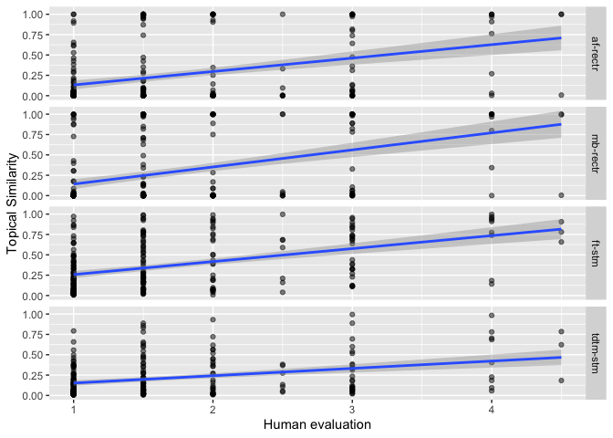
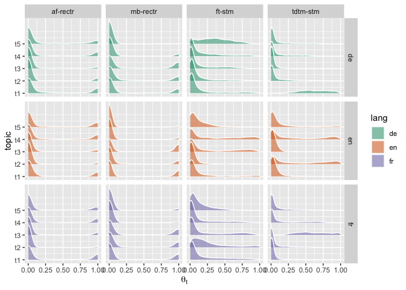
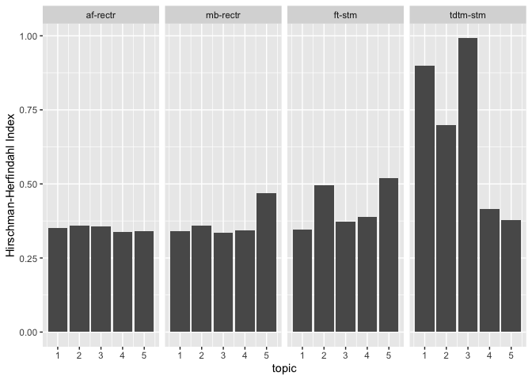
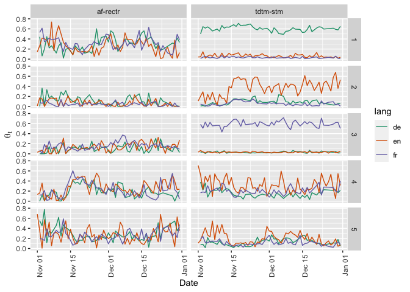
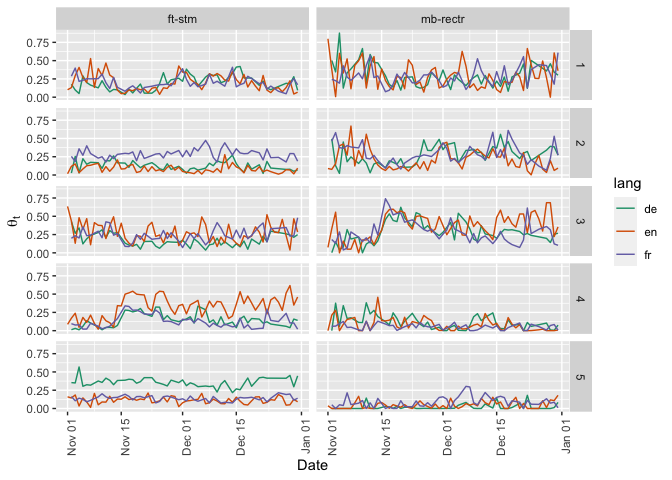

Reproducing the analyses in the paper
================

Due to copyright reasons, we cannot bundle the full text of New York
Times, Süddeutsche Zeitung and Le Fegaro news articles in this package.

The first few rows of the data look like so.

``` r
require(rectr)
require(tibble)
require(dplyr)
require(quanteda)
require(tidyverse)

readRDS("final_data_endefr.RDS")
```

    ## # A tibble: 3,391 x 10
    ##    path  id    pubdate headline lede  body  lang  content    nt tokenized_conte…
    ##    <chr> <chr> <chr>   <chr>    <chr> <chr> <chr> <chr>   <int> <list>          
    ##  1 ./pa… arti… 2 Nove… "Maladi… "Ave… "Dan… FR    "Avec …  1026 <chr [1,138]>   
    ##  2 ./pa… arti… 2 Nove… "« Cela… "LE … "Pat… FR    "LE FI…   734 <chr [820]>     
    ##  3 ./pa… arti… 2 Nove… "L'Iran… "L'a… "de … FR    "L'anc…   984 <chr [1,081]>   
    ##  4 ./pa… arti… 2 Nove… "Matthi… "Le … "Mat… FR    "Le pr…  1077 <chr [1,213]>   
    ##  5 ./pa… arti… 2 Nove… "Les 31… "Lan… "EUR… FR    "Lancé…  1012 <chr [1,115]>   
    ##  6 ./pa… arti… 2 Nove… "Genera… "Apr… "À l… FR    "Après…   800 <chr [874]>     
    ##  7 ./pa… arti… 2 Nove… "La dis… "Seu… "Les… FR    "Seul …  1171 <chr [1,318]>   
    ##  8 ./pa… arti… 2 Nove… "Les ca… "Ils… "Ce … FR    "Ils d…   552 <chr [612]>     
    ##  9 ./pa… arti… 2 Nove… "Le pré… "FRA… "À l… FR    "FRANÇ…   506 <chr [589]>     
    ## 10 ./pa… arti… 2 Nove… "La nui… "  Ç… "Au … FR    "  ÇA …   516 <chr [552]>     
    ## # … with 3,381 more rows

The content column has the content of the news articles. For the rectr
method, a processed version of the corpus and dfm is available in this
package. The data was generated using the following code.

``` r
require(rectr)
```

    ## Loading required package: rectr

``` r
require(tidyverse)
```

    ## Loading required package: tidyverse

    ## ── Attaching packages ─────────────────────────────────────── tidyverse 1.3.0 ──

    ## ✔ ggplot2 3.3.2     ✔ purrr   0.3.4
    ## ✔ tibble  3.0.1     ✔ dplyr   1.0.0
    ## ✔ tidyr   1.1.0     ✔ stringr 1.4.0
    ## ✔ readr   1.3.1     ✔ forcats 0.5.0

    ## ── Conflicts ────────────────────────────────────────── tidyverse_conflicts() ──
    ## ✖ dplyr::filter() masks stats::filter()
    ## ✖ dplyr::lag()    masks stats::lag()

``` r
require(quanteda)
```

    ## Loading required package: quanteda

    ## Package version: 2.0.1

    ## Parallel computing: 2 of 4 threads used.

    ## See https://quanteda.io for tutorials and examples.

    ## 
    ## Attaching package: 'quanteda'

    ## The following object is masked from 'package:utils':
    ## 
    ##     View

``` r
readRDS("final_data_endefr.RDS") %>% mutate(content = paste(lede, body), lang = tolower(lang), id = row_number(), outlet = recode(lang, 'en' = 'NYT', 'de' = 'SZ', 'fr' = 'LF')) %>% select(content, lang, pubdate, headline, id, outlet) -> paris
```

There are three French articles published in NYT. In order not to
interfere the analysis, these three articles were excluded.

``` r
excluded_id <- c(1729, 1815, 1843)
paris$outlet[excluded_id]
```

    ## [1] "NYT" "NYT" "NYT"

``` r
paris$headline[excluded_id]
```

    ## [1] "Les attentats à Paris révèlent les limites de Daesh\n"                               
    ## [2] "Michel Houellebecq: Après les attentats à Paris, quelle démocratie pour la France?\n"
    ## [3] "L'Arabie saoudite, un Daesh qui a réussi\n"

``` r
get_ft("fr")
get_ft("de")
get_ft("en")
```

``` r
emb <- read_ft(c("fr", "de", "en"))
paris_corpus <- create_corpus(paris$content, paris$lang)
docvars(paris_corpus, "headline") <- paris$headline
docvars(paris_corpus, "pubdate") <- paris$pubdate
docvars(paris_corpus, "id") <- paris$id
docvars(paris_corpus, "outlet") <- paris$outlet

paris_corpus <- paris_corpus[-excluded_id]

paris_dfm <- transform_dfm_boe(paris_corpus, emb)
saveRDS(paris_dfm, "paris_dfm.RDS")

paris_dfm_bert <- transform_dfm_boe(paris_corpus, mode = "bert", noise = TRUE, path = "./")
saveRDS(paris_dfm_bert, "paris_dfm_bert.RDS")
```

Again, due to copyright reasons, we cannot provide the full text and the
version translated by Google (using the DTM translation method by Reber
2019). The DTM (in STM) is available in this package. It was created
using this code.

``` r
require(tidyverse)
##require(googleLanguageR)
require(stm)
require(quanteda)

textdata <- readRDS("final_data_endefr.RDS") %>% mutate(content = paste(lede, body), lang = tolower(lang), id = row_number()) %>% select(content, lang, pubdate, headline, id)

textdata %>% filter(lang != "en") -> FR_DE_content

gl_auth("")

glx <- function(content, source) {
    print(substr(content, 1, 30))
    Sys.sleep(sample(1:5))
    res <- gl_translate(content, source, target = "en", format = 'text')
    print(substr(res$translatedText, 1, 30))
    return(res)
}

### You need to pay Google over USD200 for running this line. Also 5 hrs of your time.
FR_DE_trans <- map2(FR_DE_content$content, FR_DE_content$lang, safely(glx))

dead <- map_lgl(map(FR_DE_trans, "error"), Negate(is.null))

FR_DE_trans2 <- map2(substr(FR_DE$content[dead], 1, 20000), FR_DE$lang[dead], safely(glx))

FR_DE_trans[dead] <- FR_DE_trans2

## saveRDS(FR_DE_trans, "FR_DE_trains.RDS")

## ## reassumble

FR_DE_trans %>% map_chr(~.$result$translatedText) -> translated_content

textdata$google_translate <- textdata$content

textdata$google_translate[textdata$lang == "fr"] <- translated_content[FR_DE_content$lang == "fr"]

textdata$google_translate[textdata$lang == "de"] <- translated_content[FR_DE_content$lang == "de"]

textdata %>% sample_n(20) %>% select(content, google_translate, lang)

saveRDS(textdata, "paris_ft_translate.RDS")
```

``` r
## Exclusion of three French NYT articles.
textdata <- readRDS("paris_ft_translate.RDS")[-excluded_id,]

min_docfreq <- (nrow(textdata) * 0.005) %>% ceiling
max_docfreq <- (nrow(textdata) * 0.99) %>% ceiling

dfm(textdata$google_translate, tolower = TRUE, stem = TRUE, remove = stopwords("en"), remove_number = TRUE, remove_punct = TRUE) %>% dfm_trim(min_docfreq = min_docfreq, max_docfreq = max_docfreq) %>% convert(to = 'stm') -> paris_ft_dfm


####### tdtm

textdata <- readRDS("paris_ft_translate.RDS")

textdata %>% filter(lang == "fr") %>% pull(content) -> FR_CONTENT
textdata %>% filter(lang == "de") %>% pull(content) -> DE_CONTENT
textdata %>% filter(lang == "en") %>% pull(content) -> EN_CONTENT
FR_DFM <- dfm(FR_CONTENT, remove = stopwords("fr"), remove_numbers = TRUE, remove_punct = TRUE) %>% dfm_trim(min_docfreq = 2)

FR_terms <- colnames(FR_DFM)


## ## Uncomment the following 3 lines if you want to do the google translation

## FR_trans_terms <- gl_translate(FR_terms, source = "fr")
## saveRDS(FR_trans_terms, "FR_trans_terms.RDS")
## saveRDS(FR_terms, "FR_terms.RDS")


DE_DFM <- dfm(DE_CONTENT, remove = stopwords("de"), , remove_numbers = TRUE, remove_punct = TRUE) %>% dfm_trim(min_docfreq = 2)

DE_terms <- colnames(DE_DFM)

## Uncomment the following 3 lines if you want to do the google translation

## DE_trans_terms <- gl_translate(DE_terms, source = "de")
## saveRDS(DE_trans_terms, "DE_trans_terms.RDS")
## saveRDS(DE_terms, "DE_terms.RDS")

DE_trans_terms <- readRDS("DE_trans_terms.RDS")
FR_trans_terms <- readRDS("FR_trans_terms.RDS")


FR_tokens <- tokens(FR_CONTENT, remove_numbers = TRUE, remove_punct = TRUE)

DE_tokens <- tokens(DE_CONTENT, remove_numbers = TRUE, remove_punct = TRUE)


recon <- function(token_obj, trans_terms) {
    tibble(text = tolower(token_obj)) %>% left_join(trans_terms, by = 'text') %>% filter(!is.na(translatedText)) %>% pull(translatedText) %>% paste(collapse = " ")
}


FR_recon_en_text <- map_chr(FR_tokens, recon, trans_terms = FR_trans_terms)

DE_recon_en_text <- map_chr(DE_tokens, recon, trans_terms = DE_trans_terms)

recon_complete_text <- c(FR_recon_en_text, EN_CONTENT, DE_recon_en_text)
textdata$translated_text <- recon_complete_text

### Exclusion of three NYT articles.

textdata <- textdata[-excluded_id,]

min_docfreq <- (nrow(textdata) * 0.005) %>% ceiling
max_docfreq <- (nrow(textdata) * 0.99) %>% ceiling

names(textdata$translated_text) <- NULL

dfm(textdata$translated_text, tolower = TRUE, stem = TRUE, remove = stopwords("en"), remove_number = TRUE, remove_punct = TRUE) %>% dfm_trim(min_docfreq = min_docfreq, max_docfreq = max_docfreq) %>% convert(to = 'stm') -> paris_tdtm_dfm
```

Saving into the data directory, and don’t get us into legal trouble.

``` r
paris_dfm <- readRDS("paris_dfm.RDS")
paris_dfm_bert <- readRDS("paris_dfm_bert.RDS")

## Delete all text content, sorry, researchers!
paris_corpus[1:length(paris_corpus)] <- ""

paris_dfm$corpus <- paris_corpus
paris_dfm_bert$corpus <- paris_corpus

testthat::expect_true(all(nrow(paris_dfm$dfm) == 3388, nrow(paris_dfm_bert$dfm) == 3388, nrow(paris_tdtm_dfm$meta) == 3388, nrow(paris_ft_dfm$meta) == 3388, length(paris_corpus) == 3388))

testthat::expect_true(all(paris_dfm$corpus == ""))
testthat::expect_true(all(paris_dfm_bert$corpus == ""))

usethis::use_data(paris_corpus, overwrite = TRUE)
usethis::use_data(paris_dfm, overwrite = TRUE)
usethis::use_data(paris_dfm_bert, overwrite = TRUE)
usethis::use_data(paris_ft_dfm, overwrite = TRUE)
usethis::use_data(paris_tdtm_dfm, overwrite = TRUE)
```

# Actual reproduction

Reproduce the analyses in the paper.

Aligned fastText

``` r
require(rectr)
require(tidyverse)
require(quanteda)
paris_corpus
```

    ## Corpus consisting of 3,388 documents and 5 docvars.
    ## text1 :
    ## ""
    ## 
    ## text2 :
    ## ""
    ## 
    ## text3 :
    ## ""
    ## 
    ## text4 :
    ## ""
    ## 
    ## text5 :
    ## ""
    ## 
    ## text6 :
    ## ""
    ## 
    ## [ reached max_ndoc ... 3,382 more documents ]

``` r
paris_dfm
```

    ## dfm with a dimension of 3388 x 300 and fr/en/de language(s).
    ## 
    ## Aligned word embeddings: fasttext

``` r
paris_dfm_filtered <- filter_dfm(paris_dfm, k = 5, noise = TRUE)
```

    ## [1] "Select from: 5 th dimension."

``` r
paris_dfm_filtered
```

    ## dfm with a dimension of 3388 x 11 and fr/en/de language(s).
    ## Filtered with k =  5
    ## Aligned word embeddings: fasttext

``` r
paris_gmm <- calculate_gmm(paris_dfm_filtered, seed = 42)
paris_gmm
```

    ## 5-topic rectr model trained with a dfm with a dimension of 3388 x 11 and fr/en/de language(s).
    ## Filtered with k =  5
    ## Aligned word embeddings: fasttext

M-BERT

``` r
paris_dfm_bert
```

    ## dfm with a dimension of 3388 x 768 and fr/en/de language(s).
    ## 
    ## Aligned word embeddings: bert

``` r
paris_dfm_bert_filtered <- filter_dfm(paris_dfm_bert, k = 5, noise = TRUE)
```

    ## [1] "Select from: 4 th dimension."

``` r
paris_dfm_bert_filtered
```

    ## dfm with a dimension of 3388 x 11 and fr/en/de language(s).
    ## Filtered with k =  5
    ## Aligned word embeddings: bert

``` r
paris_gmm_bert <- calculate_gmm(paris_dfm_bert_filtered, seed = 43)
paris_gmm_bert
```

    ## 5-topic rectr model trained with a dfm with a dimension of 3388 x 11 and fr/en/de language(s).
    ## Filtered with k =  5
    ## Aligned word embeddings: bert

## Appendix II: af-rectr

``` r
get_sample <- function(i, paris_corpus, theta, threshold = 0.8, replace = FALSE) {
    tibble(hl = docvars(paris_corpus, "headline"), lang = docvars(paris_corpus, "lang"), prob = theta[,i]) %>% group_by(lang) %>% filter(prob > threshold) %>% sample_n(size = 5, weight = prob, replace = replace) %>% select(hl, lang, prob) %>% ungroup %>% arrange(lang, prob) %>% mutate(topic = i)
}

get_headline <- function(paris_gmm) {
    map_dfr(seq_len(ncol(paris_gmm$theta)), get_sample, paris_gmm$dfm$corpus, theta = paris_gmm$theta) %>% unique
}

set.seed(42)
hl <- get_headline(paris_gmm)
rio::export(select(hl, topic, lang, hl), "af_rectr_hl.csv")
print(hl, n = 100)
```

    ## # A tibble: 75 x 4
    ##    hl                                                          lang   prob topic
    ##    <chr>                                                       <chr> <dbl> <int>
    ##  1 "Ende der Museumsruhe; Galerien und Ausstellungen verbuche… de    0.875     1
    ##  2 "Der Trend geht zum Nein; Gescheiterte Olympia-Initiativen… de    0.899     1
    ##  3 "„Abschieben! Abschieben!“; Der Terror in Paris interessie… de    0.956     1
    ##  4 "Anschlag auf das Vertrauen; Entsetzt reagiert die Wirtsch… de    0.995     1
    ##  5 "Zeitenwende beim Ökostrom; Das Wirtschaftsministerium änd… de    1.00      1
    ##  6 "Obama's Climate Push Is Shaping Contours of His Coming Le… en    0.986     1
    ##  7 "Maurice Strong, Environmental Champion, Dies at 86\n"      en    0.991     1
    ##  8 "A Band Known for Wit, Now Linked to Tragedy\n"             en    0.997     1
    ##  9 "The Return of London's Fog\n"                              en    1.00      1
    ## 10 "Asset Manager Amundi Could Raise Up to $2.2 Billion in I.… en    1         1
    ## 11 "Le CSA entrouvre la porte pour le passage de LCI et Paris… fr    0.908     1
    ## 12 "Expertise France, une agence pour exporter notre savoir-f… fr    0.989     1
    ## 13 "Les centres commerciaux se réinventent pour attirer les c… fr    1.00      1
    ## 14 "Lignes rouges\n"                                           fr    1.00      1
    ## 15 "Oberthur renonce à son tour à son introduction en Bourse\… fr    1.00      1
    ## 16 "Dabei sein ist alles; Allein der Status eines Bewerbers b… de    0.960     2
    ## 17 "RYDER CUP; Ein Verfahren? Eine Farce!\n"                   de    0.973     2
    ## 18 "Großes Aufgebot für Derby; 800 Polizisten sichern Regiona… de    1.00      2
    ## 19 "Schwarzer Abend; Im Schatten des Terroraktes von Paris un… de    1.00      2
    ## 20 "Spannung in Skandinavien; Playoff-Spiele für die EM-Quali… de    1         2
    ## 21 "Adapt and Take on Challenges Around the World\n"           en    0.930     2
    ## 22 "France Investigates Decision to Hold Worlds in Oregon\n"   en    1.00      2
    ## 23 "Teenager Follows a New Route to the N.H.L.\n"              en    1.00      2
    ## 24 "Isner Defeats Federer in Paris\n"                          en    1         2
    ## 25 "With Messi Out, Neymar's Star Grows Ever Brighter\n"       en    1         2
    ## 26 "Le Brésil souhaite « la présence des athlètes russes » au… fr    0.993     2
    ## 27 "Une finale sous haute sécurité\n"                          fr    0.999     2
    ## 28 "Al-Khelaïfi : « Nous n'oublierons jamais ce que Zlatan a … fr    1.00      2
    ## 29 "Kevin Trapp, la boulette comme étiquette\n"                fr    1.00      2
    ## 30 "L'ascension fulgurante de Kingsley Coman\n"                fr    1.00      2
    ## 31 "SPD stützt Syrien-Einsatz der Bundeswehr; Minister Steinm… de    0.903     3
    ## 32 "Das Brauchtum liefert die Basis; Jungbauernschaft Altener… de    0.936     3
    ## 33 "Ich, einfach unverbesserlich; Angela Merkel umarmt mit ih… de    0.968     3
    ## 34 "MEINE PRESSESCHAU; AUSGEWÄHLT VON BORIS HERRMANN\n"        de    0.997     3
    ## 35 "Wahlerfolg für Front National zeichnet sich ab; Bei den R… de    1         3
    ## 36 "Mass Shootings in U.S. and Paris Stoke Ideological Fight … en    0.890     3
    ## 37 "Parties Split on Response but United Behind France\n"      en    0.935     3
    ## 38 "'Enough Is Enough,' Obama Says After the Latest Outbreak … en    0.980     3
    ## 39 "Iowa Poll Has Cruz Doubling Support, Passing Carson and N… en    1.00      3
    ## 40 "National Front Stumbles in French Elections\n"             en    1.00      3
    ## 41 "Helmut Schmidt, le patriarche des Allemands\n"             fr    0.846     3
    ## 42 "Valls agite le spectre de la « guerre civile »\n"          fr    1.00      3
    ## 43 "La maire de Paris se rêve en Martine Aubry\n"              fr    1.00      3
    ## 44 "Les nouveaux habits de Christian Estrosi\n"                fr    1.00      3
    ## 45 "Normandie : une triangulaire extrêmement serrée\n"         fr    1.00      3
    ## 46 "Nahost-Deutschland; Hassparolen gegen Israel, Überfälle, … de    0.833     4
    ## 47 "Wenn ein Gerücht Karriere macht; Bayerns Innenminister Jo… de    0.842     4
    ## 48 "„Aus Sicherheitsgründen geschlossen“; Menschenleere Einka… de    0.888     4
    ## 49 "Die unbeugsame Prinzessin; Indische Adelige und britische… de    0.988     4
    ## 50 "„Going to Paris is forbidden“; Katharina Horban hat die T… de    0.990     4
    ## 51 "New U.S. Visa Rules Anger Officials in Tehran\n"           en    0.961     4
    ## 52 "The Soft Power of Militant Jihad\n"                        en    0.999     4
    ## 53 "A Nation Wonders When Bloodshed Becomes Terrorism\n"       en    0.999     4
    ## 54 "Call to Arms in France Amid Raid and Hunt for Belgian Sus… en    0.999     4
    ## 55 "ISIS Leader in Libya Is Targeted in U.S. Airstrike\n"      en    1.00      4
    ## 56 "Comment les sénateurs contrôlent l'état d'urgence\n"       fr    0.972     4
    ## 57 "Dans les écoles, des élèves stressés\n"                    fr    0.986     4
    ## 58 "Identification des morts : l'insoutenable attente\n"       fr    0.998     4
    ## 59 "Hollande chez Obama pour durcir la guerre         contre … fr    1.00      4
    ## 60 "Les attentats de Coulibaly étaient téléguidés\n"           fr    1.00      4
    ## 61 "Folge einfach der Schnapsidee; F. Scott Fitzgeralds Reise… de    0.806     5
    ## 62 "Zu schön zum Wegschmeißen; In der Halle 2 kommen Dinge un… de    0.893     5
    ## 63 "„Das Duell“ von Tschechow; Ein Versuch über das Theater i… de    0.929     5
    ## 64 "Eine Reise in die sagenhafte Welt der Vulkane; Eine Freis… de    0.958     5
    ## 65 "FILMTIPP DES TAGES; Im Paradies\n"                         de    0.979     5
    ## 66 "What to Watch Monday\n"                                    en    0.933     5
    ## 67 "Best Sellers: Fashion Manners and Customs: Sunday, Novemb… en    0.967     5
    ## 68 "The Rise of Modigliani's Profile, and the Asking Prices f… en    0.999     5
    ## 69 "Hip-Hop Colors for Your Lips\n"                            en    0.999     5
    ## 70 "Sharing Fresh Energy in Paris\n"                           en    1.00      5
    ## 71 "DERNIÈRE MINUTE\n"                                         fr    0.981     5
    ## 72 "Laird Hunt, un Américain heureux à Paris\n"                fr    0.998     5
    ## 73 "DERNIÈRE MINUTE\n"                                         fr    0.999     5
    ## 74 "Coeurs de Breizh\n"                                        fr    1.00      5
    ## 75 "Les tribulations de David David-Weill en Chine\n"          fr    1.00      5

## Appendix III: mb-rectr

``` r
set.seed(42)
hl <- get_headline(paris_gmm_bert)
rio::export(select(hl, topic, lang, hl), "mb_rectr_hl.csv")
print(hl, n = 100)
```

    ## # A tibble: 75 x 4
    ##    hl                                                          lang   prob topic
    ##    <chr>                                                       <chr> <dbl> <int>
    ##  1 "Singular; Wer sich gegen den Terror wehrt und sich dabei … de    0.893     1
    ##  2 "Die Hüter; Sie haben in den besten Hotels der Welt für da… de    0.916     1
    ##  3 "Mon Dieu; In Calais reden Menschen von Krieg, mitten im F… de    0.956     1
    ##  4 "Folge einfach der Schnapsidee; F. Scott Fitzgeralds Reise… de    0.989     1
    ##  5 "Ein Leben für die Malerei; Adolf Fleischmann verdiente se… de    1.00      1
    ##  6 "Growing Up Instagrammed\n"                                 en    0.994     1
    ##  7 "For Artisans at Cartier Change Begins at Home\n"           en    0.996     1
    ##  8 "A T-Shirt Takes On a Life of Its Own\n"                    en    0.998     1
    ##  9 "Seasonal Greenery in a Cocktail Coupe\n"                   en    1.00      1
    ## 10 "A Painter of Clouds, Revisited\n"                          en    1.00      1
    ## 11 "Lilly Wood  & The Prick tisse sa Toile\n"                  fr    0.909     1
    ## 12 "Henri Salvador : sa place à Paris\n"                       fr    0.988     1
    ## 13 "Benjamin Millepied : « Le ballet doit sortir de sa bulle … fr    0.998     1
    ## 14 "L'art en plein coeur\n"                                    fr    0.998     1
    ## 15 "DERNIÈRE MINUTE\n"                                         fr    1.00      1
    ## 16 "Rappen gegen Rechtsextremismus; Schulprojekttag „Mixtape“… de    0.852     2
    ## 17 "Die fabelhafte Welt der Amelia; Seit Jahren diskutiert di… de    0.890     2
    ## 18 "REDEN WIR ÜBER; Wünsche für die Klimakonferenz; Elena Lud… de    0.993     2
    ## 19 "Die Hauptangeklagte; Der Kohle wird die größte Schuld an … de    0.999     2
    ## 20 "Von Benediktbeuern zum Klimagipfel\n"                      de    1.00      2
    ## 21 "Obama Presses Beijing on Building in South China Sea\n"    en    0.885     2
    ## 22 "A Global Accord on Climate Change\n"                       en    0.911     2
    ## 23 "Cameron Plans Rise in Military Spending\n"                 en    0.958     2
    ## 24 "Prices Drop as Supply of Oil Soars Worldwide\n"            en    1.00      2
    ## 25 "Ripples Far From the Fed\n"                                en    1.00      2
    ## 26 "Mildred, ingénieur architecte\n"                           fr    0.928     2
    ## 27 "Gérald-Brice Viret rejoint Canal +\n"                      fr    0.975     2
    ## 28 "Acidification et température, un cocktail destructeur pou… fr    1.00      2
    ## 29 "Les restaurants font la part belle aux plats à emporter\n" fr    1.00      2
    ## 30 "Expertise France, une agence pour exporter notre savoir-f… fr    1.00      2
    ## 31 "Angststörung; Brüssel im Ausnahmezustand: Restaurants, Ki… de    0.968     3
    ## 32 "Paris, 13. November 2015; Terror in Frankreich – Dutzende… de    0.984     3
    ## 33 "ATTENTATE IN PARIS; Von Werten, Religionen – und ihrem Mi… de    0.989     3
    ## 34 "Technik gegen den Terror; Um sich besser gegen Attentate … de    1.00      3
    ## 35 "Der „Islamische Staat“ und sein Kalifat\n"                 de    1         3
    ## 36 "In Presidential Campaign, It's Now Terrorism, Not Taxes\n" en    0.943     3
    ## 37 "CBS Rethinks Democratic Debate to Reflect Paris Attacks\n" en    0.969     3
    ## 38 "Dec. 31 Plot Brings Raids and Arrests in Belgium\n"        en    0.998     3
    ## 39 "World Powers Set High Goals for Syria Cease-Fire, but Pit… en    1.00      3
    ## 40 "ISIS Leader in Libya Is Targeted in U.S. Airstrike\n"      en    1         3
    ## 41 "« Il faut aller aux racines profondes d'une telle barbari… fr    0.840     3
    ## 42 "La diplomatie britannique à la croisée des chemins\n"      fr    1.00      3
    ## 43 "Le geôlier français de Daech jugé à Paris\n"               fr    1.00      3
    ## 44 "Apologie du terrorisme : moins d'outrances qu'en janvier … fr    1.00      3
    ## 45 "« Certains sont des cadres de Daech »\n"                   fr    1.00      3
    ## 46 "Platini erwägt Aussage-Verweigerung; Anwälte des Uefa-Che… de    0.891     4
    ## 47 "Normal brutal; In deutschen Stadien regiert trotz Terror … de    0.983     4
    ## 48 "Vorteil Scheich; DFB-Chef Rauball lobt Fifa-Anwärter, Pla… de    0.997     4
    ## 49 "Spürbar beklommen; Die Bundesliga entschließt sich, den n… de    1.00      4
    ## 50 "Botschaft voller Bitterkeit; Nicht nur das Nationalteam h… de    1.00      4
    ## 51 "Tanglewood Highlights\n"                                   en    0.974     4
    ## 52 "Clemson Advances to Final\n"                               en    1         4
    ## 53 "Live and Kicking: Soccer Games to Watch\n"                 en    1         4
    ## 54 "Two Finals Entail Two Surfaces for Murray\n"               en    1         4
    ## 55 "Midfielder Fails Drug Test\n"                              en    1         4
    ## 56 "Tavernost : « M6 ne veut pas se débarrasser des Girondins… fr    0.983     4
    ## 57 "Fifa : le document qui plaide en faveur de Platini\n"      fr    1.00      4
    ## 58 "Dan Carter veut finir en beauté au Racing\n"               fr    1.00      4
    ## 59 "Ligue 1 : Paris freiné, Marseille veut accélérer\n"        fr    1         4
    ## 60 "Champions Cup : Toulon tombe de haut\n"                    fr    1         4
    ## 61 "Zentrum\n"                                                 de    0.846     5
    ## 62 "Drei Stunden; Im Eiltempo beschließt der Bundestag den Sy… de    0.899     5
    ## 63 "FRANKREICH; Drehtür in den Élysée\n"                       de    0.921     5
    ## 64 "Erfolg ohne Freude; Das große Debakel blieb Frankreichs S… de    0.962     5
    ## 65 "SACHBÜCHER DES MONATS NOVEMBER\n"                          de    1.00      5
    ## 66 "Generational Challenge Confronts Spain's Leader\n"         en    0.913     5
    ## 67 "Ad by Pro-Jeb Bush Group Faults Marco Rubio's Attendance … en    0.977     5
    ## 68 "Best Sellers: Combined Print & E-Book Fiction: Sunday, De… en    1.00      5
    ## 69 "100 Notable Books of 2015\n"                               en    1.00      5
    ## 70 "National Front Faces Tougher Climb in France\n"            en    1.00      5
    ## 71 "Île-de-France  : une fin de campagne tumultueuse entre Pé… fr    1.00      5
    ## 72 "Pour Bournazel (LR), « la gauche est en train de s'écroul… fr    1.00      5
    ## 73 "Marion Maréchal-Le Pen distancerait Christian Estrosi en … fr    1.00      5
    ## 74 "Sarkozy à Avignon pour soutenir Estrosi\n"                 fr    1.00      5
    ## 75 "Pollution : Hidalgo réclame la circulation alternée à Par… fr    1         5

## Appendix VI: tdtm-stm

``` r
require(stm)
```

    ## Loading required package: stm

    ## stm v1.3.5 successfully loaded. See ?stm for help. 
    ##  Papers, resources, and other materials at structuraltopicmodel.com

``` r
set.seed(42)
translated_stm <- stm(paris_tdtm_dfm$documents, paris_tdtm_dfm$vocab, K = 5)
```

    ## Beginning Spectral Initialization 
    ##   Calculating the gram matrix...
    ##   Finding anchor words...
    ##      .....
    ##   Recovering initialization...
    ##      ...........................................................
    ## Initialization complete.
    ## ......................................................................................................
    ## Completed E-Step (2 seconds). 
    ## Completed M-Step. 
    ## Completing Iteration 1 (approx. per word bound = -7.743) 
    ## ......................................................................................................
    ## Completed E-Step (2 seconds). 
    ## Completed M-Step. 
    ## Completing Iteration 2 (approx. per word bound = -7.577, relative change = 2.142e-02) 
    ## ......................................................................................................
    ## Completed E-Step (1 seconds). 
    ## Completed M-Step. 
    ## Completing Iteration 3 (approx. per word bound = -7.540, relative change = 4.845e-03) 
    ## ......................................................................................................
    ## Completed E-Step (1 seconds). 
    ## Completed M-Step. 
    ## Completing Iteration 4 (approx. per word bound = -7.528, relative change = 1.601e-03) 
    ## ......................................................................................................
    ## Completed E-Step (1 seconds). 
    ## Completed M-Step. 
    ## Completing Iteration 5 (approx. per word bound = -7.522, relative change = 8.944e-04) 
    ## Topic 1: time, peopl, year, pari, say 
    ##  Topic 2: said, state, mr, attack, islam 
    ##  Topic 3: franc, pari, year, also, french 
    ##  Topic 4: said, one, new, work, year 
    ##  Topic 5: year, million, compani, said, world 
    ## ......................................................................................................
    ## Completed E-Step (1 seconds). 
    ## Completed M-Step. 
    ## Completing Iteration 6 (approx. per word bound = -7.517, relative change = 6.470e-04) 
    ## ......................................................................................................
    ## Completed E-Step (1 seconds). 
    ## Completed M-Step. 
    ## Completing Iteration 7 (approx. per word bound = -7.513, relative change = 4.964e-04) 
    ## ......................................................................................................
    ## Completed E-Step (1 seconds). 
    ## Completed M-Step. 
    ## Completing Iteration 8 (approx. per word bound = -7.510, relative change = 3.631e-04) 
    ## ......................................................................................................
    ## Completed E-Step (1 seconds). 
    ## Completed M-Step. 
    ## Completing Iteration 9 (approx. per word bound = -7.508, relative change = 2.390e-04) 
    ## ......................................................................................................
    ## Completed E-Step (1 seconds). 
    ## Completed M-Step. 
    ## Completing Iteration 10 (approx. per word bound = -7.507, relative change = 1.443e-04) 
    ## Topic 1: time, peopl, pari, say, year 
    ##  Topic 2: said, mr, state, attack, islam 
    ##  Topic 3: franc, pari, year, french, also 
    ##  Topic 4: said, year, one, new, work 
    ##  Topic 5: year, climat, said, million, world 
    ## ......................................................................................................
    ## Completed E-Step (1 seconds). 
    ## Completed M-Step. 
    ## Completing Iteration 11 (approx. per word bound = -7.507, relative change = 8.589e-05) 
    ## ......................................................................................................
    ## Completed E-Step (1 seconds). 
    ## Completed M-Step. 
    ## Completing Iteration 12 (approx. per word bound = -7.506, relative change = 5.401e-05) 
    ## ......................................................................................................
    ## Completed E-Step (1 seconds). 
    ## Completed M-Step. 
    ## Completing Iteration 13 (approx. per word bound = -7.506, relative change = 3.696e-05) 
    ## ......................................................................................................
    ## Completed E-Step (1 seconds). 
    ## Completed M-Step. 
    ## Completing Iteration 14 (approx. per word bound = -7.506, relative change = 2.757e-05) 
    ## ......................................................................................................
    ## Completed E-Step (1 seconds). 
    ## Completed M-Step. 
    ## Completing Iteration 15 (approx. per word bound = -7.506, relative change = 2.293e-05) 
    ## Topic 1: time, peopl, pari, say, year 
    ##  Topic 2: said, mr, state, attack, islam 
    ##  Topic 3: franc, pari, year, french, also 
    ##  Topic 4: year, one, said, new, work 
    ##  Topic 5: year, climat, said, countri, million 
    ## ......................................................................................................
    ## Completed E-Step (1 seconds). 
    ## Completed M-Step. 
    ## Completing Iteration 16 (approx. per word bound = -7.505, relative change = 2.023e-05) 
    ## ......................................................................................................
    ## Completed E-Step (1 seconds). 
    ## Completed M-Step. 
    ## Completing Iteration 17 (approx. per word bound = -7.505, relative change = 1.687e-05) 
    ## ......................................................................................................
    ## Completed E-Step (1 seconds). 
    ## Completed M-Step. 
    ## Completing Iteration 18 (approx. per word bound = -7.505, relative change = 1.405e-05) 
    ## ......................................................................................................
    ## Completed E-Step (1 seconds). 
    ## Completed M-Step. 
    ## Completing Iteration 19 (approx. per word bound = -7.505, relative change = 1.319e-05) 
    ## ......................................................................................................
    ## Completed E-Step (1 seconds). 
    ## Completed M-Step. 
    ## Completing Iteration 20 (approx. per word bound = -7.505, relative change = 1.275e-05) 
    ## Topic 1: time, peopl, pari, say, year 
    ##  Topic 2: said, mr, state, attack, islam 
    ##  Topic 3: franc, pari, year, french, also 
    ##  Topic 4: year, one, said, new, work 
    ##  Topic 5: year, climat, said, countri, million 
    ## ......................................................................................................
    ## Completed E-Step (1 seconds). 
    ## Completed M-Step. 
    ## Completing Iteration 21 (approx. per word bound = -7.505, relative change = 1.210e-05) 
    ## ......................................................................................................
    ## Completed E-Step (1 seconds). 
    ## Completed M-Step. 
    ## Completing Iteration 22 (approx. per word bound = -7.505, relative change = 1.148e-05) 
    ## ......................................................................................................
    ## Completed E-Step (1 seconds). 
    ## Completed M-Step. 
    ## Completing Iteration 23 (approx. per word bound = -7.505, relative change = 1.098e-05) 
    ## ......................................................................................................
    ## Completed E-Step (1 seconds). 
    ## Completed M-Step. 
    ## Completing Iteration 24 (approx. per word bound = -7.505, relative change = 1.092e-05) 
    ## ......................................................................................................
    ## Completed E-Step (1 seconds). 
    ## Completed M-Step. 
    ## Completing Iteration 25 (approx. per word bound = -7.505, relative change = 1.161e-05) 
    ## Topic 1: time, peopl, pari, year, say 
    ##  Topic 2: said, mr, state, attack, islam 
    ##  Topic 3: franc, pari, year, also, french 
    ##  Topic 4: year, one, said, new, work 
    ##  Topic 5: year, climat, said, countri, million 
    ## ......................................................................................................
    ## Completed E-Step (1 seconds). 
    ## Completed M-Step. 
    ## Completing Iteration 26 (approx. per word bound = -7.504, relative change = 1.292e-05) 
    ## ......................................................................................................
    ## Completed E-Step (1 seconds). 
    ## Completed M-Step. 
    ## Completing Iteration 27 (approx. per word bound = -7.504, relative change = 1.498e-05) 
    ## ......................................................................................................
    ## Completed E-Step (1 seconds). 
    ## Completed M-Step. 
    ## Completing Iteration 28 (approx. per word bound = -7.504, relative change = 1.687e-05) 
    ## ......................................................................................................
    ## Completed E-Step (1 seconds). 
    ## Completed M-Step. 
    ## Completing Iteration 29 (approx. per word bound = -7.504, relative change = 1.738e-05) 
    ## ......................................................................................................
    ## Completed E-Step (1 seconds). 
    ## Completed M-Step. 
    ## Completing Iteration 30 (approx. per word bound = -7.504, relative change = 1.680e-05) 
    ## Topic 1: time, peopl, year, pari, first 
    ##  Topic 2: said, mr, state, attack, islam 
    ##  Topic 3: franc, pari, year, also, french 
    ##  Topic 4: year, one, said, new, work 
    ##  Topic 5: year, climat, said, countri, million 
    ## ......................................................................................................
    ## Completed E-Step (1 seconds). 
    ## Completed M-Step. 
    ## Completing Iteration 31 (approx. per word bound = -7.504, relative change = 1.558e-05) 
    ## ......................................................................................................
    ## Completed E-Step (1 seconds). 
    ## Completed M-Step. 
    ## Completing Iteration 32 (approx. per word bound = -7.504, relative change = 1.351e-05) 
    ## ......................................................................................................
    ## Completed E-Step (1 seconds). 
    ## Completed M-Step. 
    ## Completing Iteration 33 (approx. per word bound = -7.504, relative change = 1.045e-05) 
    ## ......................................................................................................
    ## Completed E-Step (1 seconds). 
    ## Completed M-Step. 
    ## Model Converged

``` r
set.seed(42)
map_dfr(1:5, get_sample, paris_corpus, theta = translated_stm$theta, replace = TRUE) %>% unique -> hl
rio::export(select(hl, topic, lang, hl), "tdtm_stm_hl.csv")
print(hl, n = 100)
```

    ## # A tibble: 34 x 4
    ##    hl                                                          lang   prob topic
    ##    <chr>                                                       <chr> <dbl> <int>
    ##  1 "Auf kleiner Flamme; Zur Lichterkette bis Berlin kommen in… de    0.811     1
    ##  2 "Auf dem Weg nach oben; Antonia Lottner ist erst 19 und sc… de    0.834     1
    ##  3 "Brückenkopf des Nationalismus; Der Zugverkehr zwischen Dä… de    0.843     1
    ##  4 "FLÜCHTLINGSPOLITIK; Sanktionskatalog ist keine Lösung\n"   de    0.890     1
    ##  5 "Die große Allianz gegen den IS-Terror\n"                   de    0.803     2
    ##  6 "ISIS' Grip on Libyan City Gives It a Fallback Option\n"    en    0.936     2
    ##  7 "Link to Paris Attack Roils Debate Over Migrants in Hungar… en    0.946     2
    ##  8 "Muslim List? Call by Trump Draws Outrage\n"                en    0.947     2
    ##  9 "Parties Split on Response but United Behind France\n"      en    0.956     2
    ## 10 "Allies of Convenience\n"                                   en    0.973     2
    ## 11 "Attaques terroristes sans préc édent en plein Paris\n"     fr    0.826     3
    ## 12 "Valls propose un arsenal antiterroriste sans précédent\n"  fr    0.856     3
    ## 13 "Au centre, la déception domine\n"                          fr    0.916     3
    ## 14 "L'imprudence à l'origine du déraillement du TGV\n"         fr    0.943     3
    ## 15 "Sarkozy à Avignon pour soutenir Estrosi\n"                 fr    0.959     3
    ## 16 "Seasonal Greenery in a Cocktail Coupe\n"                   en    0.865     4
    ## 17 "It Certainly Doesn't Skimp on Significance\n"              en    0.868     4
    ## 18 "Twyla Tharp on Tour: The Right to Assemble\n"              en    0.876     4
    ## 19 "Home as an Elegant Scrapbook\n"                            en    0.890     4
    ## 20 "The Allure of the Unknown\n"                               en    0.896     4
    ## 21 "Pablo, Max et les autres\n"                                fr    0.816     4
    ## 22 "Le jour où Truman Capote s'offre le gotha\n"               fr    0.845     4
    ## 23 "Le royaume d'Olafur\n"                                     fr    0.853     4
    ## 24 "UNE SÉLECTION D'ALBUMS ET DE ROMANS POUR LES ENFANTS\n"    fr    0.912     4
    ## 25 "The Cleanest Cities? It's Not So Simple\n"                 en    0.805     5
    ## 26 "Climate Talks Also Focus on Saving World Forests\n"        en    0.893     5
    ## 27 "What the Climate Meeting Must Do\n"                        en    0.933     5
    ## 28 "Climate Negotiators Face Hurdles on Key Issues as Deadlin… en    0.978     5
    ## 29 "Climate Deal Is Signal for Industry to Go Green\n"         en    0.985     5
    ## 30 "CHRONOLOGIE\n"                                             fr    0.809     5
    ## 31 "États et investisseurs tournent le dos au charbon avant l… fr    0.816     5
    ## 32 "La COP21 et son jargon\n"                                  fr    0.831     5
    ## 33 "« Le Fonds vert, bénéfique aux pays riches »\n"            fr    0.840     5
    ## 34 "Une transition énergétique à 1 000 milliards par an\n"     fr    0.859     5

## Appendix V: ft-stm

``` r
require(stm)
require(tidyverse)
##require(googleLanguageR)
require(quanteda)

set.seed(42)
ft_stm  <- stm(paris_ft_dfm$documents, paris_ft_dfm$vocab, K = 5)
```

    ## Beginning Spectral Initialization 
    ##   Calculating the gram matrix...
    ##   Finding anchor words...
    ##      .....
    ##   Recovering initialization...
    ##      ...............................................................
    ## Initialization complete.
    ## ......................................................................................................
    ## Completed E-Step (2 seconds). 
    ## Completed M-Step. 
    ## Completing Iteration 1 (approx. per word bound = -7.785) 
    ## ......................................................................................................
    ## Completed E-Step (1 seconds). 
    ## Completed M-Step. 
    ## Completing Iteration 2 (approx. per word bound = -7.624, relative change = 2.068e-02) 
    ## ......................................................................................................
    ## Completed E-Step (2 seconds). 
    ## Completed M-Step. 
    ## Completing Iteration 3 (approx. per word bound = -7.594, relative change = 3.952e-03) 
    ## ......................................................................................................
    ## Completed E-Step (1 seconds). 
    ## Completed M-Step. 
    ## Completing Iteration 4 (approx. per word bound = -7.583, relative change = 1.415e-03) 
    ## ......................................................................................................
    ## Completed E-Step (1 seconds). 
    ## Completed M-Step. 
    ## Completing Iteration 5 (approx. per word bound = -7.577, relative change = 7.333e-04) 
    ## Topic 1: countri, year, climat, said, pari 
    ##  Topic 2: game, pari, first, also, region 
    ##  Topic 3: one, said, like, work, year 
    ##  Topic 4: said, state, attack, mr, islam 
    ##  Topic 5: also, can, year, say, one 
    ## ......................................................................................................
    ## Completed E-Step (1 seconds). 
    ## Completed M-Step. 
    ## Completing Iteration 6 (approx. per word bound = -7.574, relative change = 4.338e-04) 
    ## ......................................................................................................
    ## Completed E-Step (1 seconds). 
    ## Completed M-Step. 
    ## Completing Iteration 7 (approx. per word bound = -7.572, relative change = 2.930e-04) 
    ## ......................................................................................................
    ## Completed E-Step (1 seconds). 
    ## Completed M-Step. 
    ## Completing Iteration 8 (approx. per word bound = -7.570, relative change = 2.191e-04) 
    ## ......................................................................................................
    ## Completed E-Step (1 seconds). 
    ## Completed M-Step. 
    ## Completing Iteration 9 (approx. per word bound = -7.569, relative change = 1.725e-04) 
    ## ......................................................................................................
    ## Completed E-Step (1 seconds). 
    ## Completed M-Step. 
    ## Completing Iteration 10 (approx. per word bound = -7.568, relative change = 1.408e-04) 
    ## Topic 1: climat, year, countri, said, pari 
    ##  Topic 2: franc, nation, pari, first, game 
    ##  Topic 3: said, one, work, like, year 
    ##  Topic 4: said, state, attack, mr, islam 
    ##  Topic 5: also, can, say, peopl, year 
    ## ......................................................................................................
    ## Completed E-Step (1 seconds). 
    ## Completed M-Step. 
    ## Completing Iteration 11 (approx. per word bound = -7.567, relative change = 1.177e-04) 
    ## ......................................................................................................
    ## Completed E-Step (1 seconds). 
    ## Completed M-Step. 
    ## Completing Iteration 12 (approx. per word bound = -7.566, relative change = 1.002e-04) 
    ## ......................................................................................................
    ## Completed E-Step (1 seconds). 
    ## Completed M-Step. 
    ## Completing Iteration 13 (approx. per word bound = -7.566, relative change = 8.662e-05) 
    ## ......................................................................................................
    ## Completed E-Step (1 seconds). 
    ## Completed M-Step. 
    ## Completing Iteration 14 (approx. per word bound = -7.565, relative change = 7.589e-05) 
    ## ......................................................................................................
    ## Completed E-Step (1 seconds). 
    ## Completed M-Step. 
    ## Completing Iteration 15 (approx. per word bound = -7.564, relative change = 6.728e-05) 
    ## Topic 1: climat, year, countri, said, compani 
    ##  Topic 2: franc, nation, french, pari, first 
    ##  Topic 3: said, work, one, art, new 
    ##  Topic 4: said, state, attack, mr, islam 
    ##  Topic 5: also, say, can, peopl, one 
    ## ......................................................................................................
    ## Completed E-Step (1 seconds). 
    ## Completed M-Step. 
    ## Completing Iteration 16 (approx. per word bound = -7.564, relative change = 6.054e-05) 
    ## ......................................................................................................
    ## Completed E-Step (1 seconds). 
    ## Completed M-Step. 
    ## Completing Iteration 17 (approx. per word bound = -7.564, relative change = 5.580e-05) 
    ## ......................................................................................................
    ## Completed E-Step (1 seconds). 
    ## Completed M-Step. 
    ## Completing Iteration 18 (approx. per word bound = -7.563, relative change = 5.243e-05) 
    ## ......................................................................................................
    ## Completed E-Step (1 seconds). 
    ## Completed M-Step. 
    ## Completing Iteration 19 (approx. per word bound = -7.563, relative change = 4.956e-05) 
    ## ......................................................................................................
    ## Completed E-Step (1 seconds). 
    ## Completed M-Step. 
    ## Completing Iteration 20 (approx. per word bound = -7.562, relative change = 4.669e-05) 
    ## Topic 1: climat, year, countri, said, compani 
    ##  Topic 2: franc, french, nation, pari, first 
    ##  Topic 3: said, work, one, new, art 
    ##  Topic 4: said, state, attack, mr, islam 
    ##  Topic 5: peopl, also, say, can, one 
    ## ......................................................................................................
    ## Completed E-Step (1 seconds). 
    ## Completed M-Step. 
    ## Completing Iteration 21 (approx. per word bound = -7.562, relative change = 4.312e-05) 
    ## ......................................................................................................
    ## Completed E-Step (1 seconds). 
    ## Completed M-Step. 
    ## Completing Iteration 22 (approx. per word bound = -7.562, relative change = 3.892e-05) 
    ## ......................................................................................................
    ## Completed E-Step (1 seconds). 
    ## Completed M-Step. 
    ## Completing Iteration 23 (approx. per word bound = -7.562, relative change = 3.480e-05) 
    ## ......................................................................................................
    ## Completed E-Step (1 seconds). 
    ## Completed M-Step. 
    ## Completing Iteration 24 (approx. per word bound = -7.561, relative change = 3.149e-05) 
    ## ......................................................................................................
    ## Completed E-Step (1 seconds). 
    ## Completed M-Step. 
    ## Completing Iteration 25 (approx. per word bound = -7.561, relative change = 2.901e-05) 
    ## Topic 1: climat, year, countri, said, compani 
    ##  Topic 2: franc, french, pari, nation, first 
    ##  Topic 3: work, said, new, art, one 
    ##  Topic 4: said, state, attack, mr, islam 
    ##  Topic 5: peopl, say, also, can, one 
    ## ......................................................................................................
    ## Completed E-Step (1 seconds). 
    ## Completed M-Step. 
    ## Completing Iteration 26 (approx. per word bound = -7.561, relative change = 2.753e-05) 
    ## ......................................................................................................
    ## Completed E-Step (1 seconds). 
    ## Completed M-Step. 
    ## Completing Iteration 27 (approx. per word bound = -7.561, relative change = 2.658e-05) 
    ## ......................................................................................................
    ## Completed E-Step (1 seconds). 
    ## Completed M-Step. 
    ## Completing Iteration 28 (approx. per word bound = -7.561, relative change = 2.597e-05) 
    ## ......................................................................................................
    ## Completed E-Step (1 seconds). 
    ## Completed M-Step. 
    ## Completing Iteration 29 (approx. per word bound = -7.560, relative change = 2.560e-05) 
    ## ......................................................................................................
    ## Completed E-Step (1 seconds). 
    ## Completed M-Step. 
    ## Completing Iteration 30 (approx. per word bound = -7.560, relative change = 2.525e-05) 
    ## Topic 1: climat, year, countri, said, compani 
    ##  Topic 2: franc, french, pari, nation, first 
    ##  Topic 3: work, said, new, art, one 
    ##  Topic 4: said, state, attack, mr, islam 
    ##  Topic 5: peopl, say, also, can, one 
    ## ......................................................................................................
    ## Completed E-Step (1 seconds). 
    ## Completed M-Step. 
    ## Completing Iteration 31 (approx. per word bound = -7.560, relative change = 2.504e-05) 
    ## ......................................................................................................
    ## Completed E-Step (1 seconds). 
    ## Completed M-Step. 
    ## Completing Iteration 32 (approx. per word bound = -7.560, relative change = 2.414e-05) 
    ## ......................................................................................................
    ## Completed E-Step (1 seconds). 
    ## Completed M-Step. 
    ## Completing Iteration 33 (approx. per word bound = -7.560, relative change = 2.231e-05) 
    ## ......................................................................................................
    ## Completed E-Step (1 seconds). 
    ## Completed M-Step. 
    ## Completing Iteration 34 (approx. per word bound = -7.559, relative change = 2.016e-05) 
    ## ......................................................................................................
    ## Completed E-Step (1 seconds). 
    ## Completed M-Step. 
    ## Completing Iteration 35 (approx. per word bound = -7.559, relative change = 1.826e-05) 
    ## Topic 1: climat, year, countri, said, compani 
    ##  Topic 2: franc, french, pari, nation, first 
    ##  Topic 3: work, new, said, one, art 
    ##  Topic 4: said, state, attack, mr, islam 
    ##  Topic 5: peopl, say, also, can, one 
    ## ......................................................................................................
    ## Completed E-Step (1 seconds). 
    ## Completed M-Step. 
    ## Completing Iteration 36 (approx. per word bound = -7.559, relative change = 1.678e-05) 
    ## ......................................................................................................
    ## Completed E-Step (1 seconds). 
    ## Completed M-Step. 
    ## Completing Iteration 37 (approx. per word bound = -7.559, relative change = 1.573e-05) 
    ## ......................................................................................................
    ## Completed E-Step (1 seconds). 
    ## Completed M-Step. 
    ## Completing Iteration 38 (approx. per word bound = -7.559, relative change = 1.466e-05) 
    ## ......................................................................................................
    ## Completed E-Step (1 seconds). 
    ## Completed M-Step. 
    ## Completing Iteration 39 (approx. per word bound = -7.559, relative change = 1.378e-05) 
    ## ......................................................................................................
    ## Completed E-Step (1 seconds). 
    ## Completed M-Step. 
    ## Completing Iteration 40 (approx. per word bound = -7.559, relative change = 1.366e-05) 
    ## Topic 1: climat, year, countri, said, compani 
    ##  Topic 2: franc, french, pari, nation, first 
    ##  Topic 3: work, new, said, one, art 
    ##  Topic 4: said, state, attack, mr, islam 
    ##  Topic 5: peopl, say, also, can, one 
    ## ......................................................................................................
    ## Completed E-Step (1 seconds). 
    ## Completed M-Step. 
    ## Completing Iteration 41 (approx. per word bound = -7.559, relative change = 1.650e-05) 
    ## ......................................................................................................
    ## Completed E-Step (1 seconds). 
    ## Completed M-Step. 
    ## Completing Iteration 42 (approx. per word bound = -7.558, relative change = 1.589e-05) 
    ## ......................................................................................................
    ## Completed E-Step (1 seconds). 
    ## Completed M-Step. 
    ## Completing Iteration 43 (approx. per word bound = -7.558, relative change = 1.167e-05) 
    ## ......................................................................................................
    ## Completed E-Step (1 seconds). 
    ## Completed M-Step. 
    ## Completing Iteration 44 (approx. per word bound = -7.558, relative change = 1.030e-05) 
    ## ......................................................................................................
    ## Completed E-Step (1 seconds). 
    ## Completed M-Step. 
    ## Model Converged

``` r
set.seed(42)
map_dfr(1:5, get_sample, paris_corpus, theta = ft_stm$theta, replace = TRUE) %>% unique -> hl
rio::export(select(hl, topic, lang, hl), "ft_stm_hl.csv")
print(hl, n = 100)
```

    ## # A tibble: 62 x 4
    ##    hl                                                          lang   prob topic
    ##    <chr>                                                       <chr> <dbl> <int>
    ##  1 "Ein Klima, zwei Welten; Vor allem die Wirtschaft pocht da… de    0.811     1
    ##  2 "KOHLEAUSSTIEG; Ein schönes Symbol\n"                       de    0.814     1
    ##  3 "Vollbremsung; Wie der Verkehr Treibhausgase sparen könnte… de    0.835     1
    ##  4 "Aktien der Fluggesellschaften im Minus\n"                  de    0.857     1
    ##  5 "Grüne Gedankenspiele; Stadtratsfraktion fordert mehr Anst… de    0.923     1
    ##  6 "No Fast Impact Seen in Resuming U.S. Oil Exports\n"        en    0.900     1
    ##  7 "Climate Talks Also Focus on Saving World Forests\n"        en    0.903     1
    ##  8 "What Happens When Mother Earth Gets Angry\n"               en    0.908     1
    ##  9 "Next Step After the Climate Accord: A Carbon Tax\n"        en    0.943     1
    ## 10 "Atmospheric Greenhouse Gas Levels Hit Record, Report Says… en    0.988     1
    ## 11 "Les passeurs d'une ambition\n"                             fr    0.806     1
    ## 12 "Face à l'hégémonie américaine, l'union des concurrents lo… fr    0.850     1
    ## 13 "Critiques contre l'efficacité des engagements annoncés\n"  fr    0.884     1
    ## 14 "Vers un accord climat sans ambition ?\n"                   fr    0.907     1
    ## 15 "Melsunger Coup; Rhein-Neckar Löwen erleiden erste Niederl… de    0.806     2
    ## 16 "„Privatsache“; Entlastendes Platini-Dokument umstritten\n" de    0.812     2
    ## 17 "Alle gegen rechts; Frankreichs Premier warnt vor Krieg, s… de    0.924     2
    ## 18 "Probelauf in Paris; Test-Länderspiele im Überblick\n"      de    0.929     2
    ## 19 "Mit Ibrahimovic, ohne Kampl; Alle Teilnehmer stehen fest:… de    0.970     2
    ## 20 "Live and Kicking: Soccer Games to Watch This Week\n"       en    0.808     2
    ## 21 "Djokovic Makes Final in Paris\n"                           en    0.810     2
    ## 22 "Real Madrid Disqualified\n"                                en    0.820     2
    ## 23 "Federer Ends Djokovic's Streak\n"                          en    0.959     2
    ## 24 "Chelsea Tumbles Toward Relegation Zone\n"                  en    0.975     2
    ## 25 "Face au terrorisme, la droite revendique sa « crédibilité… fr    0.826     2
    ## 26 "À droite, la recomposition divise\n"                       fr    0.839     2
    ## 27 "Sud-Ouest : Virginie Calmels défie Alain Rousset\n"        fr    0.922     2
    ## 28 "Sarkozy va écarter Kosciusko-Morizet de la direction du p… fr    0.934     2
    ## 29 "Cambadélis : « Il y a une volonté de mettre hors jeu le P… fr    0.939     2
    ## 30 "Da ist was geboten; Am Samstag feiern die Freunde der Pin… de    0.818     3
    ## 31 "Abende in Paris; Hanns-Josef Ortheils Hommage an Roland B… de    0.835     3
    ## 32 "Chansons und Gypsy-Swing\n"                                de    0.932     3
    ## 33 "Hip-Hop Colors for Your Lips\n"                            en    0.821     3
    ## 34 "La Travesti\n"                                             en    0.838     3
    ## 35 "When the Famous Dressed Themselves\n"                      en    0.871     3
    ## 36 "Best Sellers: Travel: Sunday, November 15th 2015\n"        en    0.930     3
    ## 37 "Come On In and Pull Up a Chair, If You Dare\n"             en    0.988     3
    ## 38 "Baccarat, le luxe au quotidien\n"                          fr    0.801     3
    ## 39 "La môme noir et jaune\n"                                   fr    0.882     3
    ## 40 "Isabelle Plat se fait des cheveux\n"                       fr    0.888     3
    ## 41 "UNE SÉLECTION D'ALBUMS ET DE ROMANS POUR LES ENFANTS\n"    fr    0.962     3
    ## 42 "SYRIEN; Die falschen Verbündeten\n"                        de    0.805     4
    ## 43 "Entschlossene Favoritin; Hillary Clinton fordert im TV-Du… de    0.807     4
    ## 44 "Schwache Spur nach Paris; Große Aufregung um Terroralarm … de    0.817     4
    ## 45 "Hacker-Netzwerk droht dem IS; Anonymous will die Terrormi… de    0.843     4
    ## 46 "Mit der Bitte um Geduld; Frankreichs Präsident Hollande w… de    0.847     4
    ## 47 "German Parliament Votes to Increase Country's Military Ro… en    0.858     4
    ## 48 "Ted Cruz and Marco Rubio , Alike in Many Ways, Collide at… en    0.931     4
    ## 49 "France Pushes Allies to Weigh ISIS Action\n"               en    0.942     4
    ## 50 "Clinton's Plan to Defeat ISIS Adds Urgency\n"              en    0.945     4
    ## 51 "Texas Fails to Block Entry of Syrian Refugees\n"           en    0.986     4
    ## 52 "Hollande chez Obama pour durcir la guerre         contre … fr    0.827     4
    ## 53 "Les forces spéciales américaines ont été mises à contribu… fr    0.832     4
    ## 54 "Barack Obama défend sa stratégie contre l'EI\n"            fr    0.871     4
    ## 55 "La coalition muscle son engagement contre Daech\n"         fr    0.920     4
    ## 56 "La coopération franco-russe contre Daech à la peine\n"     fr    0.941     4
    ## 57 "Fremdenfeindlich statt solidarisch; Schüler tragen nach W… de    0.802     5
    ## 58 "Easy; Es ist nur ein Raum, direkt am Münchner Odeonsplatz… de    0.808     5
    ## 59 "„Menschlichkeit kennt keine Grenzen“; Friedrich Maier bes… de    0.815     5
    ## 60 "Geben; Die Zäsur dieses Jahres war nicht der Terror, die … de    0.817     5
    ## 61 "POLITIKUM; Jeder Mist macht ihn bekannter\n"               de    0.829     5
    ## 62 "Le somnambulisme, un trouble à ne pas prendre à la légère… fr    0.811     5

# Human coding

The coded data by two coders is available in this package.

``` r
paris_human_coding
```

    ## # A tibble: 240 x 5
    ##    pair_num  a1id  a2id coder1 coder2
    ##       <int> <int> <dbl>  <dbl>  <int>
    ##  1        1   217  2960      2      1
    ##  2        2   876  1668      1      1
    ##  3        3  2762  1566      1      1
    ##  4        4   490  2720      1      1
    ##  5        5  2965  1727      1      2
    ##  6        6    20  1654      1      1
    ##  7        7  1162  2632      4      2
    ##  8        8  2548  1823      1      1
    ##  9        9   221  1398      4      2
    ## 10       10  2712  2200      4      2
    ## # … with 230 more rows

Correlation between two coders

``` r
cor.test(paris_human_coding$coder1, paris_human_coding$coder2)
```

    ## 
    ##  Pearson's product-moment correlation
    ## 
    ## data:  paris_human_coding$coder1 and paris_human_coding$coder2
    ## t = 9.029, df = 238, p-value < 2.2e-16
    ## alternative hypothesis: true correlation is not equal to 0
    ## 95 percent confidence interval:
    ##  0.4043442 0.5937629
    ## sample estimates:
    ##       cor 
    ## 0.5051114

Interrater reliability

``` r
require(irr)
```

    ## Loading required package: irr

    ## Loading required package: lpSolve

``` r
irr::kripp.alpha(matrix(c(paris_human_coding$coder1, paris_human_coding$coder2), nrow = 2, byrow = TRUE), method = "ordinal")
```

    ##  Krippendorff's alpha
    ## 
    ##  Subjects = 240 
    ##    Raters = 2 
    ##     alpha = 0.457

Topical similarity

``` r
require(lsa)
```

    ## Loading required package: lsa

    ## Loading required package: SnowballC

``` r
id_row <- function(id, corpus) {
    which(id == docvars(corpus, "id"))
}
cal_sim <- function(id1, id2, thetax, corpus) {
    cosine(thetax[id_row(id1, corpus),], thetax[id_row(id2, corpus),])[1,1]
}

paris_human_coding %>% mutate(rectr_topicsim = map2_dbl(a1id, a2id, cal_sim, thetax = paris_gmm$theta, corpus = paris_corpus), bert_topicsim = map2_dbl(a1id, a2id, cal_sim, thetax = paris_gmm_bert$theta, corpus = paris_corpus), tstm_topicsim = map2_dbl(a1id, a2id, cal_sim, thetax = translated_stm$theta, corpus = paris_corpus), ft_topicsim = map2_dbl(a1id, a2id, cal_sim, thetax = ft_stm$theta, corpus = paris_corpus) , human = (coder1 + coder2) / 2) -> paris_topic_sim
```

``` r
cor.test(paris_topic_sim$human, paris_topic_sim$rectr_topicsim)
```

    ## 
    ##  Pearson's product-moment correlation
    ## 
    ## data:  paris_topic_sim$human and paris_topic_sim$rectr_topicsim
    ## t = 6.3328, df = 238, p-value = 1.19e-09
    ## alternative hypothesis: true correlation is not equal to 0
    ## 95 percent confidence interval:
    ##  0.2659029 0.4831432
    ## sample estimates:
    ##       cor 
    ## 0.3797463

``` r
cor.test(paris_topic_sim$human, paris_topic_sim$bert_topicsim)
```

    ## 
    ##  Pearson's product-moment correlation
    ## 
    ## data:  paris_topic_sim$human and paris_topic_sim$bert_topicsim
    ## t = 7.3848, df = 238, p-value = 2.558e-12
    ## alternative hypothesis: true correlation is not equal to 0
    ## 95 percent confidence interval:
    ##  0.3227834 0.5294480
    ## sample estimates:
    ##       cor 
    ## 0.4317654

``` r
cor.test(paris_topic_sim$human, paris_topic_sim$tstm_topicsim)
```

    ## 
    ##  Pearson's product-moment correlation
    ## 
    ## data:  paris_topic_sim$human and paris_topic_sim$tstm_topicsim
    ## t = 5.5035, df = 238, p-value = 9.609e-08
    ## alternative hypothesis: true correlation is not equal to 0
    ## 95 percent confidence interval:
    ##  0.2186725 0.4437480
    ## sample estimates:
    ##       cor 
    ## 0.3359984

``` r
cor.test(paris_topic_sim$human, paris_topic_sim$ft_topicsim)
```

    ## 
    ##  Pearson's product-moment correlation
    ## 
    ## data:  paris_topic_sim$human and paris_topic_sim$ft_topicsim
    ## t = 7.5943, df = 238, p-value = 7.032e-13
    ## alternative hypothesis: true correlation is not equal to 0
    ## 95 percent confidence interval:
    ##  0.3336831 0.5381827
    ## sample estimates:
    ##       cor 
    ## 0.4416513

## Figure 7

``` r
paris_topic_sim %>% select(rectr_topicsim, tstm_topicsim, ft_topicsim, bert_topicsim, human) %>% gather(key = "model", value = "similarity", -human) %>% mutate(model = recode(model, rectr_topicsim = "af-rectr", bert_topicsim = "mb-rectr", tstm_topicsim = "tdtm-stm", ft_topicsim = "ft-stm")) %>%  ggplot(aes(x = human, y = similarity)) + geom_point(alpha = 0.5) + facet_grid(fct_relevel(model, "af-rectr", "mb-rectr") ~ .) + geom_smooth(method = 'lm') + ylab("Topical Similarity") + xlab("Human evaluation") -> fig

height <- 6

ggsave("rectr_cmm_r1_fig7.pdf", fig, height = height, width = height * 1.77)
```

    ## `geom_smooth()` using formula 'y ~ x'

``` r
fig
```

    ## `geom_smooth()` using formula 'y ~ x'

<!-- -->

## Figure 5

``` r
require(ggridges)
```

    ## Loading required package: ggridges

``` r
theta_to_tibble <- function(theta, method = "af-rectr", paris_corpus) {
    tibble(theta = c(theta[,1], theta[,2], theta[,3], theta[,4], theta[,5]), lang = rep(docvars(paris_corpus, "lang"), 5), pubdate = rep(docvars(paris_corpus, "pubdate"), 5), topic = c(sort(rep(1:5, length(paris_corpus)))), method = method)
}


map2_dfr(list(paris_gmm$theta, paris_gmm_bert$theta, translated_stm$theta, ft_stm$theta), c("af-rectr", "mb-rectr", "tdtm-stm", "ft-stm"), theta_to_tibble, paris_corpus = paris_corpus) %>% ggplot(aes(x = theta, y = topic, group = topic)) + geom_density_ridges(aes(fill = lang), alpha = .5, color = "white", from = 0, to = 1) + scale_fill_brewer(palette = "Dark2")  + facet_grid(lang ~ fct_relevel(method, "af-rectr", "mb-rectr")) + scale_y_continuous(breaks=seq_len(5), labels=c("t1", "t2", "t3", "t4", "t5")) + xlab(expression(theta[t])) -> fig
ggsave("rectr_cmm_r1_fig5.pdf", fig, height = height, width = height * 1.77)
```

    ## Picking joint bandwidth of 0.0495

    ## Picking joint bandwidth of 0.0541

    ## Picking joint bandwidth of 0.0374

    ## Picking joint bandwidth of 0.0247

    ## Picking joint bandwidth of 0.0491

    ## Picking joint bandwidth of 0.043

    ## Picking joint bandwidth of 0.0433

    ## Picking joint bandwidth of 0.0415

    ## Picking joint bandwidth of 0.0459

    ## Picking joint bandwidth of 0.0546

    ## Picking joint bandwidth of 0.0435

    ## Picking joint bandwidth of 0.0268

``` r
fig
```

    ## Picking joint bandwidth of 0.0495

    ## Picking joint bandwidth of 0.0541

    ## Picking joint bandwidth of 0.0374

    ## Picking joint bandwidth of 0.0247

    ## Picking joint bandwidth of 0.0491

    ## Picking joint bandwidth of 0.043

    ## Picking joint bandwidth of 0.0433

    ## Picking joint bandwidth of 0.0415

    ## Picking joint bandwidth of 0.0459

    ## Picking joint bandwidth of 0.0546

    ## Picking joint bandwidth of 0.0435

    ## Picking joint bandwidth of 0.0268

<!-- -->

# Figure 6

``` r
cal_hhi <- function(model, method = "af-rectr") {
    tibble(best_fit = apply(model$theta, 1, which.max), lang = docvars(paris_corpus, "lang")) %>% count(best_fit, lang) %>% group_by(best_fit) %>% mutate(tn = sum(n), prob = (n / tn)^2) %>% summarise(hhi = sum(prob)) %>% mutate(method = method)
}

map2_dfr(list(paris_gmm, paris_gmm_bert, translated_stm, ft_stm), c("af-rectr", "mb-rectr", "tdtm-stm", 'ft-stm'), cal_hhi) %>% ggplot(aes(x = best_fit, y = hhi)) + geom_bar(stat = 'identity') + facet_grid(. ~ fct_relevel(method, "af-rectr", "mb-rectr")) + xlab("topic") + ylab("Hirschman-Herfindahl Index") -> fig
```

    ## `summarise()` ungrouping output (override with `.groups` argument)
    ## `summarise()` ungrouping output (override with `.groups` argument)
    ## `summarise()` ungrouping output (override with `.groups` argument)
    ## `summarise()` ungrouping output (override with `.groups` argument)

``` r
ggsave("rectr_cmm_r1_fig6.pdf", fig, height = height, width = height * 1.77)
fig
```

<!-- -->

## Figure 8

``` r
require(lubridate)
```

    ## Loading required package: lubridate

    ## 
    ## Attaching package: 'lubridate'

    ## The following objects are masked from 'package:base':
    ## 
    ##     date, intersect, setdiff, union

``` r
tibble(theta = c(paris_gmm$theta[,1], paris_gmm$theta[,2], paris_gmm$theta[,3], paris_gmm$theta[,4], paris_gmm$theta[,5], translated_stm$theta[,1], translated_stm$theta[,2], translated_stm$theta[,3], translated_stm$theta[,4], translated_stm$theta[,5]), lang = rep(docvars(paris_corpus, "lang"), 10), pubdate = rep(docvars(paris_corpus, "pubdate"), 10), topic = c(sort(rep(1:5, length(paris_corpus))), sort(rep(1:5, length(paris_corpus)))), method = c(rep("af-rectr", 3388*5), rep("tdtm-stm", 3388*5))) %>% mutate(pubdate = lubridate::dmy(pubdate)) %>% group_by(topic, lang, pubdate, method) %>% summarise(mean_theta = mean(theta)) %>% ggplot(aes(x = pubdate, y = mean_theta, color = lang)) + geom_line() + facet_grid(topic ~ method) + ylab(expression(theta[t])) + xlab("Date") + theme(axis.text.x = element_text(angle = 90, hjust = 1)) + scale_color_brewer(palette = "Dark2") -> fig
```

    ## `summarise()` regrouping output by 'topic', 'lang', 'pubdate' (override with `.groups` argument)

``` r
ggsave("rectr_cmm_r1_fig8.pdf", fig, height = height, width = height * 1.77)
fig
```

<!-- -->

Appendix VII

``` r
tibble(theta = c(paris_gmm_bert$theta[,1], paris_gmm_bert$theta[,2], paris_gmm_bert$theta[,3], paris_gmm_bert$theta[,4], paris_gmm_bert$theta[,5], ft_stm$theta[,1], ft_stm$theta[,2], ft_stm$theta[,3], ft_stm$theta[,4], ft_stm$theta[,5]), lang = rep(docvars(paris_corpus, "lang"), 10), pubdate = rep(docvars(paris_corpus, "pubdate"), 10), topic = c(sort(rep(1:5, length(paris_corpus))), sort(rep(1:5, length(paris_corpus)))), method = c(rep("mb-rectr", 3388*5), rep("ft-stm", 3388*5))) %>% mutate(pubdate = lubridate::dmy(pubdate)) %>% group_by(topic, lang, pubdate, method) %>% summarise(mean_theta = mean(theta)) %>% ggplot(aes(x = pubdate, y = mean_theta, color = lang)) + geom_line() + facet_grid(topic ~ method) + ylab(expression(theta[t])) + xlab("Date") + theme(axis.text.x = element_text(angle = 90, hjust = 1)) + scale_color_brewer(palette = "Dark2")
```

    ## `summarise()` regrouping output by 'topic', 'lang', 'pubdate' (override with `.groups` argument)

<!-- -->

``` r
sessionInfo()
```

    ## R version 3.6.2 (2019-12-12)
    ## Platform: x86_64-apple-darwin15.6.0 (64-bit)
    ## Running under: macOS Catalina 10.15.4
    ## 
    ## Matrix products: default
    ## BLAS:   /Library/Frameworks/R.framework/Versions/3.6/Resources/lib/libRblas.0.dylib
    ## LAPACK: /Library/Frameworks/R.framework/Versions/3.6/Resources/lib/libRlapack.dylib
    ## 
    ## locale:
    ## [1] en_US.UTF-8/en_US.UTF-8/en_US.UTF-8/C/en_US.UTF-8/en_US.UTF-8
    ## 
    ## attached base packages:
    ## [1] stats     graphics  grDevices utils     datasets  methods   base     
    ## 
    ## other attached packages:
    ##  [1] lubridate_1.7.9 ggridges_0.5.2  lsa_0.73.2      SnowballC_0.7.0
    ##  [5] irr_0.84.1      lpSolve_5.6.15  stm_1.3.5       quanteda_2.0.1 
    ##  [9] forcats_0.5.0   stringr_1.4.0   dplyr_1.0.0     purrr_0.3.4    
    ## [13] readr_1.3.1     tidyr_1.1.0     tibble_3.0.1    ggplot2_3.3.2  
    ## [17] tidyverse_1.3.0 rectr_0.1.2    
    ## 
    ## loaded via a namespace (and not attached):
    ##  [1] nlme_3.1-148       fs_1.4.2           usethis_1.6.1      RColorBrewer_1.1-2
    ##  [5] httr_1.4.1         tools_3.6.2        backports_1.1.8    utf8_1.1.4        
    ##  [9] R6_2.4.1           mgcv_1.8-31        DBI_1.1.0          colorspace_1.4-1  
    ## [13] nnet_7.3-14        withr_2.2.0        tidyselect_1.1.0   curl_4.3          
    ## [17] compiler_3.6.2     cli_2.0.2          rvest_0.3.5        xml2_1.3.2        
    ## [21] labeling_0.3       scales_1.1.1       mvtnorm_1.1-1      digest_0.6.25     
    ## [25] foreign_0.8-72     rmarkdown_2.3      rio_0.5.16         pkgconfig_2.0.3   
    ## [29] htmltools_0.5.0    dbplyr_1.4.4       rlang_0.4.6        readxl_1.3.1      
    ## [33] rstudioapi_0.11    farver_2.0.3       generics_0.0.2     jsonlite_1.7.0    
    ## [37] zip_2.0.4          magrittr_1.5       modeltools_0.2-23  Matrix_1.2-18     
    ## [41] Rcpp_1.0.4.6       munsell_0.5.0      fansi_0.4.1        lifecycle_0.2.0   
    ## [45] stringi_1.4.6      yaml_2.2.1         plyr_1.8.6         flexmix_2.3-15    
    ## [49] grid_3.6.2         blob_1.2.1         crayon_1.3.4       lattice_0.20-41   
    ## [53] splines_3.6.2      haven_2.3.1        hms_0.5.3          knitr_1.29        
    ## [57] pillar_1.4.4       stopwords_2.0      stats4_3.6.2       fastmatch_1.1-0   
    ## [61] reprex_0.3.0       glue_1.4.1         evaluate_0.14      data.table_1.12.8 
    ## [65] RcppParallel_5.0.2 modelr_0.1.8       vctrs_0.3.1        cellranger_1.1.0  
    ## [69] gtable_0.3.0       assertthat_0.2.1   xfun_0.15          openxlsx_4.1.5    
    ## [73] broom_0.5.6        RSpectra_0.16-0    ellipsis_0.3.1
