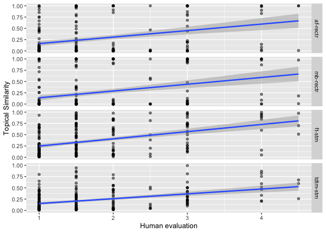
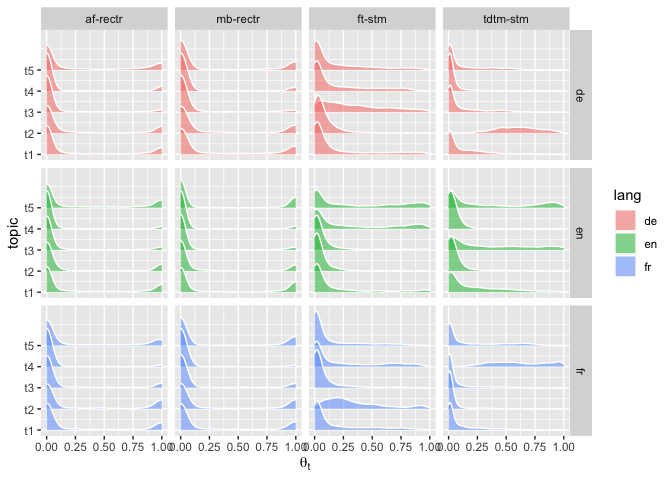
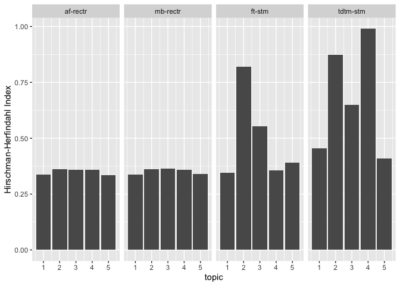
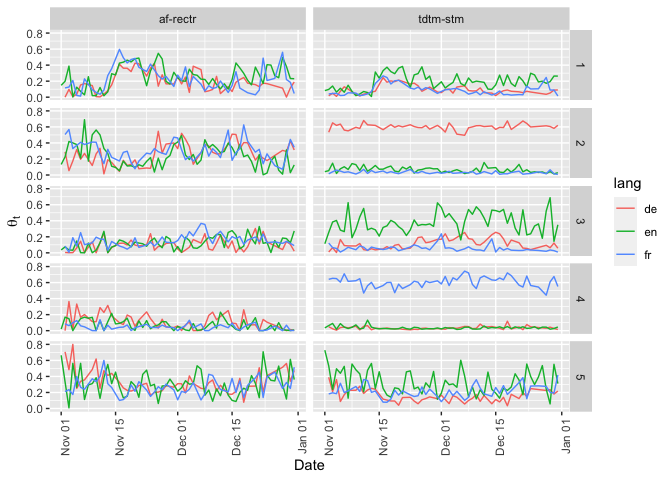

Reproducing the analyses in the paper
================

Due to copyright reasons, we cannot bundle the full text of New York
Times, Süddeutsche Zeitung and Le Fegaro news articles in this package.

The first few rows of the data look like so.

``` r
require(rectr)
require(tibble)
require(dplyr)
require(quanteda)
readRDS("final_data_endefr.RDS")
```

    ## # A tibble: 3,391 x 10
    ##    path  id    pubdate headline lede  body  lang  content    nt tokenized_conte…
    ##    <chr> <chr> <chr>   <chr>    <chr> <chr> <chr> <chr>   <int> <list>          
    ##  1 ./pa… arti… 2 Nove… "Maladi… "Ave… "Dan… FR    "Avec …  1026 <chr [1,138]>   
    ##  2 ./pa… arti… 2 Nove… "« Cela… "LE … "Pat… FR    "LE FI…   734 <chr [820]>     
    ##  3 ./pa… arti… 2 Nove… "L'Iran… "L'a… "de … FR    "L'anc…   984 <chr [1,081]>   
    ##  4 ./pa… arti… 2 Nove… "Matthi… "Le … "Mat… FR    "Le pr…  1077 <chr [1,213]>   
    ##  5 ./pa… arti… 2 Nove… "Les 31… "Lan… "EUR… FR    "Lancé…  1012 <chr [1,115]>   
    ##  6 ./pa… arti… 2 Nove… "Genera… "Apr… "À l… FR    "Après…   800 <chr [874]>     
    ##  7 ./pa… arti… 2 Nove… "La dis… "Seu… "Les… FR    "Seul …  1171 <chr [1,318]>   
    ##  8 ./pa… arti… 2 Nove… "Les ca… "Ils… "Ce … FR    "Ils d…   552 <chr [612]>     
    ##  9 ./pa… arti… 2 Nove… "Le pré… "FRA… "À l… FR    "FRANÇ…   506 <chr [589]>     
    ## 10 ./pa… arti… 2 Nove… "La nui… "  Ç… "Au … FR    "  ÇA …   516 <chr [552]>     
    ## # … with 3,381 more rows

The content column has the content of the news articles. For the rectr
method, a processed version of the corpus and dfm is available in this
package. The data was generated using the following code.

``` r
require(rectr)
require(tibble)
require(dplyr)
require(quanteda)

readRDS("final_data_endefr.RDS") %>% mutate(content = paste(lede, body), lang = tolower(lang), id = row_number()) %>% select(content, lang, pubdate, headline, id) -> paris
```

``` r
get_ft("fr")
get_ft("de")
get_ft("en")
```

``` r
emb <- read_ft(c("fr", "de", "en"))
paris_corpus <- create_corpus(paris$content, paris$lang)
paris_dfm <- transform_dfm_boe(paris_corpus, emb)
docvars(paris_corpus, "headline") <- paris$headline
docvars(paris_corpus, "pubdate") <- paris$pubdate
docvars(paris_corpus, "id") <- paris$id
usethis::use_data(paris_dfm, overwrite = TRUE)

paris_dfm_bert <- transform_dfm_boe(paris_corpus, mode = "bert", noise = TRUE)
usethis::use_data(paris_dfm_bert, overwrite = TRUE)


## Delete all text content, sorry, researchers!

paris_corpus[1:3391] <- NA
usethis::use_data(paris_corpus, overwrite = TRUE)
```

Again, due to copyright reasons, we cannot provide the full text and the
version translated by Google (using the DTM translation method by Reber
2019). The DTM (in STM) is available in this package. It was created
using this code. v

``` r
require(tidyverse)
require(googleLanguageR)
require(stm)
require(quanteda)

textdata <- readRDS("final_data_endefr.RDS") %>% mutate(content = paste(lede, body), lang = tolower(lang), id = row_number()) %>% select(content, lang, pubdate, headline, id)

textdata %>% filter(lang != "en") -> FR_DE_content

## Please insert your google token here. Uncomment if needed.
gl_auth("")

glx <- function(content, source) {
    print(substr(content, 1, 30))
    Sys.sleep(sample(1:5))
    res <- gl_translate(content, source, target = "en", format = 'text')
    print(substr(res$translatedText, 1, 30))
    return(res)
}

FR_DE_trans <- map2(FR_DE_content$content, FR_DE_content$lang, safely(glx))

dead <- map_lgl(map(FR_DE_trans, "error"), Negate(is.null))

FR_DE_trans2 <- map2(substr(FR_DE$content[dead], 1, 20000), FR_DE$lang[dead], safely(glx))

FR_DE_trans[dead] <- FR_DE_trans2

## saveRDS(FR_DE_trans, "FR_DE_trains.RDS")

## ## reassumble

FR_DE_trans %>% map_chr(~.$result$translatedText) -> translated_content

textdata$google_translate <- textdata$content

textdata$google_translate[textdata$lang == "fr"] <- translated_content[FR_DE_content$lang == "fr"]

textdata$google_translate[textdata$lang == "de"] <- translated_content[FR_DE_content$lang == "de"]

textdata %>% sample_n(20) %>% select(content, google_translate, lang)

## saveRDS(textdata, "paris_ft_translate.RDS")

####

## textdata <- readRDS("paris_ft_translate.RDS")

min_docfreq <- (nrow(textdata) * 0.005) %>% ceiling
max_docfreq <- (nrow(textdata) * 0.99) %>% ceiling

dfm(textdata$google_translate, tolower = TRUE, stem = TRUE, remove = stopwords("en"), remove_number = TRUE, remove_punct = TRUE) %>% dfm_trim(min_docfreq = min_docfreq, max_docfreq = max_docfreq) %>% convert(to = 'stm') -> paris_ft_dfm

usethis::use_data(paris_ft_dfm, overwrite = TRUE)

####### tdtm

textdata %>% filter(lang == "fr") %>% pull(content) -> FR_CONTENT
textdata %>% filter(lang == "de") %>% pull(content) -> DE_CONTENT
textdata %>% filter(lang == "en") %>% pull(content) -> EN_CONTENT
FR_DFM <- dfm(FR_CONTENT, remove = stopwords("fr"), remove_numbers = TRUE, remove_punct = TRUE) %>% dfm_trim(min_docfreq = 2)

FR_terms <- colnames(FR_DFM)


## ## Uncomment the following 3 lines if you want to do the google translation

## FR_trans_terms <- gl_translate(FR_terms, source = "fr")
## saveRDS(FR_trans_terms, "~/dev/infocrap/FR_trans_terms.RDS")
## saveRDS(FR_terms, "~/dev/infocrap/FR_terms.RDS")


DE_DFM <- dfm(DE_CONTENT, remove = stopwords("de"), , remove_numbers = TRUE, remove_punct = TRUE) %>% dfm_trim(min_docfreq = 2)

DE_terms <- colnames(DE_DFM)

## Uncomment the following 3 lines if you want to do the google translation

## DE_trans_terms <- gl_translate(DE_terms, source = "de")
## saveRDS(DE_trans_terms, "~/dev/infocrap/DE_trans_terms.RDS")
## saveRDS(DE_terms, "~/dev/infocrap/DE_terms.RDS")

DE_trans_terms <- readRDS("~/dev/infocrap/DE_trans_terms.RDS")
FR_trans_terms <- readRDS("~/dev/infocrap/FR_trans_terms.RDS")


FR_tokens <- tokens(FR_CONTENT, remove_numbers = TRUE, remove_punct = TRUE)

DE_tokens <- tokens(DE_CONTENT, remove_numbers = TRUE, remove_punct = TRUE)


recon <- function(token_obj, trans_terms) {
    tibble(text = tolower(token_obj)) %>% left_join(trans_terms, by = 'text') %>% filter(!is.na(translatedText)) %>% pull(translatedText) %>% paste(collapse = " ")
}

FR_recon_en_text <- map_chr(FR_tokens, recon, trans_terms = FR_trans_terms)

DE_recon_en_text <- map_chr(DE_tokens, recon, trans_terms = DE_trans_terms)

recon_complete_text <- c(FR_recon_en_text, EN_CONTENT, DE_recon_en_text)
textdata$translated_text <- recon_complete_text

min_docfreq <- (nrow(textdata) * 0.005) %>% ceiling
max_docfreq <- (nrow(textdata) * 0.99) %>% ceiling

dfm(textdata$translated_text, tolower = TRUE, stem = TRUE, remove = stopwords("en"), remove_number = TRUE, remove_punct = TRUE) %>% dfm_trim(min_docfreq = min_docfreq, max_docfreq = max_docfreq) %>% convert(to = 'stm') -> paris_tdtm_dfm

usethis::use_data(paris_tdtm_dfm, overwrite = TRUE)
```

# Actual reproduction

Reproduce the analyses in the paper.

Aligned fastText

``` r
require(rectr)
```

    ## Loading required package: rectr

``` r
require(tidyverse)
```

    ## Loading required package: tidyverse

    ## ── Attaching packages ────────────────────────────────── tidyverse 1.3.0 ──

    ## ✔ ggplot2 3.3.0     ✔ purrr   0.3.3
    ## ✔ tibble  3.0.1     ✔ dplyr   0.8.5
    ## ✔ tidyr   1.0.2     ✔ stringr 1.4.0
    ## ✔ readr   1.3.1     ✔ forcats 0.4.0

    ## ── Conflicts ───────────────────────────────────── tidyverse_conflicts() ──
    ## ✖ dplyr::filter() masks stats::filter()
    ## ✖ dplyr::lag()    masks stats::lag()

``` r
require(quanteda)
```

    ## Loading required package: quanteda

    ## Package version: 2.0.0

    ## Parallel computing: 2 of 4 threads used.

    ## See https://quanteda.io for tutorials and examples.

    ## 
    ## Attaching package: 'quanteda'

    ## The following object is masked from 'package:utils':
    ## 
    ##     View

``` r
###paris_corpus
```

``` r
paris_dfm
```

    ## dfm with a dimension of 3391 x 300 and fr/en/de language(s).
    ## 
    ## Aligned word embeddings: fasttext

``` r
paris_dfm_filtered <- filter_dfm(paris_dfm, k = 5, noise = TRUE)
```

    ## [1] "Select from: 5 th dimension."

``` r
paris_dfm_filtered
```

    ## dfm with a dimension of 3391 x 11 and fr/en/de language(s).
    ## Filtered with k =  5
    ## Aligned word embeddings: fasttext

``` r
paris_gmm <- calculate_gmm(paris_dfm_filtered, seed = 42)
paris_gmm
```

    ## 5-topic rectr model trained with a dfm with a dimension of 3391 x 11 and fr/en/de language(s).
    ## Filtered with k =  5
    ## Aligned word embeddings: fasttext

M-BERT

``` r
paris_dfm_bert
```

    ## dfm with a dimension of 3391 x 768 and fr/en/de language(s).
    ## 
    ## Aligned word embeddings: bert

``` r
paris_dfm_bert_filtered <- filter_dfm(paris_dfm_bert, k = 5, noise = TRUE)
```

    ## [1] "Select from: 4 th dimension."

``` r
paris_dfm_bert_filtered
```

    ## dfm with a dimension of 3391 x 11 and fr/en/de language(s).
    ## Filtered with k =  5
    ## Aligned word embeddings: bert

``` r
paris_gmm_bert <- calculate_gmm(paris_dfm_bert_filtered, seed = 42)
paris_gmm_bert
```

    ## 5-topic rectr model trained with a dfm with a dimension of 3391 x 11 and fr/en/de language(s).
    ## Filtered with k =  5
    ## Aligned word embeddings: bert

## Appendix I: af-rectr

``` r
get_sample <- function(i, paris_corpus, theta, threshold = 0.8, replace = FALSE) {
    tibble(hl = docvars(paris_corpus, "headline"), lang = docvars(paris_corpus, "lang"), prob = theta[,i]) %>% group_by(lang) %>% filter(prob > threshold) %>% sample_n(size = 5, weight = prob, replace = replace) %>% select(hl, lang, prob) %>% ungroup %>% arrange(lang, prob) %>% mutate(topic = i)
}

set.seed(42)
map_dfr(1:5, get_sample, paris_corpus, theta = paris_gmm$theta) %>% unique %>% print(n = 100) %>% knitr::kable()
```

# A tibble: 75 x 4

hl lang prob topic <chr> <chr> <dbl> <int> 1 “Nahost-Deutschland;
Hassparolen gegen Israel, Überfä… de 0.847 1 2”RAZZIA-FOTO; Ein Detail
zu viel" de 0.863 1 3 “Mehr Polizisten, aber keine Soldaten; Die
Kanzlerin … de 0.919 1 4”USA; Obamas Widerwille" de 0.987 1 5 “Die Spur
nach Belgien; In dem zerstrittenen Land tun… de 1.00 1 6”A Dutch ISIS
Fighter Is Taking Questions on Tumblr" en 0.973 1 7 “Geneva Raises Level
of Alert for Possible Terrorism … en 0.984 1 8”Anxiety Rising" en 0.989
1 9 “After the Carnage in Paris” en 0.997 1 10 “U.S. Defense Chief Prods
Gulf States to Take Larger … en 1.00 1 11”Filière djihadiste : les
écoutes qui écornent la fab… fr 0.899 1 12 “Les blessés, ces victimes
oubliées” fr 0.982 1 13 “Des textes sur le djihad, une arme… la mosquée
de … fr 0.999 1 14”Les ratés de l’antiterrorisme" fr 0.999 1 15 “Ces
djihadistes francophones que Daech fait passer à… fr 1.00 1
16”MINISTERERLAUBNIS; Haub lenkt, Gabriel denkt" de 0.827 2 17 “Das
kommt 2016; Viele neue Automodelle sind für das … de 0.859 2 18”Die
Bremser" de 0.999 2 19 “Flammender Alarm; Seit Jahrzehnten ist ein
Spanier d… de 1.00 2 20”Ab nach unten; Je länger die Weltgemeinschaft
mit CO… de 1.00 2 21 “Mennonite Farmers Are Leaving Mexico, and
Competitio… en 0.814 2 22”Amid Divisions, Optimism for a Climate Deal"
en 0.924 2 23 “The Tech Gods Giveth” en 0.938 2 24 “Period of Soaring
Emissions May Be Ending, New Data … en 1 2 25”Prices Drop as Supply of
Oil Soars Worldwide" en 1 2 26 “Budget : Juncker soutient Paris” fr
0.916 2 27 “« Paris doit marquer un véritable tournant »Ban Ki-m… fr
0.955 2 28”Laurent Poupart : « Nous allons au-delà du programme… fr 1.00
2 29 “Lignes rouges” fr 1.00 2 30 “Les passeurs d’une ambition” fr 1.00
2 31 “CSU-KREISRAT AUF FACEBOOK; Dresden lässt grüßen” de 0.879 3 32
“Trauma; In jeder Familie Europas steckt ein Stück Kr… de 0.931 3
33”Des Menschen Unfasslichkeit; Eberhard Straub hat ein… de 0.958 3 34
“Anschläge fachen deutsche Flüchtlingsdebatte an; Bay… de 0.998 3
35”Alle gegen rechts; Frankreichs Premier warnt vor Kri… de 1 3 36
“Nostalgia and Fear, Fueling Literature” en 0.863 3 37 “‘Enough Is
Enough,’ Obama Says After the Latest Outb… en 0.896 3 38”Washington Is
Next on Hollande Tour to Press Allies … en 0.984 3 39 “A Red State, but
Still an Uphill G.O.P. Bid” en 1.00 3 40 “National Front Stumbles in
French Elections” en 1.00 3 41 “Les Républicains anticipent un probable
recul de l’e… fr 0.869 3 42”La maire de Paris se rêve en Martine Aubry"
fr 1.00 3 43 “Valérie Pécresse :  « Bartolone, c’est l’homme d’un … fr
1.00 3 44”La droite s’indigne de la reconduction de Bartolone… fr 1.00 3
45 “Île-de-France : Pécresse confirme son avance” fr 1 3 46
“NAHAUFNAHME; Das Leben, eine Seifenoper; Der Unterne… de 0.929 4
47”Hans in Not; Vize-Generalsekretär des DFB steht wege… de 0.955 4 48
“Zlatans Einladung; Fußball-Narziss Ibrahimovic gasti… de 0.994 4
49”„Privatsache“; Entlastendes Platini-Dokument umstrit… de 1.00 4
50”PROFIL; Lassana Diarra; Französischer Fußballer, der… de 1.00 4 51
“As Carnage Unfolded Outside Stadium in France, Many … en 1.00 4
52”Gabon Advances in Qualifying" en 1 4 53 “Two Finals Entail Two
Surfaces for Murray” en 1 4 54 “Questions Begin After United Is Ousted”
en 1 4 55 “Guardiola Will Leave Bayern” en 1 4 56 “Une finale sous haute
sécurité” fr 1.00 4 57 “Fifa : le camp Platini dénonce un procès en
sorcelle… fr 1.00 4 58”Tavernost : « M6 ne veut pas se débarrasser des
Giro… fr 1.00 4 59 “Deux défis de choix pour les Bleus à Bercy” fr 1 4
60 “Pourquoi le PSG est favori pour sa belle avec Chelse… fr 1 4
61”Stille Anteilnahme in Gröbenzell; Bürgermeister Mart… de 0.809 5 62
“WIR HABEN VERSTANDEN” de 0.885 5 63 “München spendet Trost und Kraft”
de 0.911 5 64 “„. . . und sie töteten alle“; Während ihres Konzerte… de
0.941 5 65”Die Fahrende; Ilma Rakusa, die große Europäerin der … de
0.973 5 66 “Two Collectors Who Bought Early and Often” en 0.913 5 67
“Weaving the Entire Hall Into a Labyrinthine Plot” en 0.966 5 68 “A
Comic Book in the Company of Masterpieces” en 0.999 5 69 “Transported
Around the Globe and Across the Centurie… en 0.999 5 70”French Artists
Find a Way to Take Their Irreverence … en 1.00 5 71 “Talisman, une
familiale fort précieuse” fr 0.983 5 72 “CARNET DE ROUTE” fr 0.998 5 73
“Les maisons de ventes réestiment leur offre” fr 0.998 5 74 “La môme
noir et jaune” fr 1.00 5 75 “sortir du bois” fr 1.00 5

| hl                                                                                                                                                                                                                                                 | lang |      prob | topic |
| :------------------------------------------------------------------------------------------------------------------------------------------------------------------------------------------------------------------------------------------------- | :--- | --------: | ----: |
| Nahost-Deutschland; Hassparolen gegen Israel, Überfälle, Hunderttausende Flüchtlinge. Bei vielen Juden hierzulande wächst das Unbehagen. Andere versuchen, es zu überwinden: indem sie die Hand ausstrecken                                        | de   | 0.8467218 |     1 |
| RAZZIA-FOTO; Ein Detail zu viel                                                                                                                                                                                                                    | de   | 0.8627545 |     1 |
| Mehr Polizisten, aber keine Soldaten; Die Kanzlerin spricht sich gegen den Einsatz der Bundeswehr an den Grenzen oder im Inneren aus. CSU-Chef Seehofer stellt ihr eine Art Ultimatum                                                              | de   | 0.9194688 |     1 |
| USA; Obamas Widerwille                                                                                                                                                                                                                             | de   | 0.9869335 |     1 |
| Die Spur nach Belgien; In dem zerstrittenen Land tun sich Islamisten leicht                                                                                                                                                                        | de   | 0.9999945 |     1 |
| A Dutch ISIS Fighter Is Taking Questions on Tumblr                                                                                                                                                                                                 | en   | 0.9731653 |     1 |
| Geneva Raises Level of Alert for Possible Terrorism Suspects                                                                                                                                                                                       | en   | 0.9841812 |     1 |
| Anxiety Rising                                                                                                                                                                                                                                     | en   | 0.9886246 |     1 |
| After the Carnage in Paris                                                                                                                                                                                                                         | en   | 0.9974890 |     1 |
| U.S. Defense Chief Prods Gulf States to Take Larger Role in ISIS Fight                                                                                                                                                                             | en   | 0.9999916 |     1 |
| Filière djihadiste : les écoutes qui écornent la fable du « voyage humanitaire » en Syrie                                                                                                                                                          | fr   | 0.8988340 |     1 |
| Les blessés, ces victimes oubliées                                                                                                                                                                                                                 | fr   | 0.9820140 |     1 |
| Des textes sur le djihad, une arme… la mosquée de Lagny a été fermée                                                                                                                                                                               | fr   | 0.9993576 |     1 |
| Les ratés de l’antiterrorisme                                                                                                                                                                                                                      | fr   | 0.9993687 |     1 |
| Ces djihadistes francophones que Daech fait passer à l’action                                                                                                                                                                                      | fr   | 0.9999859 |     1 |
| MINISTERERLAUBNIS; Haub lenkt, Gabriel denkt                                                                                                                                                                                                       | de   | 0.8272261 |     2 |
| Das kommt 2016; Viele neue Automodelle sind für das kommende Jahr angekündigt, mit neuem Design und neuen Motoren. Doch der fällige Paradigmenwechsel mit Digitalisierung und alternativen Antrieben kommt nur mühsam voran                        | de   | 0.8593853 |     2 |
| Die Bremser                                                                                                                                                                                                                                        | de   | 0.9994640 |     2 |
| Flammender Alarm; Seit Jahrzehnten ist ein Spanier dem CO\&sub2; auf der Spur                                                                                                                                                                      | de   | 0.9997924 |     2 |
| Ab nach unten; Je länger die Weltgemeinschaft mit CO\&sub2;-Einsparungen wartet, desto mehr werden riskante Technologien wie das Verpressen des Gases im Erdboden notwendig. In Kanada wird das sogenannte CCS bereits seit einem Jahr praktiziert | de   | 1.0000000 |     2 |
| Mennonite Farmers Are Leaving Mexico, and Competition for Water                                                                                                                                                                                    | en   | 0.8141381 |     2 |
| Amid Divisions, Optimism for a Climate Deal                                                                                                                                                                                                        | en   | 0.9238586 |     2 |
| The Tech Gods Giveth                                                                                                                                                                                                                               | en   | 0.9375669 |     2 |
| Period of Soaring Emissions May Be Ending, New Data Suggest                                                                                                                                                                                        | en   | 1.0000000 |     2 |
| Prices Drop as Supply of Oil Soars Worldwide                                                                                                                                                                                                       | en   | 1.0000000 |     2 |
| Budget : Juncker soutient Paris                                                                                                                                                                                                                    | fr   | 0.9161532 |     2 |
| « Paris doit marquer un véritable tournant »Ban Ki-moon, secrétaire général de l’ONU                                                                                                                                                               | fr   | 0.9553366 |     2 |
| Laurent Poupart : « Nous allons au-delà du programme »                                                                                                                                                                                             | fr   | 0.9995824 |     2 |
| Lignes rouges                                                                                                                                                                                                                                      | fr   | 0.9998661 |     2 |
| Les passeurs d’une ambition                                                                                                                                                                                                                        | fr   | 0.9999600 |     2 |
| CSU-KREISRAT AUF FACEBOOK; Dresden lässt grüßen                                                                                                                                                                                                    | de   | 0.8791590 |     3 |
| Trauma; In jeder Familie Europas steckt ein Stück Krieg. Wer dem Terror mit militärischer Gewalt begegnen will, sollte das bedenken                                                                                                                | de   | 0.9314684 |     3 |
| Des Menschen Unfasslichkeit; Eberhard Straub hat ein fulminantes, ganz eigenes Lob der Großstadt geschrieben                                                                                                                                       | de   | 0.9584004 |     3 |
| Anschläge fachen deutsche Flüchtlingsdebatte an; Bayerns Ministerpräsident Seehofer weist seinen Finanzminister zurecht, der die Kanzlerin kritisiert hatte                                                                                        | de   | 0.9977269 |     3 |
| Alle gegen rechts; Frankreichs Premier warnt vor Krieg, sollte der Front National am Sonntag siegen                                                                                                                                                | de   | 1.0000000 |     3 |
| Nostalgia and Fear, Fueling Literature                                                                                                                                                                                                             | en   | 0.8633276 |     3 |
| ‘Enough Is Enough,’ Obama Says After the Latest Outbreak of Gun Violence                                                                                                                                                                           | en   | 0.8958025 |     3 |
| Washington Is Next on Hollande Tour to Press Allies for Anti-ISIS Coalition                                                                                                                                                                        | en   | 0.9843197 |     3 |
| A Red State, but Still an Uphill G.O.P. Bid                                                                                                                                                                                                        | en   | 0.9998688 |     3 |
| National Front Stumbles in French Elections                                                                                                                                                                                                        | en   | 1.0000000 |     3 |
| Les Républicains anticipent un probable recul de l’exécutif                                                                                                                                                                                        | fr   | 0.8688631 |     3 |
| La maire de Paris se rêve en Martine Aubry                                                                                                                                                                                                         | fr   | 0.9999999 |     3 |
| Valérie Pécresse :  « Bartolone, c’est l’homme d’un clan »                                                                                                                                                                                         | fr   | 0.9999999 |     3 |
| La droite s’indigne de la reconduction de Bartolone                                                                                                                                                                                                | fr   | 1.0000000 |     3 |
| Île-de-France : Pécresse confirme son avance                                                                                                                                                                                                       | fr   | 1.0000000 |     3 |
| NAHAUFNAHME; Das Leben, eine Seifenoper; Der Unternehmer Tapie muss 404 Millionen Euro zurückzahlen                                                                                                                                                | de   | 0.9286273 |     4 |
| Hans in Not; Vize-Generalsekretär des DFB steht wegen Warner-Papier vor Rauswurf                                                                                                                                                                   | de   | 0.9550595 |     4 |
| Zlatans Einladung; Fußball-Narziss Ibrahimovic gastiert mit Paris in Malmö, wo seine Saga Fahrt aufnahm – als Ehrerweisung bittet er seine Heimatstadt zum Public-Viewing-Fest                                                                     | de   | 0.9941369 |     4 |
| „Privatsache“; Entlastendes Platini-Dokument umstritten                                                                                                                                                                                            | de   | 0.9999995 |     4 |
| PROFIL; Lassana Diarra; Französischer Fußballer, der trotz Trauer spielt                                                                                                                                                                           | de   | 0.9999999 |     4 |
| As Carnage Unfolded Outside Stadium in France, Many Inside Were Unaware                                                                                                                                                                            | en   | 0.9999998 |     4 |
| Gabon Advances in Qualifying                                                                                                                                                                                                                       | en   | 1.0000000 |     4 |
| Two Finals Entail Two Surfaces for Murray                                                                                                                                                                                                          | en   | 1.0000000 |     4 |
| Questions Begin After United Is Ousted                                                                                                                                                                                                             | en   | 1.0000000 |     4 |
| Guardiola Will Leave Bayern                                                                                                                                                                                                                        | en   | 1.0000000 |     4 |
| Une finale sous haute sécurité                                                                                                                                                                                                                     | fr   | 0.9998764 |     4 |
| Fifa : le camp Platini dénonce un procès en sorcellerie                                                                                                                                                                                            | fr   | 0.9999911 |     4 |
| Tavernost : « M6 ne veut pas se débarrasser des Girondins »                                                                                                                                                                                        | fr   | 1.0000000 |     4 |
| Deux défis de choix pour les Bleus à Bercy                                                                                                                                                                                                         | fr   | 1.0000000 |     4 |
| Pourquoi le PSG est favori pour sa belle avec Chelsea                                                                                                                                                                                              | fr   | 1.0000000 |     4 |
| Stille Anteilnahme in Gröbenzell; Bürgermeister Martin Schäfer ruft zum Gedenken auf                                                                                                                                                               | de   | 0.8088448 |     5 |
| WIR HABEN VERSTANDEN                                                                                                                                                                                                                               | de   | 0.8851124 |     5 |
| München spendet Trost und Kraft                                                                                                                                                                                                                    | de   | 0.9114834 |     5 |
| „. . . und sie töteten alle“; Während ihres Konzertes in Paris starben 89 Menschen durch die Gewalt der Terroristen – jetzt geben die „Eagles of Death Metal“ ihr erstes Interview                                                                 | de   | 0.9411118 |     5 |
| Die Fahrende; Ilma Rakusa, die große Europäerin der Literatur, wird 70                                                                                                                                                                             | de   | 0.9726919 |     5 |
| Two Collectors Who Bought Early and Often                                                                                                                                                                                                          | en   | 0.9131227 |     5 |
| Weaving the Entire Hall Into a Labyrinthine Plot                                                                                                                                                                                                   | en   | 0.9655126 |     5 |
| A Comic Book in the Company of Masterpieces                                                                                                                                                                                                        | en   | 0.9991288 |     5 |
| Transported Around the Globe and Across the Centuries                                                                                                                                                                                              | en   | 0.9993302 |     5 |
| French Artists Find a Way to Take Their Irreverence to the Grave                                                                                                                                                                                   | en   | 0.9998562 |     5 |
| Talisman, une familiale fort précieuse                                                                                                                                                                                                             | fr   | 0.9833587 |     5 |
| CARNET DE ROUTE                                                                                                                                                                                                                                    | fr   | 0.9983037 |     5 |
| Les maisons de ventes réestiment leur offre                                                                                                                                                                                                        | fr   | 0.9984842 |     5 |
| La môme noir et jaune                                                                                                                                                                                                                              | fr   | 0.9996981 |     5 |
| sortir du bois                                                                                                                                                                                                                                     | fr   | 0.9999969 |     5 |

## Appendix I: mb-rectr

``` r
set.seed(42)
map_dfr(1:5, get_sample, paris_corpus, theta = paris_gmm_bert$theta) %>% unique %>% print(n = 100) %>% knitr::kable()
```

# A tibble: 75 x 4

hl lang prob topic <chr> <chr> <dbl> <int> 1 “Klartextabend; Grafings
Bürgermeisterin spricht Prob… de 0.867 1 2”Stadt der Zukunft; Stell dir
vor, es ist Krieg, und … de 0.881 1 3 “FLÜCHTLINGSKRIMINALITÄT; Vorsicht
vor Unvorsicht” de 0.930 1 4 “INLAND; Slowakei klagt wegen
Flüchtlingsquote” de 0.989 1 5 “Israel rät Europa zu Reformen;
Sicherheit müsse Vorr… de 1.00 1 6”Clinton Takes on ISIS" en 0.980 1 7
“Reigniting the Debate Over Civil Liberties vs. Natio… en 0.989 1
8”Kremlin Cutting Economic Links With the Turks" en 0.996 1 9
“France’s War Within” en 0.999 1 10 “Holes in Saudis’ Antiterrorism
Plan” en 1.00 1 11 “Suicide d’un médecin à l’hôpital Pompidou” fr 0.916
1 12 “Samy Amimour et sa fiancée” fr 0.990 1 13 “Dans l’Hérault, l’imam
Khattabi assigné à résidence… fr 1.00 1 14”Combattre ensemble" fr 1.00 1
15 “Les avions français « protégés » par une entente ave… fr 1.00 1
16”Rappen gegen Rechtsextremismus; Schulprojekttag „Mix… de 0.847 2 17
“Ein Klima, zwei Welten; Vor allem die Wirtschaft poc… de 0.895 2 18”DIE
NÄCHSTEN TAGE; Tutzing" de 0.995 2 19 “Die Hauptangeklagte; Der Kohle
wird die größte Schul… de 0.999 2 20”Billig kauft teuer; Die
französische Accor-Gruppe üb… de 1.00 2 21 “Face-Lift for a Fifth
Avenue Legend” en 0.849 2 22 “Economic Fallout of Paris Attacks Hits
Tourism, and … en 0.915 2 23”Taking a Rational Look at the Risk of
Threats" en 0.933 2 24 “India, Facing Climate Change, Also Desperately
Needs… en 1.00 2 25”Ripples Far From the Fed" en 1.00 2 26 “Pluie
d’éloges pour Borloo à l’Assemblée” fr 0.918 2 27 “À Bercy, il n’y a
pas de petites économies…” fr 0.973 2 28 “Certains dentistes facturent
des dépassements d’hono… fr 1.00 2 29”L’INTELLIGENCE ARTIFICIELLE POUR
UN RÉSEAU PLUS MALI… fr 1.00 2 30 “Concours, mode d’emploi” fr 1.00 2 31
“„Der Ministerpräsident hat das letzte Wort. Punkt“; … de 0.878 3
32”Singular; Wer sich gegen den Terror wehrt und sich d… de 0.921 3 33
“„Menschlichkeit kennt keine Grenzen“; Friedrich Maie… de 0.937 3
34”Große Sorgen, kurze Sätze; In Berlin und Brüssel wäc… de 0.990 3
35 “Alle gegen rechts; Frankreichs Premier warnt vor Kri… de 1.00 3
36”Parties Split on Response but United Behind France" en 0.879 3 37
“Root Cause” en 0.932 3 38 “For E.U., Things Can Get Worse” en 0.987 3
39 “Let My People Vote” en 1.00 3 40 “National Front Stumbles in French
Elections” en 1.00 3 41 “La France mûre pour un régime autoritaire ?” fr
0.849 3 42 “La France aux urnes, trois semaines après les attent… fr
1.00 3 43”Claude Bartolone dans le piège de Terra Nova" fr 1.00 3 44
“Face à la menace FN,   la droite reporte les hostili… fr 1.00 3
45”Île-de-France : la nouvelle stratégie du FN" fr 1.00 3 46 “Benzema
und die Piranhas; Vor dem Test gegen Deutsch… de 0.887 4 47”Sieg für
München; Polizei lobt disziplinierte Fans b… de 0.951 4 48 “„Ich bin
nicht mehr das schüchterne Mädchen“; Deutsc… de 0.985 4 49”Auge in Auge,
Rad an Rad; Der Einstieg von Max Verst… de 1.00 4 50 “EM ohne Benzema;
Konsequenz aus Affäre um Sex-Video… de 1.00 4 51”Attacks Prompt a Review
of Security at Stadiums" en 1.00 4 52 “Second Chance for Healthier
Steelers” en 1 4 53 “Chelsea Tumbles Toward Relegation Zone” en 1 4 54
“Live and Kicking: Soccer Games to Watch” en 1 4 55 “Spain and France
Get Favorable Draws” en 1 4 56 “Le match de football Angleterre-France
maintenu mard… fr 1.00 4 57”Meurtris, les Bleus joueront pour la France
et les v… fr 1.00 4 58 “De Kopa à Griezmann : la liste des bannis est
longue… fr 1.00 4 59”Cruelle désillusion pour le PSG à Madrid" fr 1 4 60
“Quels adversaires pour l’équipe de France de Didier … fr 1 4 61”Der
Zwist der Götter und die Ruhe; René Girard, der … de 0.818 5 62 “Stört
die Kunst nur? Münchner Literaturfest in Zeite… de 0.945 5 63”Im
Tanzfieber; Bald schon könnte Bruck um ein Großev… de 0.977 5 64 “Der
kleine Ozean; Schaukasten, Spielzeug, Designobje… de 0.988 5
65”Revolution niemals im Schlabberlook\! Die französisch… de 0.997 5
66 “Memories by the Spoonful” en 0.971 5 67 “Benjamin Clementine Wins
2015 Mercury Prize” en 0.996 5 68 “Faction” en 1.00 5 69 “Disparate City
Lives, Converging” en 1.00 5 70 “Film; A Collector of All Kinds” en 1.00
5 71 “« Francofonia », avis de tempête au Louvre” fr 0.998 5 72 “Beckett
sans attendre” fr 1.00 5 73 “Valadon, Utrillo et Utter au bal des
maudits” fr 1.00 5 74 “« Lee »” fr 1.00 5 75 "UNE SÉLECTION D’ALBUMS ET
DE ROMANS POUR LES ENFANTS… fr 1.00 5

| hl                                                                                                                                                                                                                                                                                                                                       | lang |      prob | topic |
| :--------------------------------------------------------------------------------------------------------------------------------------------------------------------------------------------------------------------------------------------------------------------------------------------------------------------------------------- | :--- | --------: | ----: |
| Klartextabend; Grafings Bürgermeisterin spricht Probleme offen an                                                                                                                                                                                                                                                                        | de   | 0.8671436 |     1 |
| Stadt der Zukunft; Stell dir vor, es ist Krieg, und alle gehen hin. 130 Terrortote bekommen Blumen, 147 Staatschefs bekommen Sicherheit. Tage in Paris, zwischen Trauer, Kampf und Klimakonferenz                                                                                                                                        | de   | 0.8807854 |     1 |
| FLÜCHTLINGSKRIMINALITÄT; Vorsicht vor Unvorsicht                                                                                                                                                                                                                                                                                         | de   | 0.9302856 |     1 |
| INLAND; Slowakei klagt wegen Flüchtlingsquote                                                                                                                                                                                                                                                                                            | de   | 0.9886456 |     1 |
| Israel rät Europa zu Reformen; Sicherheit müsse Vorrang vor Menschenrechten haben                                                                                                                                                                                                                                                        | de   | 0.9999653 |     1 |
| Clinton Takes on ISIS                                                                                                                                                                                                                                                                                                                    | en   | 0.9804936 |     1 |
| Reigniting the Debate Over Civil Liberties vs. National Security                                                                                                                                                                                                                                                                         | en   | 0.9893892 |     1 |
| Kremlin Cutting Economic Links With the Turks                                                                                                                                                                                                                                                                                            | en   | 0.9962721 |     1 |
| France’s War Within                                                                                                                                                                                                                                                                                                                      | en   | 0.9993071 |     1 |
| Holes in Saudis’ Antiterrorism Plan                                                                                                                                                                                                                                                                                                      | en   | 1.0000000 |     1 |
| Suicide d’un médecin à l’hôpital Pompidou                                                                                                                                                                                                                                                                                                | fr   | 0.9155294 |     1 |
| Samy Amimour et sa fiancée                                                                                                                                                                                                                                                                                                               | fr   | 0.9904989 |     1 |
| Dans l’Hérault, l’imam Khattabi assigné à résidence                                                                                                                                                                                                                                                                                      | fr   | 0.9998046 |     1 |
| Combattre ensemble                                                                                                                                                                                                                                                                                                                       | fr   | 0.9998117 |     1 |
| Les avions français « protégés » par une entente avec les pays de la région                                                                                                                                                                                                                                                              | fr   | 0.9999985 |     1 |
| Rappen gegen Rechtsextremismus; Schulprojekttag „Mixtape“ soll die demokratische Haltung an Mittelschulen stärken                                                                                                                                                                                                                        | de   | 0.8466044 |     2 |
| Ein Klima, zwei Welten; Vor allem die Wirtschaft pocht darauf, dass in Paris gleiche Regeln für alle gelten. Vielen Staaten ist das gar nicht recht                                                                                                                                                                                      | de   | 0.8948967 |     2 |
| DIE NÄCHSTEN TAGE; Tutzing                                                                                                                                                                                                                                                                                                               | de   | 0.9952515 |     2 |
| Die Hauptangeklagte; Der Kohle wird die größte Schuld an der Luftverschmutzung zugewiesen. Was sie für Europas wirtschaftlichen und politischen Aufstieg bedeutet hat, gerät darüber fast in Vergessenheit                                                                                                                               | de   | 0.9985859 |     2 |
| Billig kauft teuer; Die französische Accor-Gruppe übernimmt überraschend den Betreiber der Luxus-Hotels Raffles und Fairmont. Die Franzosen wollen sich dadurch dem Preisdruck im Internet entziehen                                                                                                                                     | de   | 0.9999998 |     2 |
| Face-Lift for a Fifth Avenue Legend                                                                                                                                                                                                                                                                                                      | en   | 0.8490703 |     2 |
| Economic Fallout of Paris Attacks Hits Tourism, and Hotels, Hard                                                                                                                                                                                                                                                                         | en   | 0.9154682 |     2 |
| Taking a Rational Look at the Risk of Threats                                                                                                                                                                                                                                                                                            | en   | 0.9332643 |     2 |
| India, Facing Climate Change, Also Desperately Needs More Energy                                                                                                                                                                                                                                                                         | en   | 1.0000000 |     2 |
| Ripples Far From the Fed                                                                                                                                                                                                                                                                                                                 | en   | 1.0000000 |     2 |
| Pluie d’éloges pour Borloo à l’Assemblée                                                                                                                                                                                                                                                                                                 | fr   | 0.9176856 |     2 |
| À Bercy, il n’y a pas de petites économies…                                                                                                                                                                                                                                                                                              | fr   | 0.9732604 |     2 |
| Certains dentistes facturent des dépassements d’honoraires illégaux                                                                                                                                                                                                                                                                      | fr   | 0.9996364 |     2 |
| L’INTELLIGENCE ARTIFICIELLE POUR UN RÉSEAU PLUS MALIN                                                                                                                                                                                                                                                                                    | fr   | 0.9999100 |     2 |
| Concours, mode d’emploi                                                                                                                                                                                                                                                                                                                  | fr   | 0.9999689 |     2 |
| „Der Ministerpräsident hat das letzte Wort. Punkt“; Seehofer gegen Söder, Folge 100. Diesmal: Der Regierungschef ist sauer, weil sein Finanzminister in einem Interview die Flüchtlingskrise mit dem Terror in Paris vermengt. Dieser sagt, er akzeptiere selbstverständlich den Führungsanspruch seines Chefs – und redet munter weiter | de   | 0.8777505 |     3 |
| Singular; Wer sich gegen den Terror wehrt und sich dabei lediglich dem autoritären Zerrbild derer anpasst, die ihn angegriffen haben, der hat schon verloren                                                                                                                                                                             | de   | 0.9211691 |     3 |
| „Menschlichkeit kennt keine Grenzen“; Friedrich Maier beschäftigt sich mit der Philosophie der Antike. Im SZ-Interview spricht der Puchheimer Professor über die Entwicklung der europäischen Werte und über die daraus resultierende Verpflichtung, in der Flüchtlingskrise die Humanität nicht zu vergessen                            | de   | 0.9368497 |     3 |
| Große Sorgen, kurze Sätze; In Berlin und Brüssel wächst die Unruhe über die EU-Feinde                                                                                                                                                                                                                                                    | de   | 0.9899040 |     3 |
| Alle gegen rechts; Frankreichs Premier warnt vor Krieg, sollte der Front National am Sonntag siegen                                                                                                                                                                                                                                      | de   | 1.0000000 |     3 |
| Parties Split on Response but United Behind France                                                                                                                                                                                                                                                                                       | en   | 0.8786609 |     3 |
| Root Cause                                                                                                                                                                                                                                                                                                                               | en   | 0.9317143 |     3 |
| For E.U., Things Can Get Worse                                                                                                                                                                                                                                                                                                           | en   | 0.9869267 |     3 |
| Let My People Vote                                                                                                                                                                                                                                                                                                                       | en   | 0.9997346 |     3 |
| National Front Stumbles in French Elections                                                                                                                                                                                                                                                                                              | en   | 1.0000000 |     3 |
| La France mûre pour un régime autoritaire ?                                                                                                                                                                                                                                                                                              | fr   | 0.8492459 |     3 |
| La France aux urnes, trois semaines après les attentats                                                                                                                                                                                                                                                                                  | fr   | 0.9999991 |     3 |
| Claude Bartolone dans le piège de Terra Nova                                                                                                                                                                                                                                                                                             | fr   | 0.9999994 |     3 |
| Face à la menace FN,   la droite reporte les hostilités                                                                                                                                                                                                                                                                                  | fr   | 0.9999998 |     3 |
| Île-de-France : la nouvelle stratégie du FN                                                                                                                                                                                                                                                                                              | fr   | 1.0000000 |     3 |
| Benzema und die Piranhas; Vor dem Test gegen Deutschland erschüttert die Erpressungs-Geschichte um Nationalspieler Mathieu Valbuena Frankreichs Fußball. Wie Trainer Deschamps die mühsam hergestellte Harmonie retten kann, ist unklar                                                                                                  | de   | 0.8866881 |     4 |
| Sieg für München; Polizei lobt disziplinierte Fans bei Regionalligaderby in Giesing                                                                                                                                                                                                                                                      | de   | 0.9514969 |     4 |
| „Ich bin nicht mehr das schüchterne Mädchen“; Deutschlands beste Spielerin Angelique Kerber über ihre Rolle im Welttennis, ihre zweite Heimat Polen und Steffi Graf                                                                                                                                                                      | de   | 0.9852110 |     4 |
| Auge in Auge, Rad an Rad; Der Einstieg von Max Verstappen mit 17 in die Formel 1 wurde von vielen kritisch beäugt – nach seiner Debüt-Saison wird er mit Auszeichnungen überhäuft                                                                                                                                                        | de   | 0.9999967 |     4 |
| EM ohne Benzema; Konsequenz aus Affäre um Sex-Video                                                                                                                                                                                                                                                                                      | de   | 0.9999981 |     4 |
| Attacks Prompt a Review of Security at Stadiums                                                                                                                                                                                                                                                                                          | en   | 0.9999163 |     4 |
| Second Chance for Healthier Steelers                                                                                                                                                                                                                                                                                                     | en   | 1.0000000 |     4 |
| Chelsea Tumbles Toward Relegation Zone                                                                                                                                                                                                                                                                                                   | en   | 1.0000000 |     4 |
| Live and Kicking: Soccer Games to Watch                                                                                                                                                                                                                                                                                                  | en   | 1.0000000 |     4 |
| Spain and France Get Favorable Draws                                                                                                                                                                                                                                                                                                     | en   | 1.0000000 |     4 |
| Le match de football Angleterre-France maintenu mardi à Londres                                                                                                                                                                                                                                                                          | fr   | 0.9999974 |     4 |
| Meurtris, les Bleus joueront pour la France et les victimes                                                                                                                                                                                                                                                                              | fr   | 0.9999999 |     4 |
| De Kopa à Griezmann : la liste des bannis est longue                                                                                                                                                                                                                                                                                     | fr   | 1.0000000 |     4 |
| Cruelle désillusion pour le PSG à Madrid                                                                                                                                                                                                                                                                                                 | fr   | 1.0000000 |     4 |
| Quels adversaires pour l’équipe de France de Didier Deschamps ?                                                                                                                                                                                                                                                                          | fr   | 1.0000000 |     4 |
| Der Zwist der Götter und die Ruhe; René Girard, der religiös inspirierte Gegenspieler der Strukturalisten, ist tot                                                                                                                                                                                                                       | de   | 0.8175933 |     5 |
| Stört die Kunst nur? Münchner Literaturfest in Zeiten der Anschläge und der Flucht                                                                                                                                                                                                                                                       | de   | 0.9452833 |     5 |
| Im Tanzfieber; Bald schon könnte Bruck um ein Großevent reicher sein                                                                                                                                                                                                                                                                     | de   | 0.9768281 |     5 |
| Der kleine Ozean; Schaukasten, Spielzeug, Designobjekt: Das Aquarium war immer eine Welt für sich. Heute muss es besonders edel sein                                                                                                                                                                                                     | de   | 0.9875779 |     5 |
| Revolution niemals im Schlabberlook\! Die französische „Elle“ wird 70 – ein Magazin, das für Frauenrechte kämpfte, Françoise Sagan verteidigte und eine Debütantin namens Brigitte Bardot groß herausbrachte                                                                                                                             | de   | 0.9966340 |     5 |
| Memories by the Spoonful                                                                                                                                                                                                                                                                                                                 | en   | 0.9708322 |     5 |
| Benjamin Clementine Wins 2015 Mercury Prize                                                                                                                                                                                                                                                                                              | en   | 0.9959807 |     5 |
| Faction                                                                                                                                                                                                                                                                                                                                  | en   | 0.9999979 |     5 |
| Disparate City Lives, Converging                                                                                                                                                                                                                                                                                                         | en   | 0.9999994 |     5 |
| Film; A Collector of All Kinds                                                                                                                                                                                                                                                                                                           | en   | 0.9999999 |     5 |
| « Francofonia », avis de tempête au Louvre                                                                                                                                                                                                                                                                                               | fr   | 0.9977770 |     5 |
| Beckett sans attendre                                                                                                                                                                                                                                                                                                                    | fr   | 0.9998344 |     5 |
| Valadon, Utrillo et Utter au bal des maudits                                                                                                                                                                                                                                                                                             | fr   | 0.9998749 |     5 |
| « Lee »                                                                                                                                                                                                                                                                                                                                  | fr   | 0.9999599 |     5 |
| UNE SÉLECTION D’ALBUMS ET DE ROMANS POUR LES ENFANTS                                                                                                                                                                                                                                                                                     | fr   | 0.9999995 |     5 |

## Appendix III: tdtm-stm

``` r
require(stm)
```

    ## Loading required package: stm

    ## stm v1.3.5 successfully loaded. See ?stm for help. 
    ##  Papers, resources, and other materials at structuraltopicmodel.com

``` r
set.seed(42)
translated_stm <- stm(paris_tdtm_dfm$documents, paris_tdtm_dfm$vocab, K = 5)
```

Beginning Spectral Initialization Calculating the gram matrix… Finding
anchor words… ….. Recovering initialization… ………………………………………………….
Initialization complete. ………………………………………………………………………………………… Completed
E-Step (1 seconds). Completed M-Step. Completing Iteration 1 (approx.
per word bound = -7.744) ………………………………………………………………………………………… Completed
E-Step (1 seconds). Completed M-Step. Completing Iteration 2 (approx.
per word bound = -7.584, relative change = 2.069e-02)
…………………………………………………………………………………………
Completed E-Step (1 seconds). Completed M-Step. Completing Iteration 3
(approx. per word bound = -7.549, relative change = 4.582e-03)
………………………………………………………………………………………… Completed E-Step
(1 seconds). Completed M-Step. Completing Iteration 4 (approx. per word
bound = -7.538, relative change = 1.449e-03)
…………………………………………………………………………………………
Completed E-Step (1 seconds). Completed M-Step. Completing Iteration 5
(approx. per word bound = -7.532, relative change = 8.097e-04) Topic 1:
pari, said, attack, french, franc Topic 2: year, time, first, say,
beauti Topic 3: said, state, mr, countri, islam Topic 4: year, pari,
also, franc, fact Topic 5: said, new, year, work, one
…………………………………………………………………………………………
Completed E-Step (1 seconds). Completed M-Step. Completing Iteration 6
(approx. per word bound = -7.527, relative change = 6.212e-04)
………………………………………………………………………………………… Completed E-Step
(1 seconds). Completed M-Step. Completing Iteration 7 (approx. per word
bound = -7.523, relative change = 4.937e-04)
…………………………………………………………………………………………
Completed E-Step (1 seconds). Completed M-Step. Completing Iteration 8
(approx. per word bound = -7.521, relative change = 3.754e-04)
………………………………………………………………………………………… Completed E-Step
(1 seconds). Completed M-Step. Completing Iteration 9 (approx. per word
bound = -7.518, relative change = 2.884e-04)
…………………………………………………………………………………………
Completed E-Step (1 seconds). Completed M-Step. Completing Iteration 10
(approx. per word bound = -7.517, relative change = 2.223e-04) Topic 1:
attack, said, pari, peopl, french Topic 2: year, time, first, say, give
Topic 3: state, said, mr, countri, unit Topic 4: year, franc, pari,
also, fact Topic 5: year, new, said, work, one
…………………………………………………………………………………………
Completed E-Step (1 seconds). Completed M-Step. Completing Iteration 11
(approx. per word bound = -7.515, relative change = 1.745e-04)
………………………………………………………………………………………… Completed E-Step
(1 seconds). Completed M-Step. Completing Iteration 12 (approx. per word
bound = -7.514, relative change = 1.396e-04)
…………………………………………………………………………………………
Completed E-Step (1 seconds). Completed M-Step. Completing Iteration 13
(approx. per word bound = -7.513, relative change = 1.132e-04)
………………………………………………………………………………………… Completed E-Step
(0 seconds). Completed M-Step. Completing Iteration 14 (approx. per word
bound = -7.513, relative change = 9.235e-05)
…………………………………………………………………………………………
Completed E-Step (1 seconds). Completed M-Step. Completing Iteration 15
(approx. per word bound = -7.512, relative change = 7.490e-05) Topic 1:
attack, said, pari, peopl, terrorist Topic 2: year, time, first, say,
give Topic 3: said, state, mr, countri, unit Topic 4: year, franc, also,
pari, fact Topic 5: year, new, said, work, one
…………………………………………………………………………………………
Completed E-Step (1 seconds). Completed M-Step. Completing Iteration 16
(approx. per word bound = -7.512, relative change = 6.078e-05)
………………………………………………………………………………………… Completed E-Step
(1 seconds). Completed M-Step. Completing Iteration 17 (approx. per word
bound = -7.511, relative change = 5.000e-05)
…………………………………………………………………………………………
Completed E-Step (1 seconds). Completed M-Step. Completing Iteration 18
(approx. per word bound = -7.511, relative change = 4.196e-05)
………………………………………………………………………………………… Completed E-Step
(1 seconds). Completed M-Step. Completing Iteration 19 (approx. per word
bound = -7.511, relative change = 3.579e-05)
…………………………………………………………………………………………
Completed E-Step (1 seconds). Completed M-Step. Completing Iteration 20
(approx. per word bound = -7.511, relative change = 3.095e-05) Topic 1:
attack, said, pari, peopl, terrorist Topic 2: year, time, first, say,
give Topic 3: said, mr, state, countri, unit Topic 4: year, franc, also,
pari, fact Topic 5: year, new, said, one, work
…………………………………………………………………………………………
Completed E-Step (1 seconds). Completed M-Step. Completing Iteration 21
(approx. per word bound = -7.510, relative change = 2.671e-05)
………………………………………………………………………………………… Completed E-Step
(1 seconds). Completed M-Step. Completing Iteration 22 (approx. per word
bound = -7.510, relative change = 2.327e-05)
…………………………………………………………………………………………
Completed E-Step (1 seconds). Completed M-Step. Completing Iteration 23
(approx. per word bound = -7.510, relative change = 2.045e-05)
………………………………………………………………………………………… Completed E-Step
(1 seconds). Completed M-Step. Completing Iteration 24 (approx. per word
bound = -7.510, relative change = 1.814e-05)
…………………………………………………………………………………………
Completed E-Step (1 seconds). Completed M-Step. Completing Iteration 25
(approx. per word bound = -7.510, relative change = 1.625e-05) Topic 1:
attack, said, islam, pari, terrorist Topic 2: year, time, first, say,
give Topic 3: mr, said, state, countri, unit Topic 4: year, franc, also,
pari, fact Topic 5: year, new, one, said, work
…………………………………………………………………………………………
Completed E-Step (1 seconds). Completed M-Step. Completing Iteration 26
(approx. per word bound = -7.510, relative change = 1.465e-05)
………………………………………………………………………………………… Completed E-Step
(1 seconds). Completed M-Step. Completing Iteration 27 (approx. per word
bound = -7.510, relative change = 1.345e-05)
…………………………………………………………………………………………
Completed E-Step (1 seconds). Completed M-Step. Completing Iteration 28
(approx. per word bound = -7.509, relative change = 1.266e-05)
………………………………………………………………………………………… Completed E-Step
(1 seconds). Completed M-Step. Completing Iteration 29 (approx. per word
bound = -7.509, relative change = 1.200e-05)
…………………………………………………………………………………………
Completed E-Step (0 seconds). Completed M-Step. Completing Iteration 30
(approx. per word bound = -7.509, relative change = 1.147e-05) Topic 1:
attack, said, islam, terrorist, pari Topic 2: time, year, first, say,
give Topic 3: mr, said, state, countri, unit Topic 4: year, franc, also,
pari, fact Topic 5: year, new, one, said, work
…………………………………………………………………………………………
Completed E-Step (1 seconds). Completed M-Step. Completing Iteration 31
(approx. per word bound = -7.509, relative change = 1.117e-05)
………………………………………………………………………………………… Completed E-Step
(0 seconds). Completed M-Step. Completing Iteration 32 (approx. per word
bound = -7.509, relative change = 1.094e-05)
…………………………………………………………………………………………
Completed E-Step (0 seconds). Completed M-Step. Completing Iteration 33
(approx. per word bound = -7.509, relative change = 1.073e-05)
………………………………………………………………………………………… Completed E-Step
(1 seconds). Completed M-Step. Completing Iteration 34 (approx. per word
bound = -7.509, relative change = 1.054e-05)
…………………………………………………………………………………………
Completed E-Step (1 seconds). Completed M-Step. Completing Iteration 35
(approx. per word bound = -7.509, relative change = 1.031e-05) Topic 1:
attack, said, islam, terrorist, state Topic 2: time, year, first, say,
give Topic 3: mr, said, state, countri, unit Topic 4: year, franc, also,
pari, fact Topic 5: year, new, one, work, said
…………………………………………………………………………………………
Completed E-Step (1 seconds). Completed M-Step. Model Converged

``` r
set.seed(42)
map_dfr(1:5, get_sample, paris_corpus, theta = translated_stm$theta, replace = TRUE) %>% unique %>% print(n = 100) %>% knitr::kable()
```

# A tibble: 34 x 4

hl lang prob topic <chr> <chr> <dbl> <int> 1 “Belgisches Phantom; Die
Behörden haben Abdelhamid Ab… de 0.801 1 2”Bekenntnis zur Nation;
Frankreichs Muslime nutzen da… de 0.817 1 3 “Großrazzia gegen
Terrorzelle in Paris; Stundenlang b… de 0.847 1 4”World Briefing |
Europe; France: Man Who Beheaded Hi… en 0.838 1 5 “An ISIS Fighter With
Family in Belgium Who Wanted Hi… en 0.839 1 6”Inquiry Into Paris Attacks
Expands to Eastern Europe… en 0.853 1 7 “ISIS Calls Bloodshed ‘First of
the Storm’” en 0.869 1 8 “Dec. 31 Plot Brings Raids and Arrests in
Belgium” en 0.959 1 9 “Der Trauermanager; Kundgebungen; Die vielen
Beileids… de 0.809 2 10”Das erste Endspiel; Oberstes Sportgericht
entscheide… de 0.849 2 11 “Bestatter auf Abruf; Schon nach der ersten
Niederlag… de 0.880 2 12”Rückkehr nach 14 Monaten; Joachim Löw holt
Stürmer M… de 0.924 2 13 “Suárez Leads Barcelona to Clásico Win” en
0.802 2 14 “Obama: Die USA machen mit” de 0.806 3 15 “Cameron Plans Rise
in Military Spending” en 0.828 3 16 “President Obama’s Hypocrisy on
Syria” en 0.841 3 17 “What Happens When Mother Earth Gets Angry” en
0.913 3 18 “The Thrill and Chills of Dirt-Cheap Gas” en 0.929 3 19
“Despite Push for Cleaner Cars, Sheer Numbers Could W… en 0.940 3
20”Nathalie Balla et Éric Courteille, un duo de choc à … fr 0.810 4 21
“« On passe à l’ère d’une ins truction de masse »” fr 0.832 4 22 “« En
Corse, l’État récolte ce qu’il a semé »” fr 0.859 4 23 “Pascal Cherki :
« Je voterai contre la réforme »” fr 0.931 4 24 “La magistrate Laurence
Vichnievsky candidate sur la … fr 0.963 4 25”Seemingly Channeling a Mix
of Rage and Grief" en 0.836 5 26 “Art House” en 0.902 5 27 “A Forgotten
Abstractionist Roars Back in Bright, Jan… en 0.958 5 28”Imagery Takes
Flight in a Tale of Fickle Love and Re… en 0.975 5 29 “Sweetly Tweaking
Traditions” en 0.984 5 30 “« 101 Robes »” fr 0.808 5 31 “Il aimait rire
et lire” fr 0.810 5 32 “mmmmmmmmmmmDe Montmartre au Ritz en passant par
le F… fr 0.811 5 33”Quatre recettes revisitées" fr 0.859 5 34 "UNE
SÉLECTION D’ALBUMS ET DE ROMANS POUR LES ENFANTS… fr 0.914 5

| hl                                                                                                                                                                                                                                          | lang |      prob | topic |
| :------------------------------------------------------------------------------------------------------------------------------------------------------------------------------------------------------------------------------------------ | :--- | --------: | ----: |
| Belgisches Phantom; Die Behörden haben Abdelhamid Abaaoud bereits an vielen Orten vermutet                                                                                                                                                  | de   | 0.8011117 |     1 |
| Bekenntnis zur Nation; Frankreichs Muslime nutzen das Freitagsgebet, um den Terror zu verurteilen                                                                                                                                           | de   | 0.8171797 |     1 |
| Großrazzia gegen Terrorzelle in Paris; Stundenlang belagert die Polizei eine konspirative Wohnung, weil die Behörden dort den Drahtzieher der Anschlagsserie vermuteten. Ob er bei den Feuergefechten getötet wurde, bleibt zunächst unklar | de   | 0.8469746 |     1 |
| World Briefing | Europe; France: Man Who Beheaded His Boss Commits Suicide in Jail, Officials Say                                                                                                                                           | en   | 0.8379701 |     1 |
| An ISIS Fighter With Family in Belgium Who Wanted Him Dead                                                                                                                                                                                  | en   | 0.8389854 |     1 |
| Inquiry Into Paris Attacks Expands to Eastern Europe, Where a Suspect Traveled                                                                                                                                                              | en   | 0.8528920 |     1 |
| ISIS Calls Bloodshed ‘First of the Storm’                                                                                                                                                                                                   | en   | 0.8692650 |     1 |
| Dec. 31 Plot Brings Raids and Arrests in Belgium                                                                                                                                                                                            | en   | 0.9594268 |     1 |
| Der Trauermanager; Kundgebungen; Die vielen Beileidsbekundungen der Münchner Bürger nach dem Terroranschlag in Paris beeindrucken den französischen Generalkonsul Jean-Claude Brunet – er spricht von Zusammenhalt und Solidarität          | de   | 0.8090404 |     2 |
| Das erste Endspiel; Oberstes Sportgericht entscheidet über Platinis Berufung                                                                                                                                                                | de   | 0.8487887 |     2 |
| Bestatter auf Abruf; Schon nach der ersten Niederlage gerät Real Madrids Trainer Benítez unter Druck                                                                                                                                        | de   | 0.8796282 |     2 |
| Rückkehr nach 14 Monaten; Joachim Löw holt Stürmer Mario Gomez zurück in die Nationalelf – der Schalker Sané wird erstmals eingeladen                                                                                                       | de   | 0.9239855 |     2 |
| Suárez Leads Barcelona to Clásico Win                                                                                                                                                                                                       | en   | 0.8019007 |     2 |
| Obama: Die USA machen mit                                                                                                                                                                                                                   | de   | 0.8060522 |     3 |
| Cameron Plans Rise in Military Spending                                                                                                                                                                                                     | en   | 0.8278789 |     3 |
| President Obama’s Hypocrisy on Syria                                                                                                                                                                                                        | en   | 0.8414512 |     3 |
| What Happens When Mother Earth Gets Angry                                                                                                                                                                                                   | en   | 0.9127999 |     3 |
| The Thrill and Chills of Dirt-Cheap Gas                                                                                                                                                                                                     | en   | 0.9291439 |     3 |
| Despite Push for Cleaner Cars, Sheer Numbers Could Work Against Climate Benefits                                                                                                                                                            | en   | 0.9397135 |     3 |
| Nathalie Balla et Éric Courteille, un duo de choc à La Redoute                                                                                                                                                                              | fr   | 0.8097510 |     4 |
| « On passe à l’ère d’une ins truction de masse »                                                                                                                                                                                            | fr   | 0.8315598 |     4 |
| « En Corse, l’État récolte ce qu’il a semé »                                                                                                                                                                                                | fr   | 0.8588583 |     4 |
| Pascal Cherki : « Je voterai contre la réforme »                                                                                                                                                                                            | fr   | 0.9309861 |     4 |
| La magistrate Laurence Vichnievsky candidate sur la liste de Laurent Wauquiez                                                                                                                                                               | fr   | 0.9632170 |     4 |
| Seemingly Channeling a Mix of Rage and Grief                                                                                                                                                                                                | en   | 0.8358144 |     5 |
| Art House                                                                                                                                                                                                                                   | en   | 0.9023080 |     5 |
| A Forgotten Abstractionist Roars Back in Bright, Jangly Lines                                                                                                                                                                               | en   | 0.9584354 |     5 |
| Imagery Takes Flight in a Tale of Fickle Love and Reconciliation                                                                                                                                                                            | en   | 0.9745109 |     5 |
| Sweetly Tweaking Traditions                                                                                                                                                                                                                 | en   | 0.9837247 |     5 |
| « 101 Robes »                                                                                                                                                                                                                               | fr   | 0.8076177 |     5 |
| Il aimait rire et lire                                                                                                                                                                                                                      | fr   | 0.8104603 |     5 |
| mmmmmmmmmmmDe Montmartre au Ritz en passant par le Flore                                                                                                                                                                                    | fr   | 0.8114942 |     5 |
| Quatre recettes revisitées                                                                                                                                                                                                                  | fr   | 0.8586223 |     5 |
| UNE SÉLECTION D’ALBUMS ET DE ROMANS POUR LES ENFANTS                                                                                                                                                                                        | fr   | 0.9144916 |     5 |

## Appendix IV: ft-stm

``` r
require(stm)
require(tidyverse)
##require(googleLanguageR)
require(quanteda)

set.seed(42)
ft_stm  <- stm(paris_ft_dfm$documents, paris_ft_dfm$vocab, K = 5)
```

Beginning Spectral Initialization Calculating the gram matrix… Finding
anchor words… ….. Recovering initialization… ………………………………………………………
Initialization complete. ………………………………………………………………………………………… Completed
E-Step (1 seconds). Completed M-Step. Completing Iteration 1 (approx.
per word bound = -7.785) ………………………………………………………………………………………… Completed
E-Step (1 seconds). Completed M-Step. Completing Iteration 2 (approx.
per word bound = -7.622, relative change = 2.089e-02)
…………………………………………………………………………………………
Completed E-Step (1 seconds). Completed M-Step. Completing Iteration 3
(approx. per word bound = -7.590, relative change = 4.203e-03)
………………………………………………………………………………………… Completed E-Step
(2 seconds). Completed M-Step. Completing Iteration 4 (approx. per word
bound = -7.580, relative change = 1.334e-03)
…………………………………………………………………………………………
Completed E-Step (1 seconds). Completed M-Step. Completing Iteration 5
(approx. per word bound = -7.576, relative change = 6.103e-04) Topic 1:
climat, year, countri, said, also Topic 2: pari, de, year, franc, le
Topic 3: also, game, time, play, year Topic 4: said, one, like, work,
peopl Topic 5: said, state, attack, mr, islam
…………………………………………………………………………………………
Completed E-Step (1 seconds). Completed M-Step. Completing Iteration 6
(approx. per word bound = -7.573, relative change = 3.464e-04)
………………………………………………………………………………………… Completed E-Step
(1 seconds). Completed M-Step. Completing Iteration 7 (approx. per word
bound = -7.571, relative change = 2.350e-04)
…………………………………………………………………………………………
Completed E-Step (1 seconds). Completed M-Step. Completing Iteration 8
(approx. per word bound = -7.570, relative change = 1.794e-04)
………………………………………………………………………………………… Completed E-Step
(1 seconds). Completed M-Step. Completing Iteration 9 (approx. per word
bound = -7.569, relative change = 1.479e-04)
…………………………………………………………………………………………
Completed E-Step (1 seconds). Completed M-Step. Completing Iteration 10
(approx. per word bound = -7.568, relative change = 1.269e-04) Topic 1:
year, climat, countri, said, also Topic 2: pari, franc, french, de, le
Topic 3: also, game, time, pari, play Topic 4: like, said, one, work,
new Topic 5: said, state, attack, mr, islam
…………………………………………………………………………………………
Completed E-Step (1 seconds). Completed M-Step. Completing Iteration 11
(approx. per word bound = -7.567, relative change = 1.122e-04)
………………………………………………………………………………………… Completed E-Step
(1 seconds). Completed M-Step. Completing Iteration 12 (approx. per word
bound = -7.566, relative change = 1.025e-04)
…………………………………………………………………………………………
Completed E-Step (1 seconds). Completed M-Step. Completing Iteration 13
(approx. per word bound = -7.565, relative change = 9.608e-05)
………………………………………………………………………………………… Completed E-Step
(1 seconds). Completed M-Step. Completing Iteration 14 (approx. per word
bound = -7.565, relative change = 9.165e-05)
…………………………………………………………………………………………
Completed E-Step (2 seconds). Completed M-Step. Completing Iteration 15
(approx. per word bound = -7.564, relative change = 8.831e-05) Topic 1:
year, climat, countri, said, compani Topic 2: franc, pari, french, le,
de Topic 3: also, pari, time, even, game Topic 4: like, one, work, said,
new Topic 5: said, state, attack, mr, islam
…………………………………………………………………………………………
Completed E-Step (1 seconds). Completed M-Step. Completing Iteration 16
(approx. per word bound = -7.563, relative change = 8.559e-05)
………………………………………………………………………………………… Completed E-Step
(1 seconds). Completed M-Step. Completing Iteration 17 (approx. per word
bound = -7.563, relative change = 8.262e-05)
…………………………………………………………………………………………
Completed E-Step (1 seconds). Completed M-Step. Completing Iteration 18
(approx. per word bound = -7.562, relative change = 7.797e-05)
………………………………………………………………………………………… Completed E-Step
(1 seconds). Completed M-Step. Completing Iteration 19 (approx. per word
bound = -7.562, relative change = 6.984e-05)
…………………………………………………………………………………………
Completed E-Step (1 seconds). Completed M-Step. Completing Iteration 20
(approx. per word bound = -7.561, relative change = 5.973e-05) Topic 1:
year, climat, countri, said, compani Topic 2: franc, french, pari, le,
de Topic 3: also, pari, time, even, say Topic 4: like, work, one, new,
year Topic 5: said, state, attack, mr, islam
…………………………………………………………………………………………
Completed E-Step (1 seconds). Completed M-Step. Completing Iteration 21
(approx. per word bound = -7.561, relative change = 5.029e-05)
………………………………………………………………………………………… Completed E-Step
(1 seconds). Completed M-Step. Completing Iteration 22 (approx. per word
bound = -7.561, relative change = 4.226e-05)
…………………………………………………………………………………………
Completed E-Step (1 seconds). Completed M-Step. Completing Iteration 23
(approx. per word bound = -7.560, relative change = 3.570e-05)
………………………………………………………………………………………… Completed E-Step
(1 seconds). Completed M-Step. Completing Iteration 24 (approx. per word
bound = -7.560, relative change = 3.025e-05)
…………………………………………………………………………………………
Completed E-Step (1 seconds). Completed M-Step. Completing Iteration 25
(approx. per word bound = -7.560, relative change = 2.598e-05) Topic 1:
year, climat, countri, said, compani Topic 2: franc, french, pari, le,
nation Topic 3: also, pari, say, time, even Topic 4: work, one, like,
year, new Topic 5: said, state, attack, mr, islam
…………………………………………………………………………………………
Completed E-Step (1 seconds). Completed M-Step. Completing Iteration 26
(approx. per word bound = -7.560, relative change = 2.241e-05)
………………………………………………………………………………………… Completed E-Step
(1 seconds). Completed M-Step. Completing Iteration 27 (approx. per word
bound = -7.560, relative change = 1.982e-05)
…………………………………………………………………………………………
Completed E-Step (1 seconds). Completed M-Step. Completing Iteration 28
(approx. per word bound = -7.559, relative change = 1.775e-05)
………………………………………………………………………………………… Completed E-Step
(1 seconds). Completed M-Step. Completing Iteration 29 (approx. per word
bound = -7.559, relative change = 1.629e-05)
…………………………………………………………………………………………
Completed E-Step (1 seconds). Completed M-Step. Completing Iteration 30
(approx. per word bound = -7.559, relative change = 1.532e-05) Topic 1:
year, climat, countri, said, compani Topic 2: franc, french, pari, le,
nation Topic 3: also, say, pari, time, even Topic 4: work, one, like,
year, new Topic 5: said, state, attack, mr, islam
…………………………………………………………………………………………
Completed E-Step (1 seconds). Completed M-Step. Completing Iteration 31
(approx. per word bound = -7.559, relative change = 1.452e-05)
………………………………………………………………………………………… Completed E-Step
(1 seconds). Completed M-Step. Completing Iteration 32 (approx. per word
bound = -7.559, relative change = 1.385e-05)
…………………………………………………………………………………………
Completed E-Step (1 seconds). Completed M-Step. Completing Iteration 33
(approx. per word bound = -7.559, relative change = 1.290e-05)
………………………………………………………………………………………… Completed E-Step
(1 seconds). Completed M-Step. Completing Iteration 34 (approx. per word
bound = -7.559, relative change = 1.182e-05)
…………………………………………………………………………………………
Completed E-Step (1 seconds). Completed M-Step. Completing Iteration 35
(approx. per word bound = -7.559, relative change = 1.066e-05) Topic 1:
year, climat, countri, said, compani Topic 2: franc, french, pari, le,
nation Topic 3: also, say, pari, time, even Topic 4: work, one, like,
year, new Topic 5: said, state, attack, mr, islam
…………………………………………………………………………………………
Completed E-Step (1 seconds). Completed M-Step. Model Converged

``` r
set.seed(42)
map_dfr(1:5, get_sample, paris_corpus, theta = ft_stm$theta, replace = TRUE) %>% unique %>% print(n = 100) %>% knitr::kable()
```

# A tibble: 65 x 4

hl lang prob topic <chr> <chr> <dbl> <int> 1 “Die Chefs sind weg, die
Arbeit beginnt; Nach der Abr… de 0.812 1 2”Das deutsche Paradox; Windrad
um Windrad wächst in d… de 0.817 1 3 “Mehr Verantwortung; Das Interesse
an ethischer Gelda… de 0.825 1 4”Kräftige Pflanzen; Ein dänisches
Öko-Start-up begeis… de 0.870 1 5 “Grüne Gedankenspiele;
Stadtratsfraktion fordert mehr… de 0.928 1 6”No Fast Impact Seen in
Resuming U.S. Oil Exports" en 0.899 1 7 “The Climate Path Ahead” en
0.905 1 8 “Crédit Agricole and Société Générale Post Higher 3rd… en
0.914 1 9”What India Can Do in Paris" en 0.943 1 10 “Global Shift to
Lower-Carbon Energy Is Too Slow, Rep… en 0.989 1 11”Encore une année
faste pour les petites et moyennes … fr 0.810 1 12 “Les transactions ont
repris en Europe” fr 0.848 1 13 “EDF sort du CAC 40” fr 0.894 1 14 “Le
virage historique de la Fed consacre la reprise a… fr 0.895 1 15”LA
BOURSE DE PARIS FREINÉE PAR LA CHUTE DES COURS DU… fr 0.920 1 16
“Wahlerfolg für Front National zeichnet sich ab; Bei … de 0.866 2
17”Alle gegen rechts; Frankreichs Premier warnt vor Kri… de 0.891 2 18
“Les attentats à Paris révèlent les limites de Daesh… en 0.898 2
19”L’Arabie saoudite, un Daesh qui a réussi" en 0.987 2 20 “LR
cherche le bon ton face à l’exécutif et au FN” fr 0.838 2 21 “Hollande
devrait retarder le remaniement” fr 0.848 2 22 “Au PS, le débat sur la
primaire est relancé” fr 0.908 2 23 “Vallaud-Belkacem veut imposer la
mixité sociale à l’… fr 0.925 2 24”Nord-Pas-de-Calais-Picardie :
l’affrontement Le Pen-… fr 0.930 2 25 “Patriotismus als Verbandszeug;
Nach den Terroranschl… de 0.828 3 26”Sturm und Drang; Markus Söder wäre
sehr, sehr gerne … de 0.842 3 27 “Spannung in Skandinavien;
Playoff-Spiele für die EM-… de 0.863 3 28”Großes Aufgebot für Derby; 800
Polizisten sichern Re… de 0.914 3 29 “Astronaut auf der grünen Insel;
Nach der überraschen… de 0.987 3 30”N.H.L. This Week: Kane and Rangers
Aim to Keep Strea… en 0.845 3 31 “Real Madrid Embarrassed at Home in El
Clásico” en 0.860 3 32 “Arsenal Eases to Its Second Straight Win” en
0.923 3 33 “Britain Evens Score With Belgium in Davis Cup” en 0.972 3 34
“Chelsea Tumbles Toward Relegation Zone” en 0.987 3 35 “Ligue 1 : Paris
freiné, Marseille veut accélérer” fr 0.809 3 36 “Malgré une année 2015
ratée, Nadal n’abdique pas” fr 0.926 3 37 “Deux défis de choix pour les
Bleus à Bercy” fr 0.976 3 38 “Treibgut, ausgebleicht; Anatomie der
feinen Leute: E… de 0.804 4 39”Zaungast des Lebens; Wie Adolph Menzel
sich behaupte… de 0.804 4 40 “Robokoch; Die Küchentechnik entwickelt
sich rasant. … de 0.807 4 41”Fotografiert wie gemalt; Konrad Weinstock
zeigt in d… de 0.823 4 42 “Art House” en 0.854 4 43 “The House That
Julia Built” en 0.921 4 44 “Imagery Takes Flight in a Tale of Fickle
Love and Re… en 0.928 4 45”Photography" en 0.930 4 46 “A Forgotten
Abstractionist Roars Back in Bright, Jan… en 0.977 4 47”Simplicité
débridée" fr 0.846 4 48 “Tous ses dessins mènent à Rome” fr 0.853 4 49
“Arlequin au palais Labia” fr 0.871 4 50 “Les Lumières noires de
Magnasco” fr 0.903 4 51 “Le Mama Shelter” fr 0.914 4 52 “TERROR IN DEN
USA; Gift des Misstrauens; VON HUBERT … de 0.801 5 53”Hacker-Netzwerk
droht dem IS; Anonymous will die Ter… de 0.814 5 54 “AUSSENANSICHT;
Vorsicht vor falschen Bündnissen; Ein… de 0.834 5 55”Anschlag in Brüssel
„möglich und wahrscheinlich“; Be… de 0.855 5 56”Im Vagen; Zwar kündigt
Wladimir Putin nach einem Tre… de 0.871 5 57 “Repugnant Religious Litmus
Tests” en 0.908 5 58 “France Pushes Allies to Weigh ISIS Action” en
0.942 5 59 “Migrants’ Attempts to Enter U.S. via Mexico Stoke Fe… en
0.962 5 60”Iraqi Forces Prepare Next U.S.-Backed Attack on ISIS… en
0.987 5 61 “Britain Halts Sinai Flights, Fearing Bomb” en 0.989 5 62 “La
nouvelle stratégie internationale de Daech” fr 0.852 5 63 “Attentats de
Paris : deux nouveaux suspects” fr 0.853 5 64 “La coalition muscle son
engagement contre Daech” fr 0.901 5 65 "Attaque au couteau à caractère
terroriste à Londres… fr 0.968 5

| hl                                                                                                                                                                                                                                                                                                                                                                       | lang |      prob | topic |
| :----------------------------------------------------------------------------------------------------------------------------------------------------------------------------------------------------------------------------------------------------------------------------------------------------------------------------------------------------------------------- | :--- | --------: | ----: |
| Die Chefs sind weg, die Arbeit beginnt; Nach der Abreise der Premierminister und Präsidenten starten die eigentlichen Verhandlungen. Die Unterhändler haben zehn Tage Zeit, um aus einem Text mit 3664 eckigen Klammern einen Vertrag zu schmieden. Wie kann das funktionieren?                                                                                          | de   | 0.8123646 |     1 |
| Das deutsche Paradox; Windrad um Windrad wächst in die Höhe, Hausbesitzer produzieren grünen Strom, ganze Regionen verfallen dem Rausch der Energiewende so sehr, dass die alten Kraftwerke unrentabel werden. Doch zugleich steht die Bundesrepublik beim Treibhausgas-Ausstoß nicht gut da. Und schon fürchtet die Politik, dass der Umstieg den Bürgern zu teuer wird | de   | 0.8166902 |     1 |
| Mehr Verantwortung; Das Interesse an ethischer Geldanlage ist da, aber für viele Banken ist der Aufwand zu groß                                                                                                                                                                                                                                                          | de   | 0.8254061 |     1 |
| Kräftige Pflanzen; Ein dänisches Öko-Start-up begeistert Investoren                                                                                                                                                                                                                                                                                                      | de   | 0.8696546 |     1 |
| Grüne Gedankenspiele; Stadtratsfraktion fordert mehr Anstrengungen bei Klimaschutz                                                                                                                                                                                                                                                                                       | de   | 0.9282814 |     1 |
| No Fast Impact Seen in Resuming U.S. Oil Exports                                                                                                                                                                                                                                                                                                                         | en   | 0.8992408 |     1 |
| The Climate Path Ahead                                                                                                                                                                                                                                                                                                                                                   | en   | 0.9048565 |     1 |
| Crédit Agricole and Société Générale Post Higher 3rd-Quarter Profits                                                                                                                                                                                                                                                                                                     | en   | 0.9141091 |     1 |
| What India Can Do in Paris                                                                                                                                                                                                                                                                                                                                               | en   | 0.9427732 |     1 |
| Global Shift to Lower-Carbon Energy Is Too Slow, Report Warns                                                                                                                                                                                                                                                                                                            | en   | 0.9890322 |     1 |
| Encore une année faste pour les petites et moyennes valeurs                                                                                                                                                                                                                                                                                                              | fr   | 0.8103809 |     1 |
| Les transactions ont repris en Europe                                                                                                                                                                                                                                                                                                                                    | fr   | 0.8484693 |     1 |
| EDF sort du CAC 40                                                                                                                                                                                                                                                                                                                                                       | fr   | 0.8942705 |     1 |
| Le virage historique de la Fed consacre la reprise américaine                                                                                                                                                                                                                                                                                                            | fr   | 0.8945300 |     1 |
| LA BOURSE DE PARIS FREINÉE PAR LA CHUTE DES COURS DU PÉTROLE BRUT                                                                                                                                                                                                                                                                                                        | fr   | 0.9202713 |     1 |
| Wahlerfolg für Front National zeichnet sich ab; Bei den Regionalwahlen in Frankreich könnten die regierenden Sozialisten laut Prognosen nur auf dem dritten Platz landen                                                                                                                                                                                                 | de   | 0.8662607 |     2 |
| Alle gegen rechts; Frankreichs Premier warnt vor Krieg, sollte der Front National am Sonntag siegen                                                                                                                                                                                                                                                                      | de   | 0.8909036 |     2 |
| Les attentats à Paris révèlent les limites de Daesh                                                                                                                                                                                                                                                                                                                      | en   | 0.8975618 |     2 |
| L’Arabie saoudite, un Daesh qui a réussi                                                                                                                                                                                                                                                                                                                                 | en   | 0.9870257 |     2 |
| LR cherche le bon ton face à l’exécutif et au FN                                                                                                                                                                                                                                                                                                                         | fr   | 0.8376030 |     2 |
| Hollande devrait retarder le remaniement                                                                                                                                                                                                                                                                                                                                 | fr   | 0.8480656 |     2 |
| Au PS, le débat sur la primaire est relancé                                                                                                                                                                                                                                                                                                                              | fr   | 0.9083236 |     2 |
| Vallaud-Belkacem veut imposer la mixité sociale à l’école                                                                                                                                                                                                                                                                                                                | fr   | 0.9247012 |     2 |
| Nord-Pas-de-Calais-Picardie : l’affrontement Le Pen-Bertrand                                                                                                                                                                                                                                                                                                             | fr   | 0.9303911 |     2 |
| Patriotismus als Verbandszeug; Nach den Terroranschlägen in Paris pilgern 46 000 Zuschauer zu St. Germain in den Parc des Princes, um der Angst und Resignation zu trotzen. Der Zusammenhalt im Stadion ist so groß, dass sogar die gegnerischen Spieler des Tabellenletzten Troyes beklatscht werden                                                                    | de   | 0.8276891 |     3 |
| Sturm und Drang; Markus Söder wäre sehr, sehr gerne CSU-Chef und Ministerpräsident. Sein Problem: Horst Seehofer. Über ein Duell mit allen Mitteln                                                                                                                                                                                                                       | de   | 0.8423404 |     3 |
| Spannung in Skandinavien; Playoff-Spiele für die EM-Qualifikation                                                                                                                                                                                                                                                                                                        | de   | 0.8629402 |     3 |
| Großes Aufgebot für Derby; 800 Polizisten sichern Regionalligaspiel im Grünwalder Stadion                                                                                                                                                                                                                                                                                | de   | 0.9143996 |     3 |
| Astronaut auf der grünen Insel; Nach der überraschenden EM-Qualifikation haben die Iren vor allem ein Ziel: Sie wollen besser abschneiden als beim letzten Turnier unter Trainer Trapattoni                                                                                                                                                                              | de   | 0.9866074 |     3 |
| N.H.L. This Week: Kane and Rangers Aim to Keep Streaks Alive                                                                                                                                                                                                                                                                                                             | en   | 0.8445866 |     3 |
| Real Madrid Embarrassed at Home in El Clásico                                                                                                                                                                                                                                                                                                                            | en   | 0.8598369 |     3 |
| Arsenal Eases to Its Second Straight Win                                                                                                                                                                                                                                                                                                                                 | en   | 0.9233227 |     3 |
| Britain Evens Score With Belgium in Davis Cup                                                                                                                                                                                                                                                                                                                            | en   | 0.9721621 |     3 |
| Chelsea Tumbles Toward Relegation Zone                                                                                                                                                                                                                                                                                                                                   | en   | 0.9872962 |     3 |
| Ligue 1 : Paris freiné, Marseille veut accélérer                                                                                                                                                                                                                                                                                                                         | fr   | 0.8085015 |     3 |
| Malgré une année 2015 ratée, Nadal n’abdique pas                                                                                                                                                                                                                                                                                                                         | fr   | 0.9263623 |     3 |
| Deux défis de choix pour les Bleus à Bercy                                                                                                                                                                                                                                                                                                                               | fr   | 0.9760873 |     3 |
| Treibgut, ausgebleicht; Anatomie der feinen Leute: Edith Whartons „Zeit der Unschuld“                                                                                                                                                                                                                                                                                    | de   | 0.8042487 |     4 |
| Zaungast des Lebens; Wie Adolph Menzel sich behauptete, indem er zeichnend die Wirklichkeit suchte                                                                                                                                                                                                                                                                       | de   | 0.8044357 |     4 |
| Robokoch; Die Küchentechnik entwickelt sich rasant. In London basteln Ingenieure jetzt schon an Androiden, die Menüs von Spitzenköchen zubereiten                                                                                                                                                                                                                        | de   | 0.8066034 |     4 |
| Fotografiert wie gemalt; Konrad Weinstock zeigt in der Galerie Orth seine Arbeiten                                                                                                                                                                                                                                                                                       | de   | 0.8228491 |     4 |
| Art House                                                                                                                                                                                                                                                                                                                                                                | en   | 0.8541538 |     4 |
| The House That Julia Built                                                                                                                                                                                                                                                                                                                                               | en   | 0.9212799 |     4 |
| Imagery Takes Flight in a Tale of Fickle Love and Reconciliation                                                                                                                                                                                                                                                                                                         | en   | 0.9281335 |     4 |
| Photography                                                                                                                                                                                                                                                                                                                                                              | en   | 0.9295987 |     4 |
| A Forgotten Abstractionist Roars Back in Bright, Jangly Lines                                                                                                                                                                                                                                                                                                            | en   | 0.9768416 |     4 |
| Simplicité débridée                                                                                                                                                                                                                                                                                                                                                      | fr   | 0.8462277 |     4 |
| Tous ses dessins mènent à Rome                                                                                                                                                                                                                                                                                                                                           | fr   | 0.8534976 |     4 |
| Arlequin au palais Labia                                                                                                                                                                                                                                                                                                                                                 | fr   | 0.8710726 |     4 |
| Les Lumières noires de Magnasco                                                                                                                                                                                                                                                                                                                                          | fr   | 0.9033595 |     4 |
| Le Mama Shelter                                                                                                                                                                                                                                                                                                                                                          | fr   | 0.9136691 |     4 |
| TERROR IN DEN USA; Gift des Misstrauens; VON HUBERT WETZEL                                                                                                                                                                                                                                                                                                               | de   | 0.8007814 |     5 |
| Hacker-Netzwerk droht dem IS; Anonymous will die Terrormiliz in den sozialen Medien attackieren                                                                                                                                                                                                                                                                          | de   | 0.8144229 |     5 |
| AUSSENANSICHT; Vorsicht vor falschen Bündnissen; Eine Allianz des Westens mit Putin und Assad wird keinen Frieden nach Syrien bringen. Von Joschka Fischer                                                                                                                                                                                                               | de   | 0.8343134 |     5 |
| Anschlag in Brüssel „möglich und wahrscheinlich“; Belgische Polizei nimmt Terrorverdächtige fest                                                                                                                                                                                                                                                                         | de   | 0.8546035 |     5 |
| Im Vagen; Zwar kündigt Wladimir Putin nach einem Treffen mit François Hollande an, den gemeinsamen Kampf gegen den IS in Syrien verstärken zu wollen. Doch wie dies genau geschehen soll, bleibt unklar                                                                                                                                                                  | de   | 0.8711539 |     5 |
| Repugnant Religious Litmus Tests                                                                                                                                                                                                                                                                                                                                         | en   | 0.9084775 |     5 |
| France Pushes Allies to Weigh ISIS Action                                                                                                                                                                                                                                                                                                                                | en   | 0.9423951 |     5 |
| Migrants’ Attempts to Enter U.S. via Mexico Stoke Fears About Jihadists                                                                                                                                                                                                                                                                                                  | en   | 0.9624503 |     5 |
| Iraqi Forces Prepare Next U.S.-Backed Attack on ISIS, With Mosul on Horizon                                                                                                                                                                                                                                                                                              | en   | 0.9874628 |     5 |
| Britain Halts Sinai Flights, Fearing Bomb                                                                                                                                                                                                                                                                                                                                | en   | 0.9891717 |     5 |
| La nouvelle stratégie internationale de Daech                                                                                                                                                                                                                                                                                                                            | fr   | 0.8520318 |     5 |
| Attentats de Paris : deux nouveaux suspects                                                                                                                                                                                                                                                                                                                              | fr   | 0.8534756 |     5 |
| La coalition muscle son engagement contre Daech                                                                                                                                                                                                                                                                                                                          | fr   | 0.9012043 |     5 |
| Attaque au couteau à caractère terroriste à Londres                                                                                                                                                                                                                                                                                                                      | fr   | 0.9677712 |     5 |

# Human coding

The coded data by two coders is available in this package.

``` r
paris_human_coding
```

    ## # A tibble: 240 x 5
    ##    pair_num  a1id  a2id coder1 coder2
    ##       <int> <int> <int>  <dbl>  <int>
    ##  1        1   217  2960      2      1
    ##  2        2   876  1668      1      1
    ##  3        3  2762  1566      1      1
    ##  4        4   490  2720      1      1
    ##  5        5  2965  1727      1      2
    ##  6        6    20  1654      1      1
    ##  7        7  1162  2632      4      2
    ##  8        8  2548  1823      1      1
    ##  9        9   221  1398      4      2
    ## 10       10  2712  2200      4      2
    ## # … with 230 more rows

Correlation between two coders

``` r
cor.test(paris_human_coding$coder1, paris_human_coding$coder2)
```

    ## 
    ##  Pearson's product-moment correlation
    ## 
    ## data:  paris_human_coding$coder1 and paris_human_coding$coder2
    ## t = 8.9493, df = 238, p-value < 2.2e-16
    ## alternative hypothesis: true correlation is not equal to 0
    ## 95 percent confidence interval:
    ##  0.4006079 0.5908686
    ## sample estimates:
    ##       cor 
    ## 0.5017829

``` r
irr::kripp.alpha(matrix(c(paris_human_coding$coder1, paris_human_coding$coder2), nrow = 2, byrow = TRUE), method = "ordinal")
```

    ##  Krippendorff's alpha
    ## 
    ##  Subjects = 240 
    ##    Raters = 2 
    ##     alpha = 0.451

``` r
require(lsa)
```

    ## Loading required package: lsa

    ## Loading required package: SnowballC

``` r
cal_sim <- function(id1, id2, thetax) {
    cosine(thetax[id1,], thetax[id2,])[1,1]
}

paris_human_coding %>% mutate(rectr_topicsim = map2_dbl(a1id, a2id, cal_sim, thetax = paris_gmm$theta), bert_topicsim = map2_dbl(a1id, a2id, cal_sim, thetax = paris_gmm_bert$theta), tstm_topicsim = map2_dbl(a1id, a2id, cal_sim, thetax = translated_stm$theta), ft_topicsim = map2_dbl(a1id, a2id, cal_sim, thetax = ft_stm$theta) , human = (coder1 + coder2) / 2) -> paris_topic_sim
```

``` r
cor.test(paris_topic_sim$human, paris_topic_sim$rectr_topicsim)
```

    ## 
    ##  Pearson's product-moment correlation
    ## 
    ## data:  paris_topic_sim$human and paris_topic_sim$rectr_topicsim
    ## t = 5.2942, df = 238, p-value = 2.715e-07
    ## alternative hypothesis: true correlation is not equal to 0
    ## 95 percent confidence interval:
    ##  0.2064486 0.4334082
    ## sample estimates:
    ##       cor 
    ## 0.3245928

``` r
cor.test(paris_topic_sim$human, paris_topic_sim$bert_topicsim)
```

    ## 
    ##  Pearson's product-moment correlation
    ## 
    ## data:  paris_topic_sim$human and paris_topic_sim$bert_topicsim
    ## t = 5.3978, df = 238, p-value = 1.63e-07
    ## alternative hypothesis: true correlation is not equal to 0
    ## 95 percent confidence interval:
    ##  0.2125120 0.4385446
    ## sample estimates:
    ##       cor 
    ## 0.3302546

``` r
cor.test(paris_topic_sim$human, paris_topic_sim$tstm_topicsim)
```

    ## 
    ##  Pearson's product-moment correlation
    ## 
    ## data:  paris_topic_sim$human and paris_topic_sim$tstm_topicsim
    ## t = 6.9305, df = 238, p-value = 3.903e-11
    ## alternative hypothesis: true correlation is not equal to 0
    ## 95 percent confidence interval:
    ##  0.2986556 0.5099554
    ## sample estimates:
    ##       cor 
    ## 0.4097878

``` r
cor.test(paris_topic_sim$human, paris_topic_sim$ft_topicsim)
```

    ## 
    ##  Pearson's product-moment correlation
    ## 
    ## data:  paris_topic_sim$human and paris_topic_sim$ft_topicsim
    ## t = 7.6399, df = 238, p-value = 5.293e-13
    ## alternative hypothesis: true correlation is not equal to 0
    ## 95 percent confidence interval:
    ##  0.3360373 0.5400636
    ## sample estimates:
    ##       cor 
    ## 0.4437832

## Figure 3

``` r
paris_topic_sim %>% select(rectr_topicsim, tstm_topicsim, ft_topicsim, bert_topicsim, human) %>% gather(key = "model", value = "similarity", -human) %>% mutate(model = recode(model, rectr_topicsim = "af-rectr", bert_topicsim = "mb-rectr", tstm_topicsim = "tdtm-stm", ft_topicsim = "ft-stm")) %>%  ggplot(aes(x = human, y = similarity)) + geom_point(alpha = 0.5) + facet_grid(fct_relevel(model, "af-rectr", "mb-rectr") ~ .) + geom_smooth(method = 'lm') + ylab("Topical Similarity") + xlab("Human evaluation")
```

    ## `geom_smooth()` using formula 'y ~ x'

<!-- -->

## Figure 2

``` r
require(ggridges)
```

    ## Loading required package: ggridges

    ## 
    ## Attaching package: 'ggridges'

    ## The following object is masked from 'package:ggplot2':
    ## 
    ##     scale_discrete_manual

``` r
theta_to_tibble <- function(theta, method = "af-rectr", paris_corpus) {
    tibble(theta = c(theta[,1], theta[,2], theta[,3], theta[,4], theta[,5]), lang = rep(docvars(paris_corpus, "lang"), 5), pubdate = rep(docvars(paris_corpus, "pubdate"), 5), topic = c(sort(rep(1:5, length(paris_corpus)))), method = method)
}


map2_dfr(list(paris_gmm$theta, paris_gmm_bert$theta, translated_stm$theta, ft_stm$theta), c("af-rectr", "mb-rectr", "tdtm-stm", "ft-stm"), theta_to_tibble, paris_corpus = paris_corpus) %>% ggplot(aes(x = theta, y = topic, group = topic)) + geom_density_ridges(aes(fill = lang), alpha = .5, color = "white", from = 0, to = 1) + facet_grid(lang ~ fct_relevel(method, "af-rectr", "mb-rectr")) + scale_y_continuous(breaks=seq_len(5), labels=c("t1", "t2", "t3", "t4", "t5")) + xlab(expression(theta[t]))
```

    ## Picking joint bandwidth of 0.044

    ## Picking joint bandwidth of 0.0542

    ## Picking joint bandwidth of 0.0431

    ## Picking joint bandwidth of 0.0276

    ## Picking joint bandwidth of 0.0413

    ## Picking joint bandwidth of 0.0424

    ## Picking joint bandwidth of 0.0418

    ## Picking joint bandwidth of 0.0441

    ## Picking joint bandwidth of 0.0485

    ## Picking joint bandwidth of 0.0538

    ## Picking joint bandwidth of 0.0392

    ## Picking joint bandwidth of 0.0264

<!-- -->

# HHI

``` r
cal_hhi <- function(model, method = "af-rectr") {
    tibble(best_fit = apply(model$theta, 1, which.max), lang = docvars(paris_corpus, "lang")) %>% count(best_fit, lang) %>% group_by(best_fit) %>% mutate(tn = sum(n), prob = (n / tn)^2) %>% summarise(hhi = sum(prob)) %>% mutate(method = method)
}

map2_dfr(list(paris_gmm, paris_gmm_bert, translated_stm, ft_stm), c("af-rectr", "mb-rectr", "tdtm-stm", 'ft-stm'), cal_hhi) %>% ggplot(aes(x = best_fit, y = hhi)) + geom_bar(stat = 'identity') + facet_grid(. ~ fct_relevel(method, "af-rectr", "mb-rectr")) + xlab("topic") + ylab("Hirschman-Herfindahl Index")
```

<!-- -->

## Figure 4

``` r
require(lubridate)
```

    ## Loading required package: lubridate

    ## 
    ## Attaching package: 'lubridate'

    ## The following object is masked from 'package:base':
    ## 
    ##     date

``` r
tibble(theta = c(paris_gmm$theta[,1], paris_gmm$theta[,2], paris_gmm$theta[,3], paris_gmm$theta[,4], paris_gmm$theta[,5], translated_stm$theta[,1], translated_stm$theta[,2], translated_stm$theta[,3], translated_stm$theta[,4], translated_stm$theta[,5]), lang = rep(docvars(paris_corpus, "lang"), 10), pubdate = rep(docvars(paris_corpus, "pubdate"), 10), topic = c(sort(rep(1:5, length(paris_corpus))), sort(rep(1:5, length(paris_corpus)))), method = c(rep("af-rectr", 16955), rep("tdtm-stm", 16955))) %>% mutate(pubdate = lubridate::dmy(pubdate)) %>% group_by(topic, lang, pubdate, method) %>% summarise(mean_theta = mean(theta)) %>% ggplot(aes(x = pubdate, y = mean_theta, color = lang)) + geom_line() + facet_grid(topic ~ method) + ylab(expression(theta[t])) + xlab("Date") + theme(axis.text.x = element_text(angle = 90, hjust = 1))
```

<!-- -->

``` r
sessionInfo()
```

    ## R version 3.6.2 (2019-12-12)
    ## Platform: x86_64-apple-darwin15.6.0 (64-bit)
    ## Running under: macOS Catalina 10.15.4
    ## 
    ## Matrix products: default
    ## BLAS:   /Library/Frameworks/R.framework/Versions/3.6/Resources/lib/libRblas.0.dylib
    ## LAPACK: /Library/Frameworks/R.framework/Versions/3.6/Resources/lib/libRlapack.dylib
    ## 
    ## locale:
    ## [1] en_US.UTF-8/en_US.UTF-8/en_US.UTF-8/C/en_US.UTF-8/en_US.UTF-8
    ## 
    ## attached base packages:
    ## [1] stats     graphics  grDevices utils     datasets  methods   base     
    ## 
    ## other attached packages:
    ##  [1] lubridate_1.7.4 ggridges_0.5.1  lsa_0.73.1      SnowballC_0.6.0
    ##  [5] stm_1.3.5       quanteda_2.0.0  forcats_0.4.0   stringr_1.4.0  
    ##  [9] dplyr_0.8.5     purrr_0.3.3     readr_1.3.1     tidyr_1.0.2    
    ## [13] tibble_3.0.1    ggplot2_3.3.0   tidyverse_1.3.0 rectr_0.1.2    
    ## 
    ## loaded via a namespace (and not attached):
    ##  [1] httr_1.4.1         splines_3.6.2      jsonlite_1.6.1    
    ##  [4] modelr_0.1.6       RcppParallel_4.4.4 assertthat_0.2.1  
    ##  [7] highr_0.8          stats4_3.6.2       cellranger_1.1.0  
    ## [10] yaml_2.2.1         pillar_1.4.4       backports_1.1.5   
    ## [13] lattice_0.20-38    glue_1.4.1         digest_0.6.25     
    ## [16] rvest_0.3.5        colorspace_1.4-1   plyr_1.8.5        
    ## [19] htmltools_0.4.0    Matrix_1.2-18      lpSolve_5.6.15    
    ## [22] pkgconfig_2.0.3    broom_0.5.2        haven_2.2.0       
    ## [25] mvtnorm_1.0-10     scales_1.1.0       RSpectra_0.16-0   
    ## [28] mgcv_1.8-31        farver_2.0.3       generics_0.0.2    
    ## [31] ellipsis_0.3.0     withr_2.1.2        nnet_7.3-12       
    ## [34] cli_2.0.2          magrittr_1.5       crayon_1.3.4      
    ## [37] readxl_1.3.1       evaluate_0.14      stopwords_1.0     
    ## [40] fs_1.3.1           fansi_0.4.1        nlme_3.1-142      
    ## [43] xml2_1.2.2         tools_3.6.2        data.table_1.12.8 
    ## [46] hms_0.5.3          lifecycle_0.2.0    munsell_0.5.0     
    ## [49] reprex_0.3.0       compiler_3.6.2     rlang_0.4.6       
    ## [52] grid_3.6.2         irr_0.84.1         rstudioapi_0.11   
    ## [55] labeling_0.3       rmarkdown_1.12     gtable_0.3.0      
    ## [58] flexmix_2.3-15     DBI_1.0.0          R6_2.4.1          
    ## [61] knitr_1.23         utf8_1.1.4         fastmatch_1.1-0   
    ## [64] modeltools_0.2-22  stringi_1.4.6      Rcpp_1.0.4.6      
    ## [67] vctrs_0.2.4        dbplyr_1.4.2       tidyselect_1.0.0  
    ## [70] xfun_0.7
