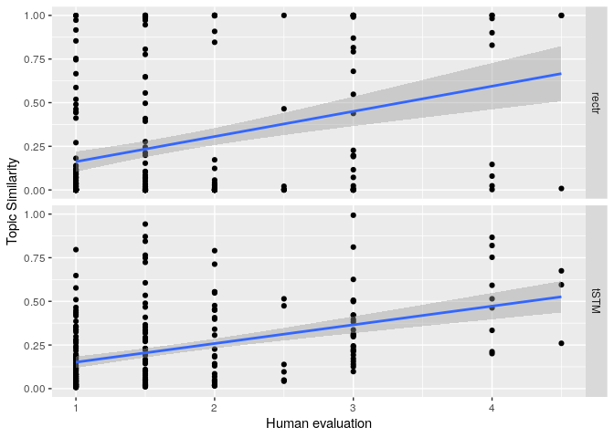
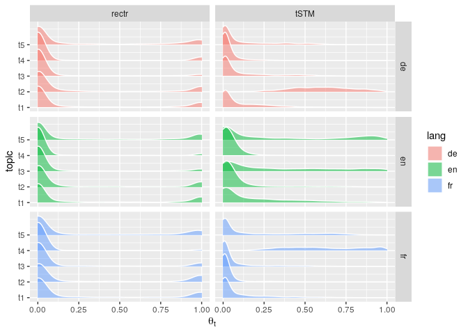
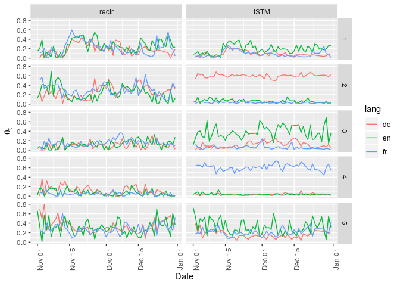

Reproducing the analyses in the paper
================

Due to copyright reasons, we cannot bundle the full text of New York Times, Süddeutsche Zeitung and Le Fegaro news articles in this package.

The first few rows of the data look like so.

``` r
require(rectr)
require(tibble)
require(dplyr)
require(quanteda)
readRDS("~/dev/infocrap/final_data_endefr.RDS")
```

    ## # A tibble: 3,391 x 10
    ##    path  id    pubdate headline lede  body  lang  content    nt tokenized_conte…
    ##    <chr> <chr> <chr>   <chr>    <chr> <chr> <chr> <chr>   <int> <list>          
    ##  1 ./pa… arti… 2 Nove… "Maladi… "Ave… "Dan… FR    "Avec …  1026 <chr [1,138]>   
    ##  2 ./pa… arti… 2 Nove… "« Cela… "LE … "Pat… FR    "LE FI…   734 <chr [820]>     
    ##  3 ./pa… arti… 2 Nove… "L'Iran… "L'a… "de … FR    "L'anc…   984 <chr [1,081]>   
    ##  4 ./pa… arti… 2 Nove… "Matthi… "Le … "Mat… FR    "Le pr…  1077 <chr [1,213]>   
    ##  5 ./pa… arti… 2 Nove… "Les 31… "Lan… "EUR… FR    "Lancé…  1012 <chr [1,115]>   
    ##  6 ./pa… arti… 2 Nove… "Genera… "Apr… "À l… FR    "Après…   800 <chr [874]>     
    ##  7 ./pa… arti… 2 Nove… "La dis… "Seu… "Les… FR    "Seul …  1171 <chr [1,318]>   
    ##  8 ./pa… arti… 2 Nove… "Les ca… "Ils… "Ce … FR    "Ils d…   552 <chr [612]>     
    ##  9 ./pa… arti… 2 Nove… "Le pré… "FRA… "À l… FR    "FRANÇ…   506 <chr [589]>     
    ## 10 ./pa… arti… 2 Nove… "La nui… "  Ç… "Au … FR    "  ÇA …   516 <chr [552]>     
    ## # … with 3,381 more rows

The content column has the content of the news articles. For the rectr method, a processed version of the corpus and dfm is available in this package. The data was generated using the following code.

``` r
readRDS("~/dev/infocrap/final_data_endefr.RDS") %>% mutate(content = paste(lede, body), lang = tolower(lang), id = row_number()) %>% select(content, lang, pubdate, headline, id) -> paris
```

``` r
get_ft("fr")
get_ft("de")
get_ft("en")
```

``` r
emb <- read_ft(c("fr", "de", "en"))
paris_corpus <- create_corpus(paris$content, paris$lang)
paris_dfm <- transform_dfm_boe(paris_corpus, emb)
docvars(paris_corpus, "headline") <- paris$headline
docvars(paris_corpus, "pubdate") <- paris$pubdate
docvars(paris_corpus, "id") <- paris$id

## Delete all text content, sorry, researchers!
paris_corpus[1:3391] <- NA
usethis::use_data(paris_corpus, overwrite = TRUE)
usethis::use_data(paris_dfm, overwrite = TRUE)
```

Again, due to copyright reasons, we cannot provide the full text and the version translated by Google (using the DTM translation method by Reber 2019). The DTM (in STM) is available in this package. It was created using this code.

``` r
require(tidyverse)
require(googleLanguageR)
require(stm)
require(quanteda)

textdata <- readRDS("~/dev/infocrap/final_data_endefr.RDS") %>% mutate(content = paste(lede, body), lang = tolower(lang), id = row_number()) %>% select(content, lang, pubdate, headline, id)

## Please insert your google token here. Uncomment if needed.
## gl_auth("____.json")


textdata %>% filter(lang == "fr") %>% pull(content) -> FR_CONTENT
textdata %>% filter(lang == "de") %>% pull(content) -> DE_CONTENT
textdata %>% filter(lang == "en") %>% pull(content) -> EN_CONTENT
FR_DFM <- dfm(FR_CONTENT, remove = stopwords("fr"), remove_numbers = TRUE, remove_punct = TRUE) %>% dfm_trim(min_docfreq = 2)

FR_terms <- colnames(FR_DFM)


## Uncomment the following 3 lines if you want to do the google translation

## FR_trans_terms <- gl_translate(FR_terms, source = "fr")
## saveRDS(FR_trans_terms, "~/dev/infocrap/FR_trans_terms.RDS")
## saveRDS(FR_terms, "~/dev/infocrap/FR_terms.RDS")


DE_DFM <- dfm(DE_CONTENT, remove = stopwords("de"), , remove_numbers = TRUE, remove_punct = TRUE) %>% dfm_trim(min_docfreq = 2)

DE_terms <- colnames(DE_DFM)

## Uncomment the following 3 lines if you want to do the google translation

## DE_trans_terms <- gl_translate(DE_terms, source = "de")
## saveRDS(DE_trans_terms, "~/dev/infocrap/DE_trans_terms.RDS")
## saveRDS(DE_terms, "~/dev/infocrap/DE_terms.RDS")

DE_trans_terms <- readRDS("~/dev/infocrap/DE_trans_terms.RDS")
FR_trans_terms <- readRDS("~/dev/infocrap/FR_trans_terms.RDS")


FR_tokens <- tokens(FR_CONTENT, remove_numbers = TRUE, remove_punct = TRUE)

DE_tokens <- tokens(DE_CONTENT, remove_numbers = TRUE, remove_punct = TRUE)


recon <- function(token_obj, trans_terms) {
    tibble(text = tolower(token_obj)) %>% left_join(trans_terms, by = 'text') %>% filter(!is.na(translatedText)) %>% pull(translatedText) %>% paste(collapse = " ")
}

FR_recon_en_text <- map_chr(FR_tokens, recon, trans_terms = FR_trans_terms)

DE_recon_en_text <- map_chr(DE_tokens, recon, trans_terms = DE_trans_terms)

recon_complete_text <- c(FR_recon_en_text, EN_CONTENT, DE_recon_en_text)
textdata$translated_text <- recon_complete_text

min_docfreq <- (nrow(textdata) * 0.005) %>% ceiling
max_docfreq <- (nrow(textdata) * 0.99) %>% ceiling

dfm(textdata$translated_text, tolower = TRUE, stem = TRUE, remove = stopwords("en"), remove_number = TRUE, remove_punct = TRUE) %>% dfm_trim(min_docfreq = min_docfreq, max_docfreq = max_docfreq) %>% convert(to = 'stm') -> paris_translated_dfm
usethis::use_data(paris_translated_dfm, overwrite = TRUE)
```

Actual reproduction
===================

Reproduce the analyses in the paper.

``` r
require(rectr)
```

    ## Loading required package: rectr

``` r
require(tidyverse)
```

    ## Loading required package: tidyverse

    ## ── Attaching packages ─────────────────────────────────────── tidyverse 1.3.0 ──

    ## ✔ ggplot2 3.2.1     ✔ purrr   0.3.3
    ## ✔ tibble  2.1.3     ✔ dplyr   0.8.3
    ## ✔ tidyr   1.0.0     ✔ stringr 1.4.0
    ## ✔ readr   1.3.1     ✔ forcats 0.4.0

    ## ── Conflicts ────────────────────────────────────────── tidyverse_conflicts() ──
    ## ✖ dplyr::filter() masks stats::filter()
    ## ✖ dplyr::lag()    masks stats::lag()

``` r
require(quanteda)
```

    ## Loading required package: quanteda

    ## Package version: 1.9.9009

    ## Parallel computing: 2 of 4 threads used.

    ## See https://quanteda.io for tutorials and examples.

    ## 
    ## Attaching package: 'quanteda'

    ## The following object is masked from 'package:utils':
    ## 
    ##     View

``` r
paris_corpus
```

    ## Corpus consisting of 3,391 documents and 4 docvars.

``` r
paris_dfm
```

    ## dfm with a dimension of 3391 x 300 and fr/en/de language(s).

``` r
emb <- read_ft(c("fr", "de", "en"))
paris_dfm_filtered <- filter_dfm(paris_dfm, paris_corpus, k = 5)
paris_dfm_filtered
```

    ## dfm with a dimension of 3391 x 11 and fr/en/de language(s).
    ## Filtered with k =  5

``` r
paris_gmm <- calculate_gmm(paris_dfm_filtered, seed = 42)
paris_gmm
```

    ## 5-topic rectr model trained with a dfm with a dimension of 3391 x 11 and fr/en/de language(s).
    ## Filtered with k =  5

Appendix I
----------

``` r
get_sample <- function(i, paris_corpus, theta, threshold = 0.8, replace = FALSE) {
    tibble(hl = docvars(paris_corpus, "headline"), lang = docvars(paris_corpus, "lang"), prob = theta[,i]) %>% group_by(lang) %>% filter(prob > threshold) %>% sample_n(size = 5, weight = prob, replace = replace) %>% select(hl, lang, prob) %>% ungroup %>% arrange(lang, prob) %>% mutate(topic = i)
}

set.seed(42)
map_dfr(1:5, get_sample, paris_corpus, theta = paris_gmm$theta) %>% unique %>% print(n = 100)
```

    ## # A tibble: 75 x 4
    ##    hl                                                          lang   prob topic
    ##    <chr>                                                       <chr> <dbl> <int>
    ##  1 "Nahost-Deutschland; Hassparolen gegen Israel, Überfälle, … de    0.847     1
    ##  2 "RAZZIA-FOTO; Ein Detail zu viel\n"                         de    0.862     1
    ##  3 "Mehr Polizisten, aber keine Soldaten; Die Kanzlerin spric… de    0.920     1
    ##  4 "USA; Obamas Widerwille\n"                                  de    0.987     1
    ##  5 "Die Spur nach Belgien; In dem zerstrittenen Land tun sich… de    1.00      1
    ##  6 "A Dutch ISIS Fighter Is Taking Questions on Tumblr\n"      en    0.973     1
    ##  7 "Attacks Push European Union to Consider Limits on Passpor… en    0.984     1
    ##  8 "Anxiety Rising\n"                                          en    0.989     1
    ##  9 "After the Carnage in Paris\n"                              en    0.997     1
    ## 10 "U.S. Defense Chief Prods Gulf States to Take Larger Role … en    1.00      1
    ## 11 "Filière djihadiste : les écoutes qui écornent la fable du… fr    0.899     1
    ## 12 "Les blessés, ces victimes oubliées\n"                      fr    0.982     1
    ## 13 "Molenbeek, foyer des réseaux djihadistes bruxellois\n"     fr    0.999     1
    ## 14 "Des textes sur le djihad, une arme... la mosquée de Lagny… fr    0.999     1
    ## 15 "Ces djihadistes francophones que Daech fait passer à l'ac… fr    1.00      1
    ## 16 "MINISTERERLAUBNIS; Haub lenkt, Gabriel denkt\n"            de    0.827     2
    ## 17 "Das kommt 2016; Viele neue Automodelle sind für das komme… de    0.860     2
    ## 18 "Das soll Paris bringen\n"                                  de    0.999     2
    ## 19 "Flammender Alarm; Seit Jahrzehnten ist ein Spanier dem CO… de    1.00      2
    ## 20 "Ab nach unten; Je länger die Weltgemeinschaft mit CO&sub2… de    1.00      2
    ## 21 "Mennonite Farmers Are Leaving Mexico, and Competition for… en    0.813     2
    ## 22 "Amid Divisions, Optimism for a Climate Deal\n"             en    0.924     2
    ## 23 "Anonymous Hackers Fight ISIS but Reactions Are Mixed\n"    en    0.937     2
    ## 24 "The Thrill and Chills of Dirt-Cheap Gas\n"                 en    1         2
    ## 25 "Global Fossil Fuel Subsidies Dwarf Funding Commitment to … en    1         2
    ## 26 "« Mustang » au galop vers les Oscars\n"                    fr    0.915     2
    ## 27 "Comment le vignoble de la Loire est devenu populaire\n"    fr    0.955     2
    ## 28 "Laurent Poupart : « Nous allons au-delà du programme »\n"  fr    1.00      2
    ## 29 "Lignes rouges\n"                                           fr    1.00      2
    ## 30 "Les passeurs d'une ambition\n"                             fr    1.00      2
    ## 31 "Erdinger Gallier; Beim traditionellen Stehempfang der Jun… de    0.881     3
    ## 32 "EUROPA; Die große Erosion; VON KURT KISTER\n"              de    0.942     3
    ## 33 "Des Menschen Unfasslichkeit; Eberhard Straub hat ein fulm… de    0.958     3
    ## 34 "Anschläge fachen deutsche Flüchtlingsdebatte an; Bayerns … de    0.998     3
    ## 35 "Alle gegen rechts; Frankreichs Premier warnt vor Krieg, s… de    1         3
    ## 36 "Nostalgia and Fear, Fueling Literature\n"                  en    0.863     3
    ## 37 "'Enough Is Enough,' Obama Says After the Latest Outbreak … en    0.895     3
    ## 38 "Washington Is Next on Hollande Tour to Press Allies for A… en    0.984     3
    ## 39 "A Red State, but Still an Uphill G.O.P. Bid\n"             en    1.00      3
    ## 40 "National Front Stumbles in French Elections\n"             en    1.00      3
    ## 41 "Les Républicains anticipent un probable recul de l'exécut… fr    0.869     3
    ## 42 "La maire de Paris se rêve en Martine Aubry\n"              fr    1.00      3
    ## 43 "Valérie Pécresse :  « Bartolone, c'est l'homme d'un clan … fr    1.00      3
    ## 44 "La droite s'indigne de la reconduction de Bartolone\n"     fr    1.00      3
    ## 45 "La gauche de la gauche en panne\n"                         fr    1         3
    ## 46 "NAHAUFNAHME; Das Leben, eine Seifenoper; Der Unternehmer … de    0.928     4
    ## 47 "Hans in Not; Vize-Generalsekretär des DFB steht wegen War… de    0.955     4
    ## 48 "Zlatans Einladung; Fußball-Narziss Ibrahimovic gastiert m… de    0.994     4
    ## 49 "„Privatsache“; Entlastendes Platini-Dokument umstritten\n" de    1.00      4
    ## 50 "PROFIL; Lassana Diarra; Französischer Fußballer, der trot… de    1.00      4
    ## 51 "As Carnage Unfolded Outside Stadium in France, Many Insid… en    1.00      4
    ## 52 "Gabon Advances in Qualifying\n"                            en    1         4
    ## 53 "Two Finals Entail Two Surfaces for Murray\n"               en    1         4
    ## 54 "Questions Begin After United Is Ousted\n"                  en    1         4
    ## 55 "Guardiola Will Leave Bayern\n"                             en    1         4
    ## 56 "Une finale sous haute sécurité\n"                          fr    1.00      4
    ## 57 "Fifa : le camp Platini dénonce un procès en sorcellerie\n" fr    1.00      4
    ## 58 "Tavernost : « M6 ne veut pas se débarrasser des Girondins… fr    1.00      4
    ## 59 "Deux défis de choix pour les Bleus à Bercy\n"              fr    1         4
    ## 60 "Pourquoi le PSG est favori pour sa belle avec Chelsea\n"   fr    1         4
    ## 61 "Ein bisschen Unsterblichkeit; Michel Piccoli zum 90. Gebu… de    0.810     5
    ## 62 "WIR HABEN VERSTANDEN\n"                                    de    0.885     5
    ## 63 "Pegida will täglich auf den Marienplatz\n"                 de    0.913     5
    ## 64 "„. . . und sie töteten alle“; Während ihres Konzertes in … de    0.942     5
    ## 65 "Die Fahrende; Ilma Rakusa, die große Europäerin der Liter… de    0.973     5
    ## 66 "Anne Frank Gains 'Co-Author' in Copyright Move\n"          en    0.913     5
    ## 67 "A Chill Grips a U.S. Haven for Syrian Families\n"          en    0.965     5
    ## 68 "A Comic Book in the Company of Masterpieces\n"             en    0.999     5
    ## 69 "Transported Around the Globe and Across the Centuries\n"   en    0.999     5
    ## 70 "French Artists Find a Way to Take Their Irreverence to th… en    1.00      5
    ## 71 "Talisman, une familiale fort précieuse\n"                  fr    0.983     5
    ## 72 "L'effet Frankie\n"                                         fr    0.998     5
    ## 73 "Ode au Médoc\n"                                            fr    0.999     5
    ## 74 "La môme noir et jaune\n"                                   fr    1.00      5
    ## 75 "sortir du bois\n"                                          fr    1.00      5

Appendix II
-----------

``` r
require(stm)
```

    ## Loading required package: stm

    ## stm v1.3.3 (2018-1-26) successfully loaded. See ?stm for help. 
    ##  Papers, resources, and other materials at structuraltopicmodel.com

``` r
require(tidyverse)
require(googleLanguageR)
```

    ## Loading required package: googleLanguageR

``` r
require(quanteda)

set.seed(42)
translated_stm  <- stm(paris_translated_dfm$documents, paris_translated_dfm$vocab, K = 5)
```

    ## Beginning Spectral Initialization 
    ##   Calculating the gram matrix...
    ##   Finding anchor words...
    ##      .....
    ##   Recovering initialization...
    ##      ..........................................................
    ## Initialization complete.
    ## ......................................................................................................
    ## Completed E-Step (1 seconds). 
    ## Completed M-Step. 
    ## Completing Iteration 1 (approx. per word bound = -7.744) 
    ## ......................................................................................................
    ## Completed E-Step (1 seconds). 
    ## Completed M-Step. 
    ## Completing Iteration 2 (approx. per word bound = -7.584, relative change = 2.069e-02) 
    ## ......................................................................................................
    ## Completed E-Step (1 seconds). 
    ## Completed M-Step. 
    ## Completing Iteration 3 (approx. per word bound = -7.549, relative change = 4.582e-03) 
    ## ......................................................................................................
    ## Completed E-Step (0 seconds). 
    ## Completed M-Step. 
    ## Completing Iteration 4 (approx. per word bound = -7.538, relative change = 1.449e-03) 
    ## ......................................................................................................
    ## Completed E-Step (0 seconds). 
    ## Completed M-Step. 
    ## Completing Iteration 5 (approx. per word bound = -7.532, relative change = 8.097e-04) 
    ## Topic 1: pari, said, attack, french, franc 
    ##  Topic 2: year, time, first, say, beauti 
    ##  Topic 3: said, state, mr, countri, islam 
    ##  Topic 4: year, pari, also, franc, fact 
    ##  Topic 5: said, new, year, work, one 
    ## ......................................................................................................
    ## Completed E-Step (0 seconds). 
    ## Completed M-Step. 
    ## Completing Iteration 6 (approx. per word bound = -7.527, relative change = 6.212e-04) 
    ## ......................................................................................................
    ## Completed E-Step (0 seconds). 
    ## Completed M-Step. 
    ## Completing Iteration 7 (approx. per word bound = -7.523, relative change = 4.937e-04) 
    ## ......................................................................................................
    ## Completed E-Step (0 seconds). 
    ## Completed M-Step. 
    ## Completing Iteration 8 (approx. per word bound = -7.521, relative change = 3.754e-04) 
    ## ......................................................................................................
    ## Completed E-Step (0 seconds). 
    ## Completed M-Step. 
    ## Completing Iteration 9 (approx. per word bound = -7.518, relative change = 2.884e-04) 
    ## ......................................................................................................
    ## Completed E-Step (0 seconds). 
    ## Completed M-Step. 
    ## Completing Iteration 10 (approx. per word bound = -7.517, relative change = 2.223e-04) 
    ## Topic 1: attack, said, pari, peopl, french 
    ##  Topic 2: year, time, first, say, give 
    ##  Topic 3: state, said, mr, countri, unit 
    ##  Topic 4: year, franc, pari, also, fact 
    ##  Topic 5: year, new, said, work, one 
    ## ......................................................................................................
    ## Completed E-Step (0 seconds). 
    ## Completed M-Step. 
    ## Completing Iteration 11 (approx. per word bound = -7.515, relative change = 1.745e-04) 
    ## ......................................................................................................
    ## Completed E-Step (0 seconds). 
    ## Completed M-Step. 
    ## Completing Iteration 12 (approx. per word bound = -7.514, relative change = 1.396e-04) 
    ## ......................................................................................................
    ## Completed E-Step (0 seconds). 
    ## Completed M-Step. 
    ## Completing Iteration 13 (approx. per word bound = -7.513, relative change = 1.132e-04) 
    ## ......................................................................................................
    ## Completed E-Step (0 seconds). 
    ## Completed M-Step. 
    ## Completing Iteration 14 (approx. per word bound = -7.513, relative change = 9.234e-05) 
    ## ......................................................................................................
    ## Completed E-Step (0 seconds). 
    ## Completed M-Step. 
    ## Completing Iteration 15 (approx. per word bound = -7.512, relative change = 7.487e-05) 
    ## Topic 1: attack, said, pari, peopl, terrorist 
    ##  Topic 2: year, time, first, say, give 
    ##  Topic 3: said, state, mr, countri, unit 
    ##  Topic 4: year, franc, also, pari, fact 
    ##  Topic 5: year, new, said, work, one 
    ## ......................................................................................................
    ## Completed E-Step (0 seconds). 
    ## Completed M-Step. 
    ## Completing Iteration 16 (approx. per word bound = -7.512, relative change = 6.079e-05) 
    ## ......................................................................................................
    ## Completed E-Step (0 seconds). 
    ## Completed M-Step. 
    ## Completing Iteration 17 (approx. per word bound = -7.511, relative change = 5.003e-05) 
    ## ......................................................................................................
    ## Completed E-Step (0 seconds). 
    ## Completed M-Step. 
    ## Completing Iteration 18 (approx. per word bound = -7.511, relative change = 4.196e-05) 
    ## ......................................................................................................
    ## Completed E-Step (0 seconds). 
    ## Completed M-Step. 
    ## Completing Iteration 19 (approx. per word bound = -7.511, relative change = 3.579e-05) 
    ## ......................................................................................................
    ## Completed E-Step (0 seconds). 
    ## Completed M-Step. 
    ## Completing Iteration 20 (approx. per word bound = -7.511, relative change = 3.094e-05) 
    ## Topic 1: attack, said, pari, peopl, terrorist 
    ##  Topic 2: year, time, first, say, give 
    ##  Topic 3: said, mr, state, countri, unit 
    ##  Topic 4: year, franc, also, pari, fact 
    ##  Topic 5: year, new, said, one, work 
    ## ......................................................................................................
    ## Completed E-Step (0 seconds). 
    ## Completed M-Step. 
    ## Completing Iteration 21 (approx. per word bound = -7.510, relative change = 2.669e-05) 
    ## ......................................................................................................
    ## Completed E-Step (0 seconds). 
    ## Completed M-Step. 
    ## Completing Iteration 22 (approx. per word bound = -7.510, relative change = 2.329e-05) 
    ## ......................................................................................................
    ## Completed E-Step (0 seconds). 
    ## Completed M-Step. 
    ## Completing Iteration 23 (approx. per word bound = -7.510, relative change = 2.046e-05) 
    ## ......................................................................................................
    ## Completed E-Step (0 seconds). 
    ## Completed M-Step. 
    ## Completing Iteration 24 (approx. per word bound = -7.510, relative change = 1.813e-05) 
    ## ......................................................................................................
    ## Completed E-Step (0 seconds). 
    ## Completed M-Step. 
    ## Completing Iteration 25 (approx. per word bound = -7.510, relative change = 1.624e-05) 
    ## Topic 1: attack, said, islam, pari, terrorist 
    ##  Topic 2: year, time, first, say, give 
    ##  Topic 3: mr, said, state, countri, unit 
    ##  Topic 4: year, franc, also, pari, fact 
    ##  Topic 5: year, new, one, said, work 
    ## ......................................................................................................
    ## Completed E-Step (0 seconds). 
    ## Completed M-Step. 
    ## Completing Iteration 26 (approx. per word bound = -7.510, relative change = 1.465e-05) 
    ## ......................................................................................................
    ## Completed E-Step (0 seconds). 
    ## Completed M-Step. 
    ## Completing Iteration 27 (approx. per word bound = -7.510, relative change = 1.344e-05) 
    ## ......................................................................................................
    ## Completed E-Step (0 seconds). 
    ## Completed M-Step. 
    ## Completing Iteration 28 (approx. per word bound = -7.509, relative change = 1.265e-05) 
    ## ......................................................................................................
    ## Completed E-Step (0 seconds). 
    ## Completed M-Step. 
    ## Completing Iteration 29 (approx. per word bound = -7.509, relative change = 1.200e-05) 
    ## ......................................................................................................
    ## Completed E-Step (0 seconds). 
    ## Completed M-Step. 
    ## Completing Iteration 30 (approx. per word bound = -7.509, relative change = 1.151e-05) 
    ## Topic 1: attack, said, islam, terrorist, pari 
    ##  Topic 2: time, year, first, say, give 
    ##  Topic 3: mr, said, state, countri, unit 
    ##  Topic 4: year, franc, also, pari, fact 
    ##  Topic 5: year, new, one, said, work 
    ## ......................................................................................................
    ## Completed E-Step (0 seconds). 
    ## Completed M-Step. 
    ## Completing Iteration 31 (approx. per word bound = -7.509, relative change = 1.112e-05) 
    ## ......................................................................................................
    ## Completed E-Step (0 seconds). 
    ## Completed M-Step. 
    ## Completing Iteration 32 (approx. per word bound = -7.509, relative change = 1.095e-05) 
    ## ......................................................................................................
    ## Completed E-Step (0 seconds). 
    ## Completed M-Step. 
    ## Completing Iteration 33 (approx. per word bound = -7.509, relative change = 1.076e-05) 
    ## ......................................................................................................
    ## Completed E-Step (0 seconds). 
    ## Completed M-Step. 
    ## Completing Iteration 34 (approx. per word bound = -7.509, relative change = 1.055e-05) 
    ## ......................................................................................................
    ## Completed E-Step (0 seconds). 
    ## Completed M-Step. 
    ## Completing Iteration 35 (approx. per word bound = -7.509, relative change = 1.032e-05) 
    ## Topic 1: attack, said, islam, terrorist, state 
    ##  Topic 2: time, year, first, say, give 
    ##  Topic 3: mr, said, state, countri, unit 
    ##  Topic 4: year, franc, also, pari, fact 
    ##  Topic 5: year, new, one, work, said 
    ## ......................................................................................................
    ## Completed E-Step (0 seconds). 
    ## Completed M-Step. 
    ## Model Converged

``` r
set.seed(42)
map_dfr(1:5, get_sample, paris_corpus, theta = translated_stm$theta, replace = TRUE) %>% unique %>% print(n = 100)
```

    ## # A tibble: 34 x 4
    ##    hl                                                          lang   prob topic
    ##    <chr>                                                       <chr> <dbl> <int>
    ##  1 "Belgisches Phantom; Die Behörden haben Abdelhamid Abaaoud… de    0.801     1
    ##  2 "Bekenntnis zur Nation; Frankreichs Muslime nutzen das Fre… de    0.817     1
    ##  3 "Großrazzia gegen Terrorzelle in Paris; Stundenlang belage… de    0.847     1
    ##  4 "World Briefing | Europe; France: Man Who Beheaded His Bos… en    0.838     1
    ##  5 "An ISIS Fighter With Family in Belgium Who Wanted Him Dea… en    0.839     1
    ##  6 "Inquiry Into Paris Attacks Expands to Eastern Europe, Whe… en    0.853     1
    ##  7 "ISIS Calls Bloodshed 'First of the Storm'\n"               en    0.869     1
    ##  8 "Dec. 31 Plot Brings Raids and Arrests in Belgium\n"        en    0.959     1
    ##  9 "Der Trauermanager; Kundgebungen; Die vielen Beileidsbekun… de    0.809     2
    ## 10 "Das erste Endspiel; Oberstes Sportgericht entscheidet übe… de    0.849     2
    ## 11 "Bestatter auf Abruf; Schon nach der ersten Niederlage ger… de    0.880     2
    ## 12 "Rückkehr nach 14 Monaten; Joachim Löw holt Stürmer Mario … de    0.924     2
    ## 13 "Suárez Leads Barcelona to Clásico Win\n"                   en    0.802     2
    ## 14 "Obama: Die USA machen mit\n"                               de    0.806     3
    ## 15 "Cameron Plans Rise in Military Spending\n"                 en    0.828     3
    ## 16 "President Obama's Hypocrisy on Syria\n"                    en    0.841     3
    ## 17 "What Happens When Mother Earth Gets Angry\n"               en    0.913     3
    ## 18 "The Thrill and Chills of Dirt-Cheap Gas\n"                 en    0.929     3
    ## 19 "Despite Push for Cleaner Cars, Sheer Numbers Could Work A… en    0.940     3
    ## 20 "Nathalie Balla et Éric Courteille, un duo de choc à La Re… fr    0.810     4
    ## 21 "« On passe à l'ère d'une ins truction de masse »\n"        fr    0.832     4
    ## 22 "« En Corse, l'État récolte ce qu'il a semé »\n"            fr    0.859     4
    ## 23 "Pascal Cherki : « Je voterai contre la réforme »\n"        fr    0.931     4
    ## 24 "La magistrate Laurence Vichnievsky candidate sur la liste… fr    0.963     4
    ## 25 "Seemingly Channeling a Mix of Rage and Grief\n"            en    0.836     5
    ## 26 "Art House\n"                                               en    0.902     5
    ## 27 "A Forgotten Abstractionist Roars Back in Bright, Jangly L… en    0.958     5
    ## 28 "Imagery Takes Flight in a Tale of Fickle Love and Reconci… en    0.975     5
    ## 29 "Sweetly Tweaking Traditions\n"                             en    0.984     5
    ## 30 "« 101 Robes »\n"                                           fr    0.808     5
    ## 31 "Il aimait rire et lire\n"                                  fr    0.810     5
    ## 32 "La garde-robe d'un temps perdu\n"                          fr    0.811     5
    ## 33 "Quatre recettes revisitées\n"                              fr    0.859     5
    ## 34 "UNE SÉLECTION D'ALBUMS ET DE ROMANS POUR LES ENFANTS\n"    fr    0.914     5

Human coding
============

The coded data by two coders is available in this package.

``` r
paris_human_coding
```

    ## # A tibble: 240 x 5
    ##    pair_num  a1id  a2id coder1 coder2
    ##       <int> <int> <int>  <dbl>  <int>
    ##  1        1   217  2960      2      1
    ##  2        2   876  1668      1      1
    ##  3        3  2762  1566      1      1
    ##  4        4   490  2720      1      1
    ##  5        5  2965  1727      1      2
    ##  6        6    20  1654      1      1
    ##  7        7  1162  2632      4      2
    ##  8        8  2548  1823      1      1
    ##  9        9   221  1398      4      2
    ## 10       10  2712  2200      4      2
    ## # … with 230 more rows

Correlation between two coders

``` r
cor.test(paris_human_coding$coder1, paris_human_coding$coder2)
```

    ## 
    ##  Pearson's product-moment correlation
    ## 
    ## data:  paris_human_coding$coder1 and paris_human_coding$coder2
    ## t = 8.9493, df = 238, p-value < 2.2e-16
    ## alternative hypothesis: true correlation is not equal to 0
    ## 95 percent confidence interval:
    ##  0.4006079 0.5908686
    ## sample estimates:
    ##       cor 
    ## 0.5017829

``` r
require(lsa)
```

    ## Loading required package: lsa

    ## Loading required package: SnowballC

``` r
cal_sim <- function(id1, id2, thetax) {
    cosine(thetax[id1,], thetax[id2,])[1,1]
}

paris_human_coding %>% mutate(rectr_topicsim = map2_dbl(a1id, a2id, cal_sim, thetax = paris_gmm$theta), tstm_topicsim = map2_dbl(a1id, a2id, cal_sim, thetax = translated_stm$theta), human = (coder1 + coder2) / 2) -> paris_topic_sim
cor.test(paris_topic_sim$human, paris_topic_sim$rectr_topicsim)
```

    ## 
    ##  Pearson's product-moment correlation
    ## 
    ## data:  paris_topic_sim$human and paris_topic_sim$rectr_topicsim
    ## t = 5.2929, df = 238, p-value = 2.733e-07
    ## alternative hypothesis: true correlation is not equal to 0
    ## 95 percent confidence interval:
    ##  0.2063710 0.4333425
    ## sample estimates:
    ##       cor 
    ## 0.3245203

``` r
cor.test(paris_topic_sim$human, paris_topic_sim$tstm_topicsim)
```

    ## 
    ##  Pearson's product-moment correlation
    ## 
    ## data:  paris_topic_sim$human and paris_topic_sim$tstm_topicsim
    ## t = 6.9304, df = 238, p-value = 3.906e-11
    ## alternative hypothesis: true correlation is not equal to 0
    ## 95 percent confidence interval:
    ##  0.2986470 0.5099485
    ## sample estimates:
    ##     cor 
    ## 0.40978

Figure 3
--------

``` r
paris_topic_sim %>% select(rectr_topicsim, tstm_topicsim, human) %>% gather(key = "model", value = "similarity", -human) %>% mutate(model = ifelse(model == "rectr_topicsim", "rectr", "tSTM")) %>% ggplot(aes(x = human, y = similarity)) + geom_point() + facet_grid(model ~ .) + geom_smooth(method = 'lm') + ylab("Topic Similarity") + xlab("Human evaluation")
```



Figure 2
--------

``` r
require(ggridges)
```

    ## Loading required package: ggridges

    ## 
    ## Attaching package: 'ggridges'

    ## The following object is masked from 'package:ggplot2':
    ## 
    ##     scale_discrete_manual

``` r
tibble(theta = c(paris_gmm$theta[,1], paris_gmm$theta[,2], paris_gmm$theta[,3], paris_gmm$theta[,4], paris_gmm$theta[,5], translated_stm$theta[,1], translated_stm$theta[,2], translated_stm$theta[,3], translated_stm$theta[,4], translated_stm$theta[,5]), lang = rep(docvars(paris_corpus, "lang"), 10), pubdate = rep(docvars(paris_corpus, "pubdate"), 10), topic = c(sort(rep(1:5, length(paris_corpus))), sort(rep(1:5, length(paris_corpus)))), method = c(rep("rectr", 16955), rep("tSTM", 16955))) %>% ggplot(aes(x = theta, y = topic, group = topic)) + geom_density_ridges(aes(fill = lang), alpha = .5, color = "white", from = 0, to = 1) + facet_grid(lang ~ method) + scale_y_continuous(breaks=seq_len(5), labels=c("t1", "t2", "t3", "t4", "t5")) + xlab(expression(theta[t]))
```

    ## Picking joint bandwidth of 0.044

    ## Picking joint bandwidth of 0.0276

    ## Picking joint bandwidth of 0.0413

    ## Picking joint bandwidth of 0.0441

    ## Picking joint bandwidth of 0.0485

    ## Picking joint bandwidth of 0.0264



Figure 4
--------

``` r
require(lubridate)
```

    ## Loading required package: lubridate

    ## 
    ## Attaching package: 'lubridate'

    ## The following object is masked from 'package:base':
    ## 
    ##     date

``` r
tibble(theta = c(paris_gmm$theta[,1], paris_gmm$theta[,2], paris_gmm$theta[,3], paris_gmm$theta[,4], paris_gmm$theta[,5], translated_stm$theta[,1], translated_stm$theta[,2], translated_stm$theta[,3], translated_stm$theta[,4], translated_stm$theta[,5]), lang = rep(docvars(paris_corpus, "lang"), 10), pubdate = rep(docvars(paris_corpus, "pubdate"), 10), topic = c(sort(rep(1:5, length(paris_corpus))), sort(rep(1:5, length(paris_corpus)))), method = c(rep("rectr", 16955), rep("tSTM", 16955))) %>% mutate(pubdate = lubridate::dmy(pubdate)) %>% group_by(topic, lang, pubdate, method) %>% summarise(mean_theta = mean(theta)) %>% ggplot(aes(x = pubdate, y = mean_theta, color = lang)) + geom_line() + facet_grid(topic ~ method) + ylab(expression(theta[t])) + xlab("Date") + theme(axis.text.x = element_text(angle = 90, hjust = 1))
```



``` r
sessionInfo()
```

    ## R version 3.6.2 (2019-12-12)
    ## Platform: x86_64-pc-linux-gnu (64-bit)
    ## Running under: Ubuntu 18.04.3 LTS
    ## 
    ## Matrix products: default
    ## BLAS:   /usr/lib/x86_64-linux-gnu/blas/libblas.so.3.7.1
    ## LAPACK: /usr/lib/x86_64-linux-gnu/lapack/liblapack.so.3.7.1
    ## 
    ## locale:
    ##  [1] LC_CTYPE=en_US.UTF-8       LC_NUMERIC=C              
    ##  [3] LC_TIME=en_US.UTF-8        LC_COLLATE=en_US.UTF-8    
    ##  [5] LC_MONETARY=en_US.UTF-8    LC_MESSAGES=en_US.UTF-8   
    ##  [7] LC_PAPER=en_US.UTF-8       LC_NAME=C                 
    ##  [9] LC_ADDRESS=C               LC_TELEPHONE=C            
    ## [11] LC_MEASUREMENT=en_US.UTF-8 LC_IDENTIFICATION=C       
    ## 
    ## attached base packages:
    ## [1] stats     graphics  grDevices utils     datasets  methods   base     
    ## 
    ## other attached packages:
    ##  [1] lubridate_1.7.4       ggridges_0.5.1        lsa_0.73.1           
    ##  [4] SnowballC_0.6.0       googleLanguageR_0.2.0 stm_1.3.3            
    ##  [7] quanteda_1.9.9009     forcats_0.4.0         stringr_1.4.0        
    ## [10] dplyr_0.8.3           purrr_0.3.3           readr_1.3.1          
    ## [13] tidyr_1.0.0           tibble_2.1.3          ggplot2_3.2.1        
    ## [16] tidyverse_1.3.0       rectr_0.0.5          
    ## 
    ## loaded via a namespace (and not attached):
    ##  [1] httr_1.4.1         jsonlite_1.6       modelr_0.1.5       RcppParallel_4.4.4
    ##  [5] assertthat_0.2.1   stats4_3.6.2       cellranger_1.1.0   yaml_2.2.0        
    ##  [9] pillar_1.4.3       backports_1.1.5    lattice_0.20-38    glue_1.3.1        
    ## [13] digest_0.6.23      googleAuthR_1.1.1  rvest_0.3.5        colorspace_1.4-1  
    ## [17] plyr_1.8.5         htmltools_0.4.0    Matrix_1.2-18      pkgconfig_2.0.3   
    ## [21] broom_0.5.3        haven_2.2.0        mvtnorm_1.0-11     scales_1.1.0      
    ## [25] RSpectra_0.16-0    farver_2.0.3       generics_0.0.2     ellipsis_0.3.0    
    ## [29] withr_2.1.2        nnet_7.3-12        lazyeval_0.2.2     cli_2.0.1         
    ## [33] magrittr_1.5       crayon_1.3.4       readxl_1.3.1       memoise_1.1.0     
    ## [37] evaluate_0.14      stopwords_1.0      fs_1.3.1           fansi_0.4.1       
    ## [41] nlme_3.1-143       xml2_1.2.2         tools_3.6.2        data.table_1.12.8 
    ## [45] hms_0.5.3          gargle_0.3.1       lifecycle_0.1.0    munsell_0.5.0     
    ## [49] reprex_0.3.0       compiler_3.6.2     rlang_0.4.4        grid_3.6.2        
    ## [53] rstudioapi_0.10    labeling_0.3       base64enc_0.1-3    rmarkdown_2.0     
    ## [57] gtable_0.3.0       flexmix_2.3-15     DBI_1.1.0          reshape2_1.4.3    
    ## [61] R6_2.4.1           knitr_1.26         utf8_1.1.4         fastmatch_1.1-0   
    ## [65] modeltools_0.2-22  stringi_1.4.5      Rcpp_1.0.3         vctrs_0.2.2       
    ## [69] spacyr_1.2         dbplyr_1.4.2       tidyselect_1.0.0   xfun_0.12
